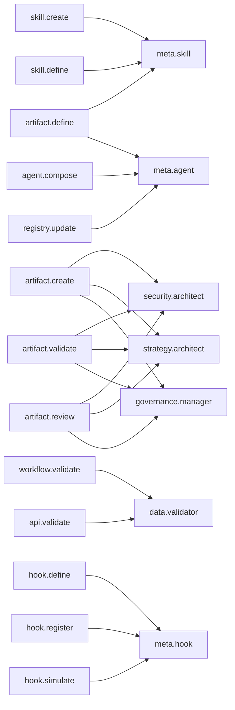

# Component Relationships

Inter-component dependencies and flows.

## Skills → Agents

## Hooks → Commands

| Hook | Command |
|------|---------|
| `performance-monitor-pre` | `/performance` |
| `performance-monitor-post` | `/performance` |
| `auto-stage-edited-files` | `/dev` |
