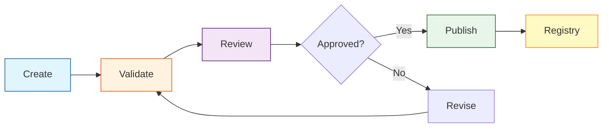
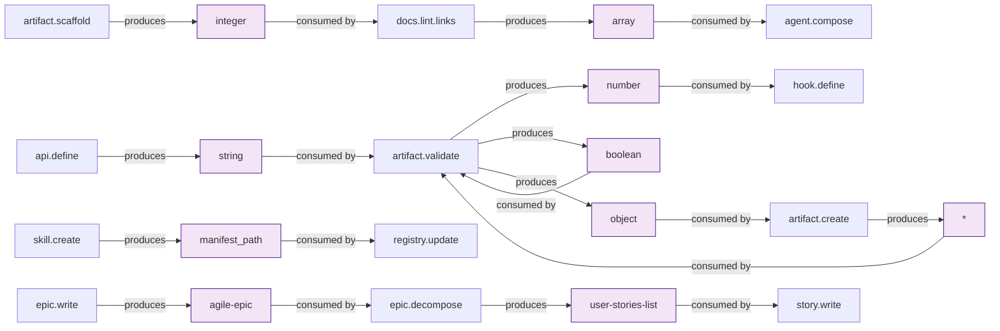

# Component Relationships & Taxonomy

Comprehensive visualization of Betty Framework component relationships.

## Table of Contents

1. [Domain Overview](#domain-overview)
2. [Artifact Lifecycle](#artifact-lifecycle)
3. [Skill → Agent Network](#skill--agent-network)
4. [Artifact Flow](#artifact-flow)
5. [Hooks → Commands](#hooks--commands)

---

## Domain Overview

Distribution of skills and agents across all 10 canonical domains.

```mermaid
graph TB
    %% Domain Overview

    ai[AI<br/>6 skills, 8 agents]
    api[API<br/>5 skills, 3 agents]
    architecture[ARCHITECTURE<br/>14 skills, 0 agents]
    data[DATA<br/>1 skills, 2 agents]
    deployment[DEPLOYMENT<br/>3 skills, 0 agents]
    docs[DOCS<br/>5 skills, 0 agents]
    governance[GOVERNANCE<br/>5 skills, 0 agents]
    operations[OPERATIONS<br/>9 skills, 5 agents]
    security[SECURITY<br/>0 skills, 1 agents]
    testing[TESTING<br/>1 skills, 1 agents]

    %% Style domains by category
    style api fill:#e1f5ff,stroke:#01579b,color:#000
    style data fill:#f3e5f5,stroke:#4a148c,color:#000
    style security fill:#ffebee,stroke:#b71c1c,color:#000
    style testing fill:#e8f5e9,stroke:#1b5e20,color:#000
    style docs fill:#fff3e0,stroke:#e65100,color:#000
    style architecture fill:#fce4ec,stroke:#880e4f,color:#000
    style governance fill:#f1f8e9,stroke:#33691e,color:#000
    style deployment fill:#e0f2f1,stroke:#004d40,color:#000
    style operations fill:#ede7f6,stroke:#311b92,color:#000
    style ai fill:#fff9c4,stroke:#f57f17,color:#000
```

---

## Artifact Lifecycle

Standard lifecycle flow for all artifacts: create → validate → review → publish.

---

## Skill → Agent Network

Shows which skills are used by which agents (limited to first 30 relationships).

```mermaid
graph TD
    %% Skill → Agent Relationships

    skill_create[skill.create] --> meta_skill[meta.skill]
    skill_define[skill.define] --> meta_skill[meta.skill]
    artifact_define[artifact.define] --> meta_skill[meta.skill]
    artifact_create[artifact.create] --> security_architect[security.architect]
    artifact_validate[artifact.validate] --> security_architect[security.architect]
    artifact_review[artifact.review] --> security_architect[security.architect]
    agent_compose[agent.compose] --> meta_agent[meta.agent]
    artifact_define[artifact.define] --> meta_agent[meta.agent]
    registry_update[registry.update] --> meta_agent[meta.agent]
    workflow_validate[workflow.validate] --> data_validator[data.validator]
    api_validate[api.validate] --> data_validator[data.validator]
    hook_define[hook.define] --> meta_hook[meta.hook]
    hook_register[hook.register] --> meta_hook[meta.hook]
    hook_simulate[hook.simulate] --> meta_hook[meta.hook]
    artifact_create[artifact.create] --> strategy_architect[strategy.architect]
    artifact_validate[artifact.validate] --> strategy_architect[strategy.architect]
    artifact_review[artifact.review] --> strategy_architect[strategy.architect]
    artifact_create[artifact.create] --> governance_manager[governance.manager]
    artifact_validate[artifact.validate] --> governance_manager[governance.manager]
    artifact_review[artifact.review] --> governance_manager[governance.manager]
    file_compare[file.compare] --> file_processor[file.processor]
    workflow_orchestrate[workflow.orchestrate] --> file_processor[file.processor]
    build_optimize[build.optimize] --> file_processor[file.processor]
    command_define[command.define] --> meta_command[meta.command]
    artifact_define[artifact.define] --> meta_command[meta.command]
    api_compatibility[api.compatibility] --> api_analyzer[api.analyzer]
    api_validate[api.validate] --> api_analyzer[api.analyzer]
    artifact_define[artifact.define] --> meta_artifact[meta.artifact]
    registry_update[registry.update] --> meta_artifact[meta.artifact]
    registry_query[registry.query] --> meta_artifact[meta.artifact]

    %% Styling
    classDef skillNode fill:#e1f5ff,stroke:#01579b
    classDef agentNode fill:#fff3e0,stroke:#e65100
    class registry_query skillNode
    class artifact_validate skillNode
    class api_compatibility skillNode
    class hook_simulate skillNode
    class build_optimize skillNode
    class registry_update skillNode
    class skill_create skillNode
    class workflow_orchestrate skillNode
    class artifact_review skillNode
    class hook_define skillNode
    class api_validate skillNode
    class file_compare skillNode
    class hook_register skillNode
    class skill_define skillNode
    class artifact_define skillNode
    class artifact_create skillNode
    class command_define skillNode
    class workflow_validate skillNode
    class agent_compose skillNode
    class meta_skill agentNode
    class security_architect agentNode
    class meta_agent agentNode
    class data_validator agentNode
    class meta_hook agentNode
    class strategy_architect agentNode
    class governance_manager agentNode
    class file_processor agentNode
    class meta_command agentNode
    class api_analyzer agentNode
    class meta_artifact agentNode
```

---

## Artifact Flow

Producer/consumer relationships for artifacts (sample of 10 artifacts).

---

## Hooks → Commands

Event-driven hook to command mappings.

| Hook | Event | Command |
|------|-------|---------|
| `performance-monitor-pre` | after-tool-call | `/performance` |
| `performance-monitor-post` | after-tool-call | `/performance` |
| `auto-stage-edited-files` | after-tool-call | `/dev` |

---

## Metrics

- **Skills**: 49
- **Agents**: 20
- **Hooks**: 3
- **Commands**: 10
- **Skill→Agent Relationships**: 54
- **Artifact Producers**: 75
- **Artifact Consumers**: 52

---

*Generated by Betty Framework Taxonomy System*