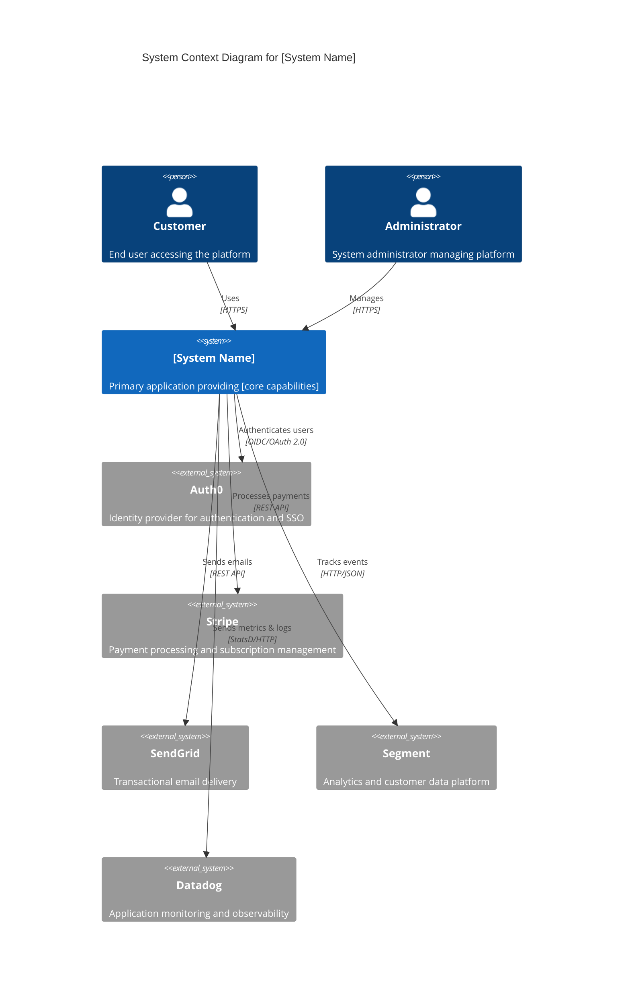
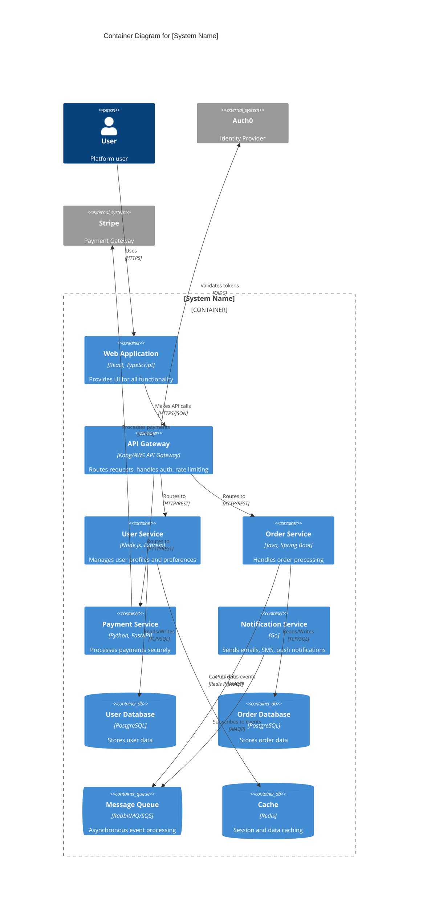

# Architecture Overview

## Document Metadata

| **Field** | **Value** |
|-----------|-----------|
| **Version** | 1.0.0 |
| **Last Updated** | 2025-01-15 |
| **Document Owner** | Chief Architect |
| **Status** | Draft / In Review / Approved |
| **Classification** | Internal / Confidential |
| **Next Review Date** | 2025-Q2 |

## Executive Summary

This architecture overview provides a comprehensive technical landscape of the [System Name] using industry-standard frameworks including the C4 Model (Context, Containers, Components, Code), the 4+1 View Model (Logical, Process, Physical, Development, Scenarios), and quality attribute scenarios from SEI. The architecture addresses ISO 25010 quality attributes including performance efficiency, security, reliability, maintainability, and scalability while implementing proven patterns such as microservices, hexagonal architecture, event-driven design, and cloud-native principles.

**Key Architectural Characteristics:**
- **Architecture Pattern**: [Microservices / Layered / Event-Driven / Hexagonal]
- **Deployment Model**: [Cloud-Native / Hybrid / Multi-Cloud / On-Premises]
- **Cloud Provider**: [AWS / Azure / GCP / Multi-Cloud]
- **Programming Paradigm**: [Polyglot / .NET / Java / Node.js / Python]
- **Data Architecture**: [Event Sourcing / CQRS / Traditional RDBMS / Data Mesh]

## Table of Contents

1. [System Context (C4 Level 1)](#system-context-c4-level-1)
2. [Container Architecture (C4 Level 2)](#container-architecture-c4-level-2)
3. [Component Design (C4 Level 3)](#component-design-c4-level-3)
4. [4+1 Architectural Views](#41-architectural-views)
5. [Architectural Patterns](#architectural-patterns)
6. [Technology Stack](#technology-stack)
7. [Quality Attributes & Scenarios](#quality-attributes--scenarios)
8. [Cross-Cutting Concerns](#cross-cutting-concerns)
9. [Architecture Decision Records](#architecture-decision-records)
10. [Constraints & Assumptions](#constraints--assumptions)

---

## System Context (C4 Level 1)

### Context Diagram



**Alternative PlantUML Syntax:**

```plantuml
@startuml C4_Context
!include https://raw.githubusercontent.com/plantuml-stdlib/C4-PlantUML/master/C4_Context.puml

LAYOUT_WITH_LEGEND()

title System Context Diagram - [System Name]

Person(customer, "Customer", "End user accessing platform")
Person(admin, "Administrator", "Platform administrator")

System(platform, "[System Name]", "Provides [core business capabilities]")

System_Ext(idp, "Auth0", "Identity Provider")
System_Ext(payment, "Stripe", "Payment Gateway")
System_Ext(email, "SendGrid", "Email Service")
System_Ext(cdn, "CloudFlare", "CDN & DDoS Protection")

Rel(customer, platform, "Uses", "HTTPS")
Rel(platform, idp, "Authenticates", "OIDC")
Rel(platform, payment, "Processes payments", "REST")
Rel(platform, email, "Sends transactional emails", "SMTP API")
Rel(platform, cdn, "Serves static assets", "HTTPS")

@enduml
```

### External Dependencies

| **System** | **Purpose** | **Protocol** | **Criticality** | **SLA** |
|-----------|------------|-------------|----------------|---------|
| Auth0 | Authentication & SSO | OIDC/OAuth 2.0 | High | 99.99% |
| Stripe | Payment processing | REST API | Critical | 99.99% |
| SendGrid | Email delivery | SMTP/API | Medium | 99.95% |
| AWS | Cloud infrastructure | Various | Critical | 99.99% |
| Datadog | Observability | HTTP/StatsD | Medium | 99.9% |

---

## Container Architecture (C4 Level 2)

### Container Diagram



### Container Inventory

| **Container** | **Technology** | **Purpose** | **Scaling Strategy** | **Port** |
|--------------|----------------|-------------|---------------------|----------|
| Web Application | React 18, TypeScript | User interface | CDN + auto-scaling | 443 |
| API Gateway | Kong / AWS API Gateway | Request routing, auth | Horizontal auto-scaling | 443 |
| User Service | Node.js 20, Express | User management | Horizontal auto-scaling | 3000 |
| Order Service | Java 17, Spring Boot | Order processing | Horizontal auto-scaling | 8080 |
| Payment Service | Python 3.11, FastAPI | Payment processing | Horizontal auto-scaling | 8000 |
| Notification Service | Go 1.21 | Notifications | Horizontal auto-scaling | 9000 |
| User Database | PostgreSQL 15 | User data persistence | Read replicas | 5432 |
| Order Database | PostgreSQL 15 | Order data persistence | Read replicas | 5432 |
| Message Queue | RabbitMQ / SQS | Event-driven communication | Clustered | 5672 |
| Cache | Redis 7 | Caching layer | Cluster mode | 6379 |

---

## Component Design (C4 Level 3)

### Example: Order Service Components

```plantuml
@startuml Order_Service_Components
!include https://raw.githubusercontent.com/plantuml-stdlib/C4-PlantUML/master/C4_Component.puml

LAYOUT_WITH_LEGEND()

title Component Diagram - Order Service

Container_Boundary(orderService, "Order Service") {
    Component(orderController, "Order Controller", "REST Controller", "Handles HTTP requests")
    Component(orderApplicationService, "Order Application Service", "Application Service", "Orchestrates business logic")
    Component(orderDomainService, "Order Domain Service", "Domain Service", "Core business rules")
    Component(orderRepository, "Order Repository", "Repository", "Data access layer")
    Component(paymentAdapter, "Payment Adapter", "Adapter", "Integrates with payment service")
    Component(eventPublisher, "Event Publisher", "Publisher", "Publishes domain events")
}

ContainerDb(database, "Order Database", "PostgreSQL", "Stores order data")
Container(messageQueue, "Message Queue", "RabbitMQ", "Event stream")
System_Ext(paymentService, "Payment Service", "Payment processing")

Rel(orderController, orderApplicationService, "Uses")
Rel(orderApplicationService, orderDomainService, "Delegates to")
Rel(orderApplicationService, orderRepository, "Persists via")
Rel(orderApplicationService, paymentAdapter, "Calls")
Rel(orderApplicationService, eventPublisher, "Publishes events via")

Rel(orderRepository, database, "Reads/Writes", "SQL")
Rel(eventPublisher, messageQueue, "Publishes to", "AMQP")
Rel(paymentAdapter, paymentService, "Calls", "HTTP/REST")

@enduml
```

### Layer Organization (Hexagonal Architecture)

```
Order Service (Hexagonal Architecture)
│
├── Application Layer (Ports)
│   ├── REST API (Inbound Port)
│   ├── Application Services
│   └── Use Case Orchestration
│
├── Domain Layer (Core)
│   ├── Domain Models (Order, OrderItem, Payment)
│   ├── Domain Services
│   ├── Business Rules & Invariants
│   └── Domain Events
│
└── Infrastructure Layer (Adapters)
    ├── Persistence (PostgreSQL Adapter)
    ├── Message Queue (RabbitMQ Adapter)
    ├── External Services (Payment Gateway Adapter)
    └── Caching (Redis Adapter)
```

---

## 4+1 Architectural Views

### Logical View

**Purpose**: Shows key abstractions and their relationships

```
Logical Architecture Layers:

┌─────────────────────────────────────┐
│    Presentation Layer               │
│  (Web App, Mobile Apps, CLI)        │
└─────────────────────────────────────┘
              ↓
┌─────────────────────────────────────┐
│    API Gateway Layer                │
│  (Routing, Auth, Rate Limiting)     │
└─────────────────────────────────────┘
              ↓
┌─────────────────────────────────────┐
│    Application Services Layer       │
│  (Microservices, Business Logic)    │
└─────────────────────────────────────┘
              ↓
┌─────────────────────────────────────┐
│    Domain Layer                     │
│  (Entities, Domain Services)        │
└─────────────────────────────────────┘
              ↓
┌─────────────────────────────────────┐
│    Data Layer                       │
│  (Repositories, Data Access)        │
└─────────────────────────────────────┘
```

### Process View

**Purpose**: Shows runtime behavior and process interactions

**Key Processes:**
1. User Authentication Flow
2. Order Processing Workflow
3. Payment Processing
4. Notification Delivery
5. Background Job Processing

### Development View

**Purpose**: Shows code organization and build structure

```
Repository Structure:

monorepo/
├── apps/
│   ├── web-app/                 # React frontend
│   ├── api-gateway/             # Kong config / AWS CDK
│   └── services/
│       ├── user-service/        # Node.js
│       ├── order-service/       # Java Spring Boot
│       ├── payment-service/     # Python FastAPI
│       └── notification-service/ # Go
├── libs/
│   ├── shared-types/            # TypeScript types
│   ├── shared-utils/            # Common utilities
│   └── domain-models/           # Shared domain models
├── infrastructure/
│   ├── terraform/               # IaC for AWS
│   ├── kubernetes/              # K8s manifests
│   └── docker/                  # Dockerfiles
└── docs/
    └── architecture/            # Architecture docs
```

### Physical View

**Purpose**: Shows deployment topology

```
AWS Multi-AZ Deployment:

Region: us-east-1
├── AZ-1a
│   ├── EKS Worker Nodes (Auto-scaling)
│   ├── RDS Primary (PostgreSQL)
│   └── ElastiCache Primary (Redis)
├── AZ-1b
│   ├── EKS Worker Nodes (Auto-scaling)
│   ├── RDS Read Replica
│   └── ElastiCache Replica
└── AZ-1c
    ├── EKS Worker Nodes (Auto-scaling)
    ├── RDS Read Replica
    └── ElastiCache Replica

Global Services:
├── CloudFront (CDN)
├── Route 53 (DNS)
├── WAF (Web Application Firewall)
└── API Gateway (Managed)
```

### Scenarios View

**Key Usage Scenarios:**

1. **User Registration & Onboarding**
2. **Order Placement & Fulfillment**
3. **Payment Processing**
4. **Real-time Notifications**
5. **Admin Dashboard Operations**

---

## Architectural Patterns

### Microservices Architecture

**Pattern**: Distributed services with bounded contexts (Domain-Driven Design)

**Characteristics:**
- Independent deployment and scaling
- Service boundaries aligned with business capabilities
- Database per service pattern
- Event-driven communication for loose coupling
- API Gateway for client-facing unified API

### Event-Driven Architecture

**Pattern**: Asynchronous communication via events

**Implementation:**
- **Event Store**: RabbitMQ / AWS SQS / Apache Kafka
- **Event Types**: Domain Events, Integration Events
- **Patterns**: Event Sourcing (for audit trail), CQRS (Command Query Responsibility Segregation)

### Hexagonal Architecture (Ports & Adapters)

**Pattern**: Isolation of business logic from external concerns

**Structure:**
- **Core**: Domain logic, business rules, entities
- **Ports**: Interfaces defining contracts (inbound/outbound)
- **Adapters**: Implementations for databases, APIs, message queues

---

## Technology Stack

### Frontend

| **Component** | **Technology** | **Version** | **Purpose** |
|--------------|----------------|-------------|-------------|
| Framework | React | 18.x | UI framework |
| Language | TypeScript | 5.x | Type-safe JavaScript |
| State Management | Redux Toolkit | 2.x | Global state |
| Styling | Tailwind CSS | 3.x | Utility-first CSS |
| Build Tool | Vite | 5.x | Fast build tool |
| Testing | Vitest + Testing Library | Latest | Unit/integration tests |

### Backend Services

| **Service** | **Language** | **Framework** | **Purpose** |
|------------|--------------|---------------|-------------|
| User Service | Node.js 20 | Express | User management |
| Order Service | Java 17 | Spring Boot 3 | Order processing |
| Payment Service | Python 3.11 | FastAPI | Payments |
| Notification Service | Go 1.21 | Gin | Notifications |

### Data Layer

| **Component** | **Technology** | **Version** | **Purpose** |
|--------------|----------------|-------------|-------------|
| Primary Database | PostgreSQL | 15.x | OLTP workloads |
| Cache | Redis | 7.x | Session & data caching |
| Message Queue | RabbitMQ | 3.12.x | Event streaming |
| Object Storage | AWS S3 | - | File storage |
| Search | Elasticsearch | 8.x | Full-text search |

### Infrastructure & DevOps

| **Component** | **Technology** | **Purpose** |
|--------------|----------------|-------------|
| Container Orchestration | Kubernetes (EKS) | Service deployment |
| Service Mesh | Istio | mTLS, observability |
| Infrastructure as Code | Terraform | AWS provisioning |
| CI/CD | GitHub Actions | Build & deploy |
| Container Registry | ECR | Docker images |
| Monitoring | Datadog | Metrics, logs, traces |
| Logging | ELK Stack | Centralized logging |
| Secrets Management | AWS Secrets Manager | Credentials storage |

### Cloud Services (AWS)

| **Service** | **Purpose** |
|------------|-------------|
| EKS | Kubernetes cluster |
| RDS PostgreSQL | Managed database |
| ElastiCache Redis | Managed cache |
| SQS | Message queuing |
| S3 | Object storage |
| CloudFront | CDN |
| Route 53 | DNS |
| WAF | Web application firewall |
| Secrets Manager | Secrets storage |
| CloudWatch | Monitoring & logging |

---

## Quality Attributes & Scenarios

### Performance Efficiency

| **Scenario** | **Source** | **Stimulus** | **Response** | **Measure** |
|-------------|------------|-------------|-------------|-------------|
| Peak Load | 10,000 concurrent users | Place order | System processes request | p95 < 500ms |
| Database Query | Application | Fetch user profile | Cached result returned | p99 < 100ms |
| API Response | Mobile app | Search products | Results displayed | p95 < 300ms |

**Tactics:**
- Horizontal auto-scaling (HPA in Kubernetes)
- Read replicas for database (PostgreSQL streaming replication)
- Redis caching for frequently accessed data
- CDN for static assets (CloudFront)
- Connection pooling and query optimization

### Reliability

| **Scenario** | **Source** | **Stimulus** | **Response** | **Measure** |
|-------------|------------|-------------|-------------|-------------|
| Service Failure | Payment service | Service crashes | Requests retry with backoff | 0 data loss |
| Database Failure | RDS Primary | Node failure | Automatic failover | RTO < 60s |
| AZ Outage | AWS | AZ-1a unavailable | Traffic routes to AZ-1b/1c | 99.99% availability |

**Tactics:**
- Multi-AZ deployment
- Circuit breaker pattern (Resilience4j/Hystrix)
- Retry with exponential backoff
- Health checks and automatic recovery
- Database replication and automated failover

### Security

| **Scenario** | **Source** | **Stimulus** | **Response** | **Measure** |
|-------------|------------|-------------|-------------|-------------|
| Unauthorized Access | Attacker | Access attempt | Request blocked | 0 unauthorized access |
| Data Breach | Attacker | Database compromise | Data encrypted | 0 plaintext exposure |
| OWASP Top 10 | Security scan | Vulnerability scan | No critical issues | A grade |

**Tactics:**
- OAuth 2.0 / OpenID Connect authentication
- JWT tokens with short expiration
- mTLS between services (Istio)
- Encryption at rest (AWS KMS)
- Encryption in transit (TLS 1.3)
- WAF for DDoS and injection attacks
- Least privilege IAM policies

### Scalability

| **Scenario** | **Source** | **Stimulus** | **Response** | **Measure** |
|-------------|------------|-------------|-------------|-------------|
| Traffic Spike | Marketing campaign | 5x normal load | Auto-scale to handle | No degradation |
| Data Growth | Operations | 100M records | Query performance maintained | p95 < 500ms |
| Geographic Expansion | Business | New region launch | Deploy to new region | < 100ms latency |

**Tactics:**
- Horizontal Pod Autoscaler (HPA)
- Database sharding by tenant/region
- Read replicas for read-heavy workloads
- Multi-region deployment (future)
- Asynchronous processing for non-critical operations

### Maintainability

| **Scenario** | **Source** | **Stimulus** | **Response** | **Measure** |
|-------------|------------|-------------|-------------|-------------|
| New Feature | Product | Add payment method | Feature deployed | < 2 days |
| Bug Fix | Support | Critical bug reported | Fix deployed | < 4 hours |
| Dependency Update | Security | CVE published | Patch applied | < 24 hours |

**Tactics:**
- Microservices for independent deployment
- Comprehensive automated testing (80%+ coverage)
- CI/CD pipelines for rapid deployment
- Feature flags for gradual rollout
- Infrastructure as Code (Terraform)

---

## Cross-Cutting Concerns

### Security Architecture

**Defense in Depth:**

```
┌──────────────────────────────────────┐
│  CloudFlare WAF / DDoS Protection    │ ← Layer 1: Perimeter
└──────────────────────────────────────┘
              ↓
┌──────────────────────────────────────┐
│  AWS WAF / Security Groups           │ ← Layer 2: Network
└──────────────────────────────────────┘
              ↓
┌──────────────────────────────────────┐
│  API Gateway (Auth, Rate Limiting)   │ ← Layer 3: Application Gateway
└──────────────────────────────────────┘
              ↓
┌──────────────────────────────────────┐
│  Service Mesh (mTLS, Authz)          │ ← Layer 4: Service-to-Service
└──────────────────────────────────────┘
              ↓
┌──────────────────────────────────────┐
│  Application Security (OWASP)        │ ← Layer 5: Application
└──────────────────────────────────────┘
              ↓
┌──────────────────────────────────────┐
│  Data Encryption (KMS, TLS)          │ ← Layer 6: Data
└──────────────────────────────────────┘
```

**Security Controls:**
- **Authentication**: Auth0 with MFA
- **Authorization**: RBAC with JWT claims
- **Encryption in Transit**: TLS 1.3, mTLS (Istio)
- **Encryption at Rest**: AWS KMS
- **Secrets Management**: AWS Secrets Manager
- **Network Security**: Security Groups, NACLs, WAF
- **Vulnerability Scanning**: Snyk, Trivy
- **SAST/DAST**: SonarQube, OWASP ZAP

### Data Architecture

**Data Flow:**

```
Transactional Data (OLTP)
    ↓
PostgreSQL (Write/Read)
    ↓
CDC (Change Data Capture)
    ↓
Event Stream (Kafka/SQS)
    ↓
┌────────────────┬─────────────────┐
│                │                 │
Analytics DB     Data Lake        Search Index
(Redshift)       (S3)             (Elasticsearch)
```

**Data Management:**
- **Consistency**: Strong consistency within service boundary, eventual consistency across services
- **Backup**: Automated daily backups, 30-day retention, point-in-time recovery
- **Compliance**: GDPR-compliant data handling, data residency controls
- **Data Classification**: PII encryption, PCI DSS compliance for payment data

### Integration Architecture

**Integration Patterns:**

1. **Synchronous (API Gateway)**:
   - REST APIs for CRUD operations
   - GraphQL for flexible queries
   - gRPC for service-to-service communication

2. **Asynchronous (Event-Driven)**:
   - Domain events for business workflows
   - Integration events for cross-service communication
   - Message queues for reliable delivery

3. **Batch Integration**:
   - ETL jobs for analytics
   - Scheduled data synchronization
   - Reporting aggregations

### Observability Strategy

**Three Pillars of Observability:**

1. **Metrics** (Datadog, Prometheus):
   - Service-level indicators (SLIs)
   - RED metrics: Rate, Errors, Duration
   - Infrastructure metrics: CPU, memory, disk

2. **Logs** (ELK Stack):
   - Structured logging (JSON format)
   - Correlation IDs for distributed tracing
   - Centralized log aggregation

3. **Traces** (Datadog APM, Jaeger):
   - Distributed tracing across services
   - Latency analysis
   - Dependency mapping

**SLO-Based Alerting:**
- Availability SLO: 99.9% (43.2 min/month downtime)
- Latency SLO: p95 < 500ms, p99 < 1000ms
- Error Budget: 0.1% for non-critical APIs

---

## Architecture Decision Records

### ADR-001: Adopt Microservices Architecture

**Status**: Accepted

**Context**: Need for independent scaling and deployment of services

**Decision**: Adopt microservices pattern with service boundaries aligned to business capabilities

**Consequences**:
- Independent scaling and deployment
- Technology diversity
- Team autonomy
- Increased operational complexity
- Distributed system challenges (eventual consistency, distributed transactions)

### ADR-002: Use PostgreSQL as Primary Database

**Status**: Accepted

**Context**: Need for ACID transactions, complex queries, and strong consistency

**Decision**: Use PostgreSQL 15 for all transactional data

**Consequences**:
- Strong ACID guarantees
- Rich query capabilities (JSON, full-text search)
- Mature ecosystem and tooling
- Scaling requires read replicas and potential sharding

### ADR-003: Adopt Event-Driven Architecture

**Status**: Accepted

**Context**: Need for loose coupling between services and asynchronous processing

**Decision**: Implement event-driven patterns using RabbitMQ/SQS

**Consequences**:
- Loose coupling between services
- Better fault tolerance
- Scalability for background processing
- Eventual consistency challenges
- Message ordering and deduplication complexity

---

## Constraints & Assumptions

### Constraints

**Technical Constraints:**
- Must run on AWS (existing cloud commitment)
- PCI DSS Level 1 compliance required for payment data
- GDPR compliance for EU customer data
- Maximum 500ms API response time (p95)
- 99.9% availability SLA

**Organizational Constraints:**
- Team expertise: Strong in Node.js and React, learning Java/Go
- Budget: $50K/month cloud infrastructure
- Timeline: MVP in 6 months
- Compliance: SOC 2 Type II certification required by EOY

---

## References

**Architecture Frameworks:**
- [C4 Model](https://c4model.com/) - Software architecture diagrams
- [TOGAF 9.2](https://www.opengroup.org/togaf) - Enterprise architecture framework
- [AWS Well-Architected Framework](https://aws.amazon.com/architecture/well-architected/)

**Design Patterns:**
- Martin Fowler - [Microservices Patterns](https://martinfowler.com/microservices/)
- Chris Richardson - [Microservices.io](https://microservices.io/)
- Gregor Hohpe - [Enterprise Integration Patterns](https://www.enterpriseintegrationpatterns.com/)

**Quality Attributes:**
- [ISO/IEC 25010](https://iso25000.com/index.php/en/iso-25000-standards/iso-25010) - Software quality model
- [SEI Quality Attribute Workshop](https://insights.sei.cmu.edu/library/quality-attribute-workshop-collection/)

---

**Document Version**: 1.0.0
**Last Updated**: 2025-01-15
**Next Review**: 2025-Q2
**Owner**: Chief Architect

*This architecture overview follows industry best practices from TOGAF, C4 Model, and AWS Well-Architected Framework. Update quarterly or when significant architectural changes occur.*
