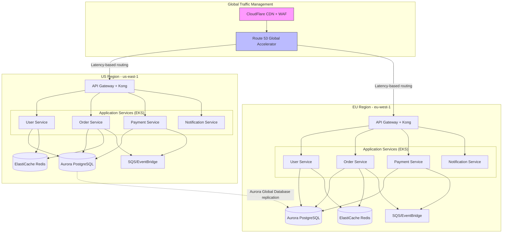

# Architecture Vision

> **See also**: `artifact_descriptions/architecture-vision.md` for complete guidance on TOGAF ADM Phase A, capability modeling, technology radar, and transformation roadmap planning

## Document Metadata

| Field | Value |
|-------|-------|
| **Version** | 2.0.0 |
| **Document ID** | ARCH-VIS-2025-001 |
| **Status** | Approved |
| **Created** | 2025-01-15 |
| **Last Updated** | 2025-01-20 |
| **Next Review** | 2025-Q3 |
| **Document Owner** | Chief Architect |
| **Classification** | Internal - Confidential |
| **Approval Date** | 2025-01-22 |

## Executive Summary

This Architecture Vision defines our strategic transformation from a monolithic, on-premise architecture to a modern, cloud-native, microservices-based platform over a 3-year horizon (2025-2027). The transformation addresses critical business drivers: global market expansion requiring sub-100ms latency worldwide, 10x traffic growth projection, and need for weekly feature releases (vs. current quarterly cycle).

**Strategic Outcomes**:
- **Performance**: p95 latency <200ms globally (current: 1.2s), support 50M+ monthly active users (current: 5M)
- **Availability**: 99.99% SLA (current: 99.5%), <5min RTO for regional failures (current: 4hr RTO)
- **Velocity**: Weekly deployments with zero-downtime (current: quarterly with 4hr maintenance windows)
- **Cost Efficiency**: 35% infrastructure cost reduction through cloud optimization and autoscaling
- **Security**: Zero Trust architecture with mTLS, encryption everywhere, SOC 2 Type II + ISO 27001 compliance

**Investment**: $12M over 3 years ($4M/year) with expected ROI of 240% through revenue enablement, operational efficiency, and cost savings.

**Timeline**: 3-year phased transformation aligned to business roadmap and risk mitigation strategy.

---

## Table of Contents

1. [Business Context & Drivers](#business-context--drivers)
2. [Current State Assessment](#current-state-assessment)
3. [Target State Architecture](#target-state-architecture)
4. [Gap Analysis](#gap-analysis)
5. [Transformation Roadmap](#transformation-roadmap)
6. [Technology Radar](#technology-radar)
7. [Capability Heat Map](#capability-heat-map)
8. [Migration Strategy](#migration-strategy)
9. [Architecture Principles](#architecture-principles)
10. [Quality Attributes & Targets](#quality-attributes--targets)
11. [Investment & ROI](#investment--roi)
12. [Risks & Mitigation](#risks--mitigation)

---

## Business Context & Drivers

### Strategic Business Objectives (2025-2027)

| Objective | Target | Timeline | Architecture Dependency |
|-----------|--------|----------|------------------------|
| Global expansion to APAC & LATAM markets | 15 new countries | 2025-2026 | Multi-region active-active, <100ms latency |
| 10x user growth | 5M → 50M MAU | 2025-2027 | Horizontal scalability, auto-scaling, cost optimization |
| Real-time personalization | 80% of users | 2026-Q2 | Event streaming, ML/AI platform, low-latency data access |
| Mobile-first experience | 70% mobile traffic | 2025-Q4 | API-first, offline support, edge caching |
| Marketplace ecosystem | 500+ third-party apps | 2027-Q1 | Developer platform, API management, multi-tenancy |

### Business Pain Points Driving Transformation

**Customer Experience**:
- **Latency**: International users experience 800ms-2s page load times (target: <200ms p95)
- **Availability**: Monthly outages averaging 4 hours impact 99.5% SLA (target: 99.99%)
- **Mobile Performance**: Mobile app crashes at 3.5% rate (industry standard: <1%)

**Business Agility**:
- **Time to Market**: Quarterly releases prevent rapid feature iteration (target: weekly deployments)
- **A/B Testing**: Limited experimentation capability restricts product optimization
- **Market Responsiveness**: Cannot quickly adapt to market changes or competitor innovations

**Operational Efficiency**:
- **Infrastructure Costs**: Over-provisioned on-premise datacenter at $8M/year with 40% idle capacity
- **Operational Overhead**: 15 engineers managing infrastructure (target: 5 SREs with automation)
- **Technical Debt**: Estimated 18 months of accumulated debt slowing development velocity by 40%

**Security & Compliance**:
- **Audit Compliance**: SOC 2 gaps require significant manual controls and documentation
- **Data Residency**: Cannot meet GDPR data residency without multi-region deployment
- **Zero Trust**: Perimeter security model incompatible with modern hybrid/remote workforce

---

## Current State Assessment

### Current Architecture Overview

```
Legacy Three-Tier Monolithic Architecture (On-Premise)

┌─────────────────────────────────────────────────────┐
│          Load Balancer (F5 BIG-IP)                  │
│     us-east datacenter, single region               │
└─────────────────────────────────────────────────────┘
                      ↓
┌─────────────────────────────────────────────────────┐
│     Application Tier (Monolithic Java/Spring)       │
│  - 8x app servers (over-provisioned, 40% idle)      │
│  - Quarterly deployments, 4hr maintenance window    │
│  - 450K LOC, 12-year-old codebase                   │
└─────────────────────────────────────────────────────┘
                      ↓
┌─────────────────────────────────────────────────────┐
│         Database Tier (Oracle RAC)                  │
│  - Primary + 2 read replicas                        │
│  - No horizontal scalability                        │
│  - 8TB database with query performance degradation  │
└─────────────────────────────────────────────────────┘
```

### Current State Pain Points

| Category | Issue | Impact | Business Cost |
|----------|-------|--------|---------------|
| **Performance** | Monolithic database bottleneck | p95 latency 1.2s | 15% cart abandonment rate |
| **Scalability** | Vertical scaling only | Cannot handle Black Friday traffic | $2M/year in lost revenue |
| **Availability** | Single datacenter SPOF | Quarterly outages 4-6 hours | $500K/outage in revenue loss |
| **Deployment** | Quarterly releases with downtime | Slow feature delivery | Competitive disadvantage |
| **Global Performance** | No CDN, no edge caching | 2s+ latency for APAC/EMEA users | Market expansion blocked |
| **Cost** | Over-provisioned on-premise | $8M/year with 40% idle capacity | $3M/year waste |
| **Security** | Perimeter-based security | No mTLS, no encryption in transit internally | SOC 2 gaps, audit findings |

### Technical Debt Inventory

| Debt Category | Estimated Effort | Risk Level | Priority |
|---------------|------------------|------------|----------|
| Monolithic database schema refactoring | 12 engineer-months | High | P0 (blocks scalability) |
| Legacy authentication system (custom, non-standard) | 6 engineer-months | Critical | P0 (security risk) |
| Synchronous coupling between modules | 8 engineer-months | High | P0 (deployment bottleneck) |
| Lack of observability (no distributed tracing) | 3 engineer-months | Medium | P1 (operational blind spots) |
| Hardcoded configuration (no externalized config) | 4 engineer-months | Medium | P1 (environment promotion issues) |

**Total Technical Debt**: Estimated 33 engineer-months (~$660K assuming $20K/engineer-month loaded cost)

---

## Target State Architecture

### Target State Vision

**Modern Cloud-Native Microservices Architecture on AWS with Multi-Region Active-Active Deployment**



### Core Services (Microservices Decomposition)

Following Domain-Driven Design bounded contexts:

#### Customer Domain

| Service | Responsibility | Technology Stack | Data Store | API Protocol |
|---------|---------------|------------------|------------|--------------|
| **User Service** | User profiles, authentication, authorization | Node.js 20, Express | PostgreSQL 15 + Redis | REST + GraphQL |
| **Preference Service** | User preferences, settings, notifications config | Go 1.21 | PostgreSQL 15 | gRPC |
| **Identity Service** | OAuth 2.0 / OIDC provider, SSO, MFA | Auth0 (managed) | Auth0 managed | OIDC |

#### Commerce Domain

| Service | Responsibility | Technology Stack | Data Store | API Protocol |
|---------|---------------|------------------|------------|--------------|
| **Product Catalog Service** | Product information, search, inventory | Java 17, Spring Boot | PostgreSQL 15 + Elasticsearch | REST |
| **Shopping Cart Service** | Cart management, session state | Redis (in-memory) | Redis Cluster | REST |
| **Order Service** | Order processing, fulfillment workflow | Java 17, Spring Boot | PostgreSQL 15 | REST + Events |
| **Payment Service** | Payment processing, PCI DSS compliance | Python 3.11, FastAPI | PostgreSQL 15 (encrypted) | REST |
| **Pricing Service** | Dynamic pricing, promotions, discounts | Python 3.11, FastAPI | PostgreSQL 15 + Redis | gRPC |

---

## Transformation Roadmap

### 3-Year Phased Migration Strategy

```
2025                          2026                          2027
Q1   Q2   Q3   Q4   |   Q1   Q2   Q3   Q4   |   Q1   Q2   Q3   Q4
━━━━━━━━━━━━━━━━━━━━━━━━━━━━━━━━━━━━━━━━━━━━━━━━━━━━━━━━━━━━━━━━

Phase 1: Foundation & Pilot
├─ AWS landing zone setup
├─ CI/CD pipelines (GitHub Actions)
├─ Observability stack (Datadog)
├─ First microservice: User Service
└─ Strangler Fig pattern initiation

Phase 2: Core Services Migration
├─ Order Service migration
├─ Payment Service (PCI DSS compliance)
├─ Product Catalog Service
├─ API Gateway (Kong) deployment
├─ Service mesh (Istio) rollout
└─ Database migration (Oracle → PostgreSQL)

Phase 3: Multi-Region & Scale
├─ EU region deployment (eu-west-1)
├─ Active-active configuration
├─ Event streaming (Kafka MSK)
├─ Aurora Global Database
├─ Advanced caching strategy
└─ Decommission remaining monolith

Phase 4: Innovation & Optimization
├─ ML/AI platform (SageMaker)
├─ Real-time personalization
├─ Developer platform & API marketplace
├─ FinOps optimization
├─ On-premise datacenter decommission
└─ SOC 2 Type II + ISO 27001 certification
```

---

## Technology Radar

Following ThoughtWorks Technology Radar model with quarterly updates:

### Adopt (Use for new projects)

| Technology | Category | Rationale |
|------------|----------|-----------|
| **Kubernetes (EKS)** | Platform | Industry standard for container orchestration |
| **PostgreSQL 15** | Data Store | Open-source, mature, Aurora for managed service |
| **Redis 7 (ElastiCache)** | Cache | High-performance caching, clustering support |
| **Istio** | Service Mesh | mTLS, observability, traffic management |
| **Kong Gateway** | API Management | Open-source, extensible, Kubernetes-native |
| **Terraform** | IaC | Multi-cloud, mature ecosystem, GitOps friendly |
| **GitHub Actions** | CI/CD | Native GitHub integration, cost-effective |
| **Datadog** | Observability | APM, logs, metrics unified platform |
| **Auth0** | Identity | Managed OIDC/OAuth, reduces security burden |

### Trial (Pilot projects, gain experience)

| Technology | Category | Rationale |
|------------|----------|-----------|
| **Apache Kafka (MSK)** | Event Streaming | Proven at scale, evaluating vs. EventBridge |
| **GraphQL (Apollo)** | API | Flexible querying for mobile/web clients |
| **gRPC** | Service Communication | High-performance internal APIs |
| **Argo CD** | GitOps | Kubernetes-native continuous delivery |
| **SageMaker** | ML Platform | Managed ML, but evaluating complexity vs. benefit |

### Hold (Avoid for new projects)

| Technology | Category | Rationale |
|------------|----------|-----------|
| **Oracle Database** | Data Store | Expensive licensing, vendor lock-in, migrating away |
| **Java Spring 4** | Framework | Unsupported, migrating to Spring Boot 3 |
| **F5 BIG-IP** | Load Balancer | Hardware dependency, replaced by cloud-native |
| **Memcached** | Cache | Limited features vs. Redis, not using |
| **Nagios** | Monitoring | Legacy, poor UX, replaced by Datadog |

---

## Capability Heat Map

Visual representation of capability maturity across business domains:

| Business Capability | Current Maturity | Target Maturity | Gap | Priority | Investment |
|---------------------|-----------------|----------------|-----|----------|------------|
| **User Management** | Developing (2) | Optimized (5) | 3 | P0 | $800K |
| **Order Processing** | Developing (2) | Optimized (5) | 3 | P0 | $1.2M |
| **Payment Processing** | Developing (2) | Managed (4) | 2 | P0 | $1M |
| **Product Catalog** | Developing (2) | Optimized (5) | 3 | P0 | $900K |
| **API Management** | Initial (1) | Optimized (5) | 4 | P0 | $500K |
| **DevOps / CI/CD** | Developing (2) | Optimized (5) | 3 | P0 | $600K |
| **Security (Zero Trust)** | Developing (2) | Optimized (5) | 3 | P0 | $900K |
| **Multi-Region DR** | Initial (1) | Managed (4) | 3 | P0 | $2M |

**Legend**: 1=Initial | 2-3=Developing | 4-5=Managed/Optimized (CMM Levels)

---

## Migration Strategy

### Strangler Fig Pattern

Incremental replacement of monolith functionality following Martin Fowler's Strangler Fig pattern:

```
Migration Approach:

┌──────────────────────────────────────────────────────────┐
│               API Gateway (Routing Layer)                │
│    Routes traffic to monolith OR microservice            │
└──────────────────────────────────────────────────────────┘
                ↓                           ↓
        ┌───────────────┐          ┌───────────────────┐
        │   Monolith    │          │  Microservices    │
        │  (Shrinking)  │          │   (Growing)       │
        └───────────────┘          └───────────────────┘
                ↓                           ↓
        ┌───────────────┐          ┌───────────────────┐
        │  Oracle DB    │  ←─CDC─→ │  PostgreSQL DBs   │
        │ (Read-only)   │          │  (Primary Write)  │
        └───────────────┘          └───────────────────┘

Phase 1: Route 10% traffic to User Service (microservice)
Phase 2: Route 50% traffic after validation
Phase 3: Route 100% traffic, monolith retired
```

---

## Architecture Principles

Following TOGAF architecture principles framework:

### Business Principles

1. **Business Continuity**: Architecture must support 99.99% availability with <5min RTO
2. **Customer Experience First**: p95 latency <200ms globally, optimize for mobile
3. **Regulatory Compliance**: GDPR, PCI DSS, SOC 2, ISO 27001 compliance by design
4. **Data-Driven Decision Making**: Real-time analytics and experimentation capabilities

### Data Principles

5. **Data is an Asset**: Treat data as strategic asset with proper governance and quality
6. **Single Source of Truth**: Each data domain has authoritative source service
7. **Privacy by Design**: PII minimization, encryption, data residency compliance
8. **Data Portability**: Standard formats, avoid vendor lock-in, export capabilities

### Application Principles

9. **API-First**: All functionality exposed via well-documented, versioned APIs
10. **Service Autonomy**: Microservices own data, deployable independently
11. **Resilience by Design**: Circuit breakers, retries, graceful degradation, chaos engineering
12. **Observability Built-In**: Structured logging, distributed tracing, metrics for all services

### Technology Principles

13. **Cloud-Native First**: Leverage managed services, avoid undifferentiated heavy lifting
14. **Open Standards**: Prefer open-source and standards over proprietary solutions
15. **Automation Over Manual**: GitOps, IaC, automated testing, self-service platforms
16. **Security as Code**: Shift-left security, automated compliance checks, policy-as-code

---

## Quality Attributes & Targets

Using ISO 25010 quality model with measurable SEI quality attribute scenarios:

### Performance Efficiency

| Scenario | Stimulus | Response | Measure (Current → Target) |
|----------|----------|----------|---------------------------|
| **Page Load** | User requests homepage from US | Page fully rendered | p95: 1.2s → 200ms |
| **API Response** | Mobile app calls order API | Order details returned | p95: 800ms → 150ms |
| **Search Latency** | User searches for "shoes" | Results displayed | p95: 1.5s → 100ms |
| **Throughput** | Black Friday peak traffic | System processes requests | 5K RPS → 50K RPS |

**Tactics**: Horizontal auto-scaling, Redis caching, CDN, database read replicas, Elasticsearch

### Reliability

| Scenario | Stimulus | Response | Measure (Current → Target) |
|----------|----------|----------|---------------------------|
| **Uptime** | Normal operations | System available | 99.5% → 99.99% (43.2 min/year) |
| **Regional Failure** | AWS region outage | Automatic failover to healthy region | RTO: 4 hours → 5 minutes |
| **Data Durability** | Disaster scenario | Data recoverable | RPO: 15 min → 1 minute |
| **Service Failure** | Microservice crashes | Graceful degradation, no cascading failure | 0 data loss, degraded mode |

**Tactics**: Multi-region active-active, Aurora Global Database, circuit breakers, health checks

---

## Investment & ROI

### Total Cost of Ownership (TCO)

**Current State (On-Premise)**:
- Infrastructure: $8M/year (datacenter, servers, network, storage)
- Licensing: $2M/year (Oracle, F5, monitoring tools)
- Personnel: $3M/year (15 infrastructure engineers, 10 developers)
- **Total**: $13M/year

**Target State (Cloud-Native AWS)**:
- AWS Infrastructure: $5M/year (compute, storage, network, managed services)
- Licensing: $800K/year (Datadog, Auth0, Kong enterprise, minor tools)
- Personnel: $2M/year (5 SREs, 15 developers with higher productivity)
- **Total**: $7.8M/year

**Annual Savings**: $5.2M/year (40% reduction)

### ROI Calculation

**Revenue Impact**:
- Market expansion enabled: $15M additional revenue/year (APAC + LATAM markets)
- Reduced cart abandonment (faster checkout): $3M/year
- Uptime improvement (fewer outages): $2M/year
- **Total Revenue Impact**: $20M/year

**Cost Savings**:
- Infrastructure cost reduction: $5.2M/year
- Operational efficiency: $1M/year (reduced manual operations)
- **Total Cost Savings**: $6.2M/year

**Net Benefit**: $20M (revenue) + $6.2M (cost savings) = $26.2M/year

**ROI**: ($26.2M × 3 years - $12M initial investment) / $12M = **553% over 3 years**

---

## Risks & Mitigation

### Strategic Risks

| Risk | Likelihood | Impact | Mitigation Strategy |
|------|-----------|--------|-------------------|
| **Cloud vendor lock-in** | High | Medium | Multi-cloud abstraction layer (Terraform), avoid proprietary services, document exit strategy |
| **Skills shortage (cloud/microservices)** | High | High | Hire 5 senior engineers with cloud expertise, $200K training budget, pair programming |
| **Transformation fatigue** | Medium | High | Phased approach, celebrate milestones, transparent communication, executive sponsorship |

### Technical Risks

| Risk | Likelihood | Impact | Mitigation Strategy |
|------|-----------|--------|-------------------|
| **Data migration failure** | Medium | Critical | CDC with Debezium, dual-write phase, extensive validation, rollback plan, dry runs |
| **Performance degradation** | High | High | Load testing, gradual traffic shift, feature flags, automated rollback, SLO monitoring |
| **Security vulnerabilities** | Medium | Critical | Penetration testing, bug bounty, third-party audits, security champions, shift-left |

---

## References

**Enterprise Architecture Frameworks**:
- TOGAF 9.2 ADM Phase A (Architecture Vision)
- AWS Well-Architected Framework
- Cloud Adoption Framework (AWS CAF)

**Architecture Patterns**:
- Martin Fowler - Microservices Patterns, Strangler Fig Pattern
- Chris Richardson - Microservices.io
- Domain-Driven Design (Eric Evans)

**Quality Frameworks**:
- ISO/IEC 25010 (Software Quality Model)
- SEI Quality Attribute Workshop

---

## Document Control

| Field | Value |
|-------|-------|
| **Document ID** | ARCH-VIS-2025-001 |
| **Version** | 2.0 (Approved) |
| **Created** | 2025-01-15 |
| **Last Updated** | 2025-01-20 |
| **Next Review** | 2025-Q3 (Quarterly reviews) |
| **Owner** | Chief Architect |
| **Approver** | CTO |
| **Classification** | Internal - Confidential |

---

**End of Architecture Vision Document**

*This architecture vision is a living document updated quarterly to reflect technology evolution, business priorities, and lessons learned during transformation.*
