# Capability Model

**Document Version:** 1.0.0
**Last Updated:** 2024-01-15
**Status:** Draft
**Owner:** [Enterprise Architecture Team]
**Classification:** Internal

---

## Executive Summary

This capability model defines and organizes business capabilities independent of organizational structure, processes, or technology implementation. It provides a business-oriented view of what the organization does or needs to do, enabling strategic planning, investment prioritization, and architecture alignment across enterprise initiatives.

**Organization:** [Enterprise or Business Unit name]

**Business Context:** [Industry sector and strategic focus]

**Modeling Framework:** Business Capability Mapping aligned with TOGAF and Business Architecture Guild standards

---

## Table of Contents

1. [Capability Model Overview](#capability-model-overview)
2. [Level 1 Capabilities (Strategic)](#level-1-capabilities-strategic)
3. [Level 2 Capabilities (Operational)](#level-2-capabilities-operational)
4. [Level 3 Capabilities (Tactical)](#level-3-capabilities-tactical)
5. [Capability Definitions](#capability-definitions)
6. [Capability Maturity Assessment](#capability-maturity-assessment)
7. [Capability Heat Maps](#capability-heat-maps)
8. [Application Mapping](#application-mapping)
9. [Investment Priorities](#investment-priorities)
10. [Roadmap](#roadmap)

---

## Capability Model Overview

### What is a Business Capability?

> A business capability represents **what** an organization does or needs to do to execute its business model and strategy, independent of **how** it does it (processes), **who** does it (organization), or **where** it's done (locations).

**Key Characteristics:**
- **Stable:** Capabilities change slowly over time (organizational changes don't affect capabilities)
- **Outcome-Focused:** Defined by business outcomes, not implementation details
- **Business Language:** Named using terms business stakeholders understand
- **Technology-Agnostic:** Independent of current technology choices
- **Hierarchical:** Organized in logical parent-child decomposition

### Purpose & Benefits

**Strategic Planning:**
- Identify capability gaps preventing strategic objectives
- Prioritize investments based on capability maturity and business value
- Align technology initiatives with business needs

**Portfolio Management:**
- Map applications to capabilities they support
- Identify redundancy and rationalization opportunities
- Guide build vs. buy vs. partner decisions

**Architecture Alignment:**
- Ensure solutions support required capabilities consistently
- Define service boundaries aligned with capability model
- Guide microservices decomposition

### Capability Hierarchy

**Decomposition Levels:**
- **Level 1:** Strategic capabilities visible to executives (6-12 capabilities)
- **Level 2:** Operational capabilities owned by business units (30-60 capabilities)
- **Level 3:** Tactical capabilities executed by teams (100-200 capabilities)
- **Level 4+:** Optional further decomposition for complex domains

---

## Level 1 Capabilities (Strategic)

### Capability Taxonomy - Level 1

### Level 1 Capability Descriptions

| Capability Name | Description | Business Value | Owner |
|----------------|-------------|----------------|--------|
| **Marketing & Customer Acquisition** | Attract, engage, and convert prospects into customers through targeted campaigns and brand management | Drive revenue growth through new customer acquisition | CMO |
| **Sales & Channel Management** | Manage sales processes, partner channels, and customer relationships to close deals | Maximize revenue conversion and channel effectiveness | CSO |
| **Customer Service & Support** | Deliver post-sale support, handle inquiries, and ensure customer satisfaction | Retain customers and build loyalty through excellent service | CCO |
| **Product & Service Management** | Define, develop, and manage product portfolio based on market needs | Ensure competitive product offerings that meet customer demands | CPO |
| **Order Fulfillment** | Process orders, manage inventory, and deliver products/services to customers | Deliver on customer promises efficiently and accurately | COO |
| **Supply Chain Management** | Source materials, manage suppliers, and coordinate logistics | Optimize costs while ensuring supply reliability | COO |
| **Financial Management** | Manage budgeting, accounting, reporting, and financial planning | Ensure financial health and regulatory compliance | CFO |
| **Human Capital Management** | Recruit, develop, and retain talent to support business objectives | Build organizational capability through great people | CHRO |
| **Technology Management** | Provide and manage technology platforms, infrastructure, and data | Enable business capabilities through technology | CIO/CTO |
| **Risk & Compliance** | Identify, assess, and mitigate risks; ensure regulatory compliance | Protect enterprise value and maintain license to operate | CRO |
| **Strategy & Planning** | Define strategic direction, set objectives, and allocate resources | Align organization toward shared goals | CEO |

---

## Level 2 Capabilities (Operational)

### Example: Marketing & Customer Acquisition (Level 2 Decomposition)

### Example: Order Fulfillment (Level 2 Decomposition)

### Level 2 Capability Catalog

| L1 Capability | L2 Capability | Description | Key Processes | Success Metrics |
|--------------|---------------|-------------|---------------|-----------------|
| **Marketing & Customer Acquisition** | Brand Management | Build and maintain brand identity, reputation, and positioning | Brand strategy, trademark management, brand guidelines | Brand awareness, Net Promoter Score |
| | Campaign Management | Plan, execute, and measure marketing campaigns across channels | Campaign planning, execution, measurement | Campaign ROI, lead generation |
| | Digital Marketing | Leverage digital channels (web, social, email) for customer engagement | SEO, SEM, email marketing, social media | Website traffic, conversion rate |
| | Marketing Analytics | Measure marketing effectiveness and customer insights | Attribution analysis, customer segmentation, reporting | Marketing-attributed revenue |
| **Order Fulfillment** | Order Capture | Accept and record customer orders across all channels | Order entry, order confirmation, order tracking | Order capture time, error rate |
| | Order Validation | Verify order details, pricing, and business rules | Credit check, fraud detection, inventory check | Validation success rate |
| | Payment Processing | Collect and process customer payments securely | Payment authorization, capture, settlement | Payment success rate, PCI compliance |
| | Inventory Allocation | Reserve inventory and determine fulfillment location | Stock reservation, warehouse selection | Fill rate, allocation time |
| | Picking & Packing | Locate, pick, pack, and prepare orders for shipment | Pick list generation, packing, labeling | Pick accuracy, packing time |
| | Shipping & Delivery | Coordinate carrier shipment and track delivery | Carrier selection, label creation, tracking | On-time delivery, shipping cost |
| | Returns & Refunds | Process product returns and issue refunds | Return authorization, refund processing | Return processing time, refund accuracy |

---

## Level 3 Capabilities (Tactical)

### Example: Payment Processing (Level 3 Decomposition)

### Level 3 Capability Details

| L2 Capability | L3 Capability | Description | Systems | Data |
|--------------|---------------|-------------|---------|------|
| **Payment Processing** | Payment Authorization | Request authorization from payment network to charge customer | Payment Gateway, Fraud Service | Card details, transaction amount, merchant ID |
| | Payment Capture | Collect authorized funds from customer account | Payment Gateway, Settlement System | Authorization code, order ID, amount |
| | Settlement & Reconciliation | Settle transactions and reconcile with bank statements | Settlement System, GL | Transaction records, bank statements |
| | Fraud Detection | Identify and prevent fraudulent transactions | Fraud Detection System, ML Models | Transaction patterns, customer history, device fingerprints |
| | Refund Processing | Return funds to customer for returned or cancelled orders | Payment Gateway, Order System | Original transaction, refund amount, reason |
| | Recurring Billing | Automatically charge customers on subscription schedule | Subscription Management, Payment Gateway | Subscription plan, billing cycle, payment method |

---

## Capability Definitions

### Capability Definition Template

Use this template for each Level 2 capability:

#### Capability: Order Validation

**Capability ID:** ORD-002

**Parent Capability:** Order Fulfillment (ORD-000)

**Description:**
Verify that customer orders are complete, accurate, and valid before processing. Ensure inventory availability, pricing correctness, credit worthiness, and fraud risk assessment.

**Business Value:**
- Reduce order errors and downstream fulfillment issues
- Prevent fraudulent orders before financial loss
- Improve customer satisfaction through accurate order confirmation
- Minimize operational costs from order corrections

**Capability Components:**
1. **Credit Check:** Verify customer creditworthiness for B2B orders
2. **Fraud Detection:** Assess fraud risk score and flag suspicious orders
3. **Inventory Verification:** Confirm product availability across warehouses
4. **Pricing Validation:** Verify pricing, discounts, and promotions are correctly applied
5. **Address Validation:** Validate shipping address is deliverable
6. **Business Rules:** Apply business-specific validation rules (order limits, restricted products)

**Key Stakeholders:**
- **Business Owner:** VP of Operations
- **Process Owner:** Order Management Director
- **Key Users:** Order Entry Clerks, Customer Service Representatives
- **IT Owner:** E-Commerce Platform Team

**Success Metrics:**

| Metric | Current | Target | Measurement Frequency |
|--------|---------|--------|----------------------|
| Validation accuracy | 94% | 99% | Daily |
| Avg validation time | 8 seconds | 3 seconds | Real-time |
| False positive rate (fraud) | 12% | 5% | Weekly |
| Order rejection rate | 8% | 3% | Daily |

**Enabling Processes:**
- Order Entry & Validation Process
- Credit Approval Process
- Fraud Review Process
- Inventory Allocation Process

**Supporting Applications:**

| Application | Purpose | Criticality | Replacement Plan |
|-------------|---------|-------------|------------------|
| Order Management System | Core order validation | Critical | Modernize 2025 |
| Fraud Detection Service | Fraud risk scoring | High | Upgrade ML models Q2 |
| Credit Check Service | B2B credit verification | Medium | SaaS migration 2024 |
| Inventory Management System | Stock availability | Critical | Cloud migration 2024 |

**Data Dependencies:**

| Data Entity | Source System | Quality | Governance |
|-------------|--------------|---------|------------|
| Customer Credit Score | Credit Bureau API | High | Finance owns |
| Product Inventory Levels | Warehouse Management | Medium | Operations owns |
| Pricing & Promotions | Product Catalog | High | Product owns |
| Fraud Rules | Fraud Detection | High | Risk owns |

**Regulatory Requirements:**
- PCI DSS: Secure handling of payment data during validation
- CCPA/GDPR: Customer data processing consent and privacy
- Consumer Protection: Accurate pricing and terms disclosure

**Current State Assessment:**

**Maturity Level:** 3 - Defined
- Standardized validation process across channels
- Automated fraud detection with manual review
- Integrated with core systems
- Gaps: Slow validation time, high false positives, limited ML

**Pain Points:**
- Manual fraud review creates bottleneck (4-6 hour delay)
- Legacy credit check system causes timeouts (20% failure rate)
- No real-time inventory visibility across warehouses
- Pricing validation errors during promotions (5% error rate)

**Improvement Opportunities:**
1. Implement ML-based fraud detection to reduce false positives
2. Replace credit check system with modern API-based service
3. Real-time inventory visibility across all fulfillment locations
4. Automated pricing validation with rules engine

**Target State Vision:**

**Maturity Level:** 5 - Optimizing
- Sub-second validation across all channels
- AI/ML fraud detection with <2% false positive rate
- Real-time inventory across global network
- Self-service credit approval for low-risk customers
- Continuous optimization through data analytics

**Gap Analysis:**

| Capability Component | Current State | Target State | Gap | Priority |
|---------------------|---------------|--------------|-----|----------|
| Credit Check | Legacy batch system | Real-time API | High | P1 |
| Fraud Detection | Rule-based + manual | ML-based automated | Medium | P1 |
| Inventory Verification | Daily sync | Real-time event-driven | High | P2 |
| Pricing Validation | Static rules | Dynamic rules engine | Medium | P3 |
| Address Validation | Basic check | AI-powered validation | Low | P4 |

**Investment Requirements:**

| Initiative | Est. Cost | Timeline | Dependencies |
|-----------|-----------|----------|--------------|
| ML Fraud Detection | $500K | 6 months | Data platform ready |
| Credit API Migration | $200K | 3 months | Vendor selection |
| Real-Time Inventory | $750K | 9 months | Event bus infrastructure |
| Pricing Rules Engine | $300K | 4 months | Product catalog modernization |

**Total Investment:** $1.75M over 12 months

**Expected Benefits:**
- Order validation time reduced from 8s to 2s (75% improvement)
- Fraud false positives reduced from 12% to 2% (83% improvement)
- Manual fraud review volume reduced by 80%
- Order rejection rate reduced from 8% to 3%
- Operational cost savings: $1.2M annually
- Customer satisfaction improvement: +15 NPS points

**ROI:** Break-even in 18 months, 3-year NPV of $2.8M

---

## Capability Maturity Assessment

### Maturity Model Framework

**Level 1 - Initial (Ad-Hoc)**
- No standardized processes
- Success depends on individual heroics
- Unpredictable results
- Firefighting mode

**Level 2 - Repeatable**
- Basic processes documented
- Success can be repeated for similar work
- Discipline to track cost and schedule
- Earlier successes can be replicated

**Level 3 - Defined**
- Processes standardized and documented
- All projects use approved, tailored versions
- Processes are integrated and consistent
- Proactive management

**Level 4 - Managed**
- Quantitative quality goals set
- Detailed process and product quality metrics
- Processes and products quantitatively understood
- Predictable performance

**Level 5 - Optimizing**
- Continuous process improvement
- Quantitative feedback from process
- Piloting innovative ideas and technologies
- Industry-leading performance

### Capability Maturity Heatmap

### Maturity Assessment by Capability

| Capability | Current Maturity | People | Process | Technology | Data | Target Maturity | Gap | Priority |
|-----------|-----------------|--------|---------|------------|------|----------------|-----|----------|
| **Marketing & Customer Acquisition** | 4 - Managed | 4 | 4 | 5 | 3 | 5 - Optimizing | 1 | Medium |
| Brand Management | 4 | 5 | 4 | 4 | 3 | 5 | 1 | Low |
| Campaign Management | 4 | 4 | 4 | 5 | 4 | 5 | 1 | Medium |
| Digital Marketing | 5 | 5 | 5 | 5 | 4 | 5 | 0 | N/A |
| Marketing Analytics | 3 | 3 | 3 | 4 | 2 | 5 | 2 | High |
| **Sales & Channel Management** | 3 - Defined | 3 | 3 | 3 | 2 | 4 - Managed | 1 | High |
| Opportunity Management | 3 | 4 | 3 | 3 | 2 | 4 | 1 | High |
| Quote Management | 2 | 3 | 2 | 2 | 2 | 4 | 2 | High |
| Partner Management | 3 | 3 | 3 | 3 | 2 | 4 | 1 | Medium |
| **Order Fulfillment** | 3 - Defined | 3 | 3 | 3 | 3 | 4 - Managed | 1 | High |
| Order Capture | 4 | 3 | 4 | 4 | 3 | 5 | 1 | Medium |
| Order Validation | 3 | 3 | 3 | 3 | 3 | 5 | 2 | High |
| Payment Processing | 4 | 4 | 4 | 4 | 4 | 5 | 1 | Medium |
| Inventory Allocation | 2 | 2 | 2 | 2 | 2 | 4 | 2 | Critical |
| Shipping & Delivery | 3 | 3 | 3 | 3 | 3 | 4 | 1 | Medium |

**Assessment Dimensions:**

**People:**
- 1: Untrained, ad-hoc skillset
- 2: Basic training provided
- 3: Certified professionals with defined roles
- 4: Cross-trained experts with succession planning
- 5: Industry-leading talent with continuous learning

**Process:**
- 1: No defined process
- 2: Basic process documented
- 3: Standardized across organization
- 4: Quantitatively managed with metrics
- 5: Continuously optimized with automation

**Technology:**
- 1: Manual or spreadsheets
- 2: Basic departmental tools
- 3: Integrated enterprise systems
- 4: Automated with analytics
- 5: AI/ML-enabled, self-optimizing

**Data:**
- 1: No data or poor quality
- 2: Basic data capture
- 3: Clean data with governance
- 4: Analytics-ready with insights
- 5: Real-time, predictive data platform

---

## Capability Heat Maps

### Performance Heat Map

> Shows current performance level for each capability (Red = Poor, Yellow = Acceptable, Green = Excellent)

```mermaid
graph TB
    subgraph "Performance Assessment"
        subgraph "Customer Capabilities"
            M1[Marketing<br/>🟢 Excellent]
            S1[Sales<br/>🟡 Acceptable]
            CS1[Service<br/>🔴 Poor]
        end

        subgraph "Operations"
            P1[Product<br/>🟢 Excellent]
            O1[Orders<br/>🟡 Acceptable]
            SC1[Supply Chain<br/>🟢 Excellent]
        end

        subgraph "Support"
            F1[Finance<br/>🟢 Excellent]
            H1[HR<br/>🔴 Poor]
            I1[IT<br/>🟡 Acceptable]
        end
    end
```

### Risk Heat Map

> Shows business risk if capability fails (Red = Critical, Yellow = High, Green = Low)

```mermaid
graph TB
    subgraph "Business Risk Assessment"
        subgraph "Customer Capabilities"
            M2[Marketing<br/>🟡 High Risk]
            S2[Sales<br/>🔴 Critical Risk]
            CS2[Service<br/>🟡 High Risk]
        end

        subgraph "Operations"
            P2[Product<br/>🔴 Critical Risk]
            O2[Orders<br/>🔴 Critical Risk]
            SC2[Supply Chain<br/>🔴 Critical Risk]
        end

        subgraph "Support"
            F2[Finance<br/>🔴 Critical Risk]
            H2[HR<br/>🟡 High Risk]
            I2[IT<br/>🔴 Critical Risk]
        end
    end
```

### Investment Heat Map

> Shows current investment level (Red = Under-invested, Yellow = Adequate, Green = Well-funded)

```mermaid
graph TB
    subgraph "Investment Assessment"
        subgraph "Customer Capabilities"
            M3[Marketing<br/>🟢 Well-funded]
            S3[Sales<br/>🟡 Adequate]
            CS3[Service<br/>🔴 Under-invested]
        end

        subgraph "Operations"
            P3[Product<br/>🟢 Well-funded]
            O3[Orders<br/>🔴 Under-invested]
            SC3[Supply Chain<br/>🟡 Adequate]
        end

        subgraph "Support"
            F3[Finance<br/>🟡 Adequate]
            H3[HR<br/>🔴 Under-invested]
            I3[IT<br/>🟡 Adequate]
        end
    end
```

### Priority Matrix

> Combines performance and risk to identify investment priorities

| Capability | Performance | Risk | Investment | Priority Action |
|-----------|-------------|------|------------|----------------|
| Customer Service | 🔴 Poor | 🟡 High | 🔴 Under-invested | **Critical:** Immediate investment required |
| Order Fulfillment | 🟡 Acceptable | 🔴 Critical | 🔴 Under-invested | **Critical:** High priority for 2024 |
| HR Management | 🔴 Poor | 🟡 High | 🔴 Under-invested | **High:** Strategic hire and tools needed |
| Sales Management | 🟡 Acceptable | 🔴 Critical | 🟡 Adequate | **Medium:** Optimize existing investments |
| Marketing | 🟢 Excellent | 🟡 High | 🟢 Well-funded | **Maintain:** Continue current trajectory |
| Supply Chain | 🟢 Excellent | 🔴 Critical | 🟡 Adequate | **Monitor:** Ensure continued performance |

---

## Application Mapping

### Application Portfolio to Capability Mapping

### Application-Capability Matrix

| Application | Order Fulfillment | Inventory Mgmt | Payment Processing | Customer Mgmt | Finance | Status | Replacement Plan |
|-------------|-------------------|----------------|-------------------|---------------|---------|--------|------------------|
| **Order Management System** | Primary | Supporting | Supporting | Supporting | None | Keep | Modernize 2025 |
| **Warehouse Management** | Supporting | Primary | None | None | None | Keep | Cloud migrate 2024 |
| **Payment Gateway (Stripe)** | Supporting | None | Primary | None | None | Keep | No change |
| **CRM (Salesforce)** | None | None | None | Primary | None | Keep | Expand features |
| **ERP (SAP)** | Supporting | Supporting | None | None | Primary | Tolerate | Phased retirement 2026 |
| **Legacy Credit System** | Supporting | None | None | None | None | Retire | Replace Q2 2024 |
| **Fraud Detection** | Supporting | None | Supporting | None | None | Keep | Upgrade ML Q3 2024 |

**Application Status Definitions:**
- **Keep:** Strategic application, continued investment
- **Tolerate:** Non-strategic but necessary, minimal investment
- **Retire:** End-of-life, plan replacement
- **Invest:** Strategic growth area, increase investment

### Capability Coverage Analysis

| Capability | # Applications Supporting | Primary App | Coverage Rating | Redundancy | Risk |
|-----------|---------------------------|-------------|-----------------|------------|------|
| Order Capture | 2 | OMS | Good | Low | Low |
| Order Validation | 1 | OMS | Adequate | None | Medium |
| Payment Processing | 2 | Payment Gateway | Good | Low | Low |
| Inventory Allocation | 3 | WMS | Excellent | High | Low |
| Shipping & Delivery | 2 | Carrier Integration | Good | Low | Medium |
| Customer Support | 1 | CRM | Good | None | Medium |
| Financial Reporting | 4 | ERP | Poor (Too many) | Excessive | High |

**Coverage Ratings:**
- **Poor:** No application or excessive fragmentation
- **Adequate:** Single application with gaps
- **Good:** Well-supported with appropriate redundancy
- **Excellent:** Comprehensive coverage with resilience

**Findings:**
1. **Under-Coverage:** Order Validation relies on single system (OMS) with no backup
2. **Over-Coverage:** Financial Reporting fragmented across 4 systems creating reconciliation issues
3. **Retirement Risk:** Legacy Credit System supports critical Order Validation capability
4. **Single Point of Failure:** CRM is sole system for Customer Support capability

---

## Investment Priorities

### Investment Strategy Framework

**Strategic Capabilities** (Core Domain - Competitive Advantage)
- **Goal:** Industry-leading maturity (Level 5)
- **Investment:** High - Build custom, innovate
- **Examples:** Product Innovation, Customer Experience

**Supporting Capabilities** (Supporting Subdomain - Necessary but Not Differentiating)
- **Goal:** Market parity (Level 3-4)
- **Investment:** Medium - Buy or build standard
- **Examples:** Order Processing, Inventory Management

**Generic Capabilities** (Generic Subdomain - Commodity)
- **Goal:** Cost efficiency (Level 2-3)
- **Investment:** Low - Buy SaaS, outsource
- **Examples:** Payroll, Email

### 2024 Investment Priorities

### Investment Allocation by Capability

| Capability | Strategic Classification | 2024 Budget | 2025 Plan | 2026 Plan | 3-Year Total |
|-----------|-------------------------|-------------|-----------|-----------|--------------|
| **Order Fulfillment** | Supporting | $3.2M | $1.8M | $800K | $5.8M |
| Order Validation | Supporting | $1.75M | $500K | - | $2.25M |
| Inventory Allocation | Supporting | $1.2M | $1M | $500K | $2.7M |
| Shipping Integration | Supporting | $250K | $300K | $300K | $850K |
| **Customer Service** | Strategic | $2.5M | $2M | $1.5M | $6M |
| Support Platform | Strategic | $2M | $1.5M | $1M | $4.5M |
| Self-Service | Strategic | $500K | $500K | $500K | $1.5M |
| **Sales Management** | Supporting | $800K | $1.2M | $600K | $2.6M |
| CRM Enhancement | Supporting | $800K | $1.2M | $600K | $2.6M |
| **Marketing** | Strategic | $600K | $800K | $1M | $2.4M |
| Analytics Platform | Strategic | $600K | $800K | $1M | $2.4M |
| **Technology Infrastructure** | Generic | $1.5M | $2M | $1.5M | $5M |
| Cloud Migration | Generic | $1M | $1.5M | $1M | $3.5M |
| Security & Compliance | Generic | $500K | $500K | $500K | $1.5M |
| **Total** | | **$8.6M** | **$7.8M** | **$5.4M** | **$21.8M** |

### Business Case Summary

| Initiative | Capability | Investment | Annual Benefit | Payback | 3-Yr NPV |
|-----------|-----------|------------|----------------|---------|----------|
| Order Validation Modernization | Order Fulfillment | $1.75M | $1.2M | 18 mo | $2.8M |
| Customer Service Platform | Customer Service | $2.5M | $1.8M | 20 mo | $3.5M |
| Real-Time Inventory | Inventory Management | $1.2M | $900K | 16 mo | $2.1M |
| Sales CRM Enhancement | Sales Management | $800K | $500K | 19 mo | $1.1M |
| Marketing Analytics | Marketing Analytics | $600K | $400K | 18 mo | $850K |

---

## Roadmap

### 3-Year Capability Evolution Roadmap

### Quarterly Milestones (2024)

**Q1 2024:**
- Order Validation: Complete requirements and vendor selection
- Customer Service: Platform procurement and architecture design
- Real-Time Inventory: Event bus infrastructure deployment
- Sales CRM: Feature prioritization workshop

**Q2 2024:**
- Order Validation: ML fraud detection deployment
- Customer Service: Platform implementation kickoff
- Real-Time Inventory: Pilot with 2 warehouses
- Sales CRM: Phase 1 features in production

**Q3 2024:**
- Order Validation: Credit API migration complete
- Customer Service: Core features in beta
- Real-Time Inventory: Rollout to all fulfillment centers
- Marketing Analytics: Platform selection

**Q4 2024:**
- Order Validation: Production deployment and optimization
- Customer Service: Platform production launch
- Real-Time Inventory: Optimization and advanced features
- Sales CRM: Phase 2 features deployment

### Target State Capability Map (2026)

---

## Example 1: Retail Enterprise Capability Model

### Context

**Industry:** Omnichannel Retail
**Revenue:** $5B annually
**Employees:** 10,000
**Stores:** 500 physical + e-commerce

### Level 1 Capability Map

### Key Capability Details

**Omnichannel Sales:**
- **Components:** E-Commerce, Mobile App, Physical Stores, Call Center, Social Commerce
- **Maturity:** Level 4 (Managed)
- **Strategic Priority:** High - Core differentiator
- **Investment:** $10M over 3 years for unified commerce platform

**Order Fulfillment:**
- **Components:** Ship from Store, Buy Online Pickup In-Store (BOPIS), Home Delivery, Returns Anywhere
- **Maturity:** Level 3 (Defined)
- **Strategic Priority:** High - Customer expectation
- **Investment:** $8M for real-time inventory and intelligent routing

---

## Example 2: Financial Services Capability Model

### Context

**Industry:** Commercial Banking
**Assets:** $100B
**Customers:** 5M retail, 50K business
**Branches:** 200

### Level 1 Capability Map

### Critical Capabilities

**Fraud Prevention:**
- **Components:** Transaction Monitoring, Anomaly Detection, Customer Authentication, Dispute Management
- **Maturity:** Level 5 (Optimizing)
- **Strategic Priority:** Critical - Regulatory requirement
- **Investment:** $15M annually for ML-based detection

**Digital Banking:**
- **Components:** Mobile Banking, Online Banking, Digital Onboarding, Robo-Advisory
- **Maturity:** Level 3 (Defined)
- **Strategic Priority:** High - Customer preference shift
- **Investment:** $25M for digital transformation

---

## Appendix: Industry Reference Models

### APQC Process Classification Framework

**Mapping to APQC:**

| Our Capability | APQC Category | APQC Process Group |
|---------------|---------------|-------------------|
| Product Management | 1.0 Develop Vision & Strategy | 1.1 Define business concept and product/service offering |
| Marketing | 2.0 Develop and Manage Products/Services | 2.1 Market products and services |
| Sales | 3.0 Market and Sell Products/Services | 3.1 Understand markets, customers, and capabilities |
| Order Fulfillment | 4.0 Deliver Products and Services | 4.1 Plan for and align supply chain resources |
| Customer Service | 5.0 Manage Customer Service | 5.1 Develop customer service strategy |
| Financial Management | 6.0 Develop and Manage Human Capital | 8.0 Manage Financial Resources |

### TOGAF Business Capability Framework

**Alignment with TOGAF:**
- Our model follows TOGAF Business Architecture principles
- Capabilities are independent of organizational structure (follows TOGAF guidance)
- Hierarchical decomposition aligns with TOGAF recommended 3-4 levels
- Capability definitions include business value (TOGAF requirement)

---

## Related Artifacts

| Artifact | Relationship | Location |
|----------|--------------|----------|
| Business Strategy | Provides strategic context | `governance/mission-statement.md` |
| Application Portfolio | Maps technology to capabilities | `architecture/application-portfolio.md` |
| Technology Roadmap | Implements capability improvements | `architecture/technology-roadmap.md` |
| Business Process Models | Realizes capabilities through processes | `governance/business-process-models.yaml` |
| Organization Chart | Shows who operates capabilities | `governance/organization-chart.md` |

---

## References

- **TOGAF 9.2 Business Architecture** - The Open Group (2018)
- **A Guide to the Business Architecture Body of Knowledge (BIZBOK)** - Business Architecture Guild (2023)
- **APQC Process Classification Framework** - APQC
- **Business Capability Modeling: Theory & Practice** by Ulrich Homann (Microsoft)
- **Enterprise Architecture as Strategy** by Jeanne W. Ross et al. (2006)
- **The Art of Business Value** by Mark Schwartz (2016)
- **Capability-Based Planning** - Gartner Research
- **Business Capability Maps: The Missing Link** - Forrester Research

---

**Document Approval:**

| Role | Name | Signature | Date |
|------|------|-----------|------|
| Chief Enterprise Architect | [Name] | | |
| Chief Strategy Officer | [Name] | | |
| Business Unit Leaders | [Names] | | |

---

**Change History:**

| Version | Date | Author | Changes |
|---------|------|--------|---------|
| 1.0.0 | 2024-01-15 | [Name] | Initial capability model |
