# Component Model

**Document Version:** 1.0.0
**Last Updated:** 2024-01-15
**Status:** Draft
**Owner:** [Solution Architecture Team]
**Classification:** Internal

---

## Executive Summary

This component model defines the technical architecture using a hierarchical decomposition of system components, their responsibilities, interfaces, and dependencies. It provides the bridge between business requirements and technical implementation, enabling teams to understand the system structure, dependencies, and integration points.

**System Name:** [System or application name]

**Architecture Style:** [Microservices | Monolith | Serverless | Event-Driven | Hybrid]

**Modeling Framework:** C4 Model (Context, Container, Component, Code)

---

## Table of Contents

1. [System Context](#system-context)
2. [Container Architecture](#container-architecture)
3. [Component Catalog](#component-catalog)
4. [Component Details](#component-details)
5. [Integration Patterns](#integration-patterns)
6. [Dependency Management](#dependency-management)
7. [Non-Functional Requirements](#non-functional-requirements)
8. [Deployment View](#deployment-view)
9. [Technology Stack](#technology-stack)
10. [Implementation Roadmap](#implementation-roadmap)

---

## System Context

### C4 Level 1: System Context Diagram

> Shows how the system fits into the world, identifying external actors and systems it interacts with.

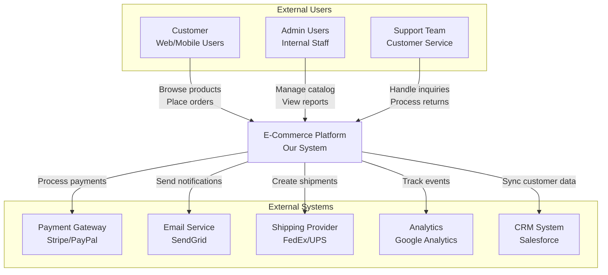

### System Purpose

**Business Value:** [What business problems does this system solve?]

**Key Capabilities:**
- Capability 1: Product catalog management with search and filtering
- Capability 2: Order processing and fulfillment orchestration
- Capability 3: Customer account management and personalization
- Capability 4: Payment processing and fraud detection
- Capability 5: Inventory management and warehouse coordination

**Target Users:**
- **Customers:** 100,000+ monthly active users placing orders
- **Administrators:** 50 internal staff managing operations
- **Support Team:** 20 customer service representatives

---

## Container Architecture

### C4 Level 2: Container Diagram

> Shows the high-level technology containers (applications, databases, file systems) that make up the system.

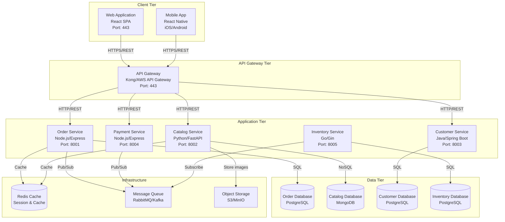

### Container Descriptions

| Container | Technology | Purpose | Scaling Strategy |
|-----------|-----------|---------|------------------|
| **Web Application** | React 18 + TypeScript | Customer-facing SPA for browsing and ordering | CDN distribution, auto-scale |
| **Mobile App** | React Native | Native iOS/Android customer app | App store distribution |
| **API Gateway** | Kong / AWS API Gateway | Authentication, rate limiting, routing | Horizontal auto-scale |
| **Order Service** | Node.js 20 + Express | Order lifecycle management | Horizontal pod autoscaling |
| **Catalog Service** | Python 3.11 + FastAPI | Product catalog and search | Read replicas, caching |
| **Customer Service** | Java 17 + Spring Boot | Customer account management | Horizontal auto-scale |
| **Payment Service** | Node.js 20 + Express | Payment processing orchestration | Vertical scale for compliance |
| **Inventory Service** | Go 1.21 + Gin | Stock management and allocation | Horizontal auto-scale |
| **Message Queue** | Apache Kafka | Asynchronous event streaming | Partitioned topics |
| **Cache** | Redis 7.0 | Session storage and caching | Cluster mode with replicas |
| **Object Storage** | AWS S3 / MinIO | Product images and documents | Geo-replicated |

---

## Component Catalog

### C4 Level 3: Component Overview

> Decomposes each container into components showing responsibilities and interactions.

### Order Service Components

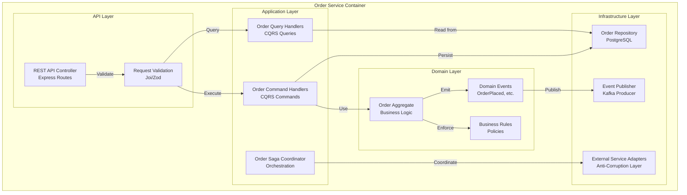

---

## Component Details

### Component Template

For each significant component, document:

#### Component: Order Command Handler

**Component Type:** Application Service

**Responsibilities:**
- Process incoming order commands (PlaceOrder, ConfirmOrder, CancelOrder)
- Validate business rules before execution
- Coordinate with Order Aggregate for state changes
- Publish domain events to event bus
- Handle idempotency for duplicate requests

**Interfaces:**

| Interface Type | Protocol | Consumers | Purpose |
|---------------|----------|-----------|---------|
| **Inbound** | HTTP REST | API Gateway | Receive order commands |
| **Inbound** | gRPC | Internal services | High-performance order creation |
| **Outbound** | Kafka | Event Bus | Publish domain events |
| **Outbound** | SQL | Order Database | Persist order state |

**API Endpoints:**

```yaml
POST /api/v1/orders
  Description: Create new order
  Request Body:
    customerId: string (uuid)
    orderLines:
      - productId: string (uuid)
        quantity: integer
        unitPrice: number
    shippingAddress: Address
  Response: 201 Created
    orderId: string (uuid)
    orderNumber: string
    status: "PENDING"

POST /api/v1/orders/{orderId}/confirm
  Description: Confirm pending order
  Response: 200 OK
    status: "CONFIRMED"
    confirmedAt: timestamp

DELETE /api/v1/orders/{orderId}
  Description: Cancel order
  Request Body:
    reason: string
  Response: 200 OK
    status: "CANCELLED"
```

**Dependencies:**

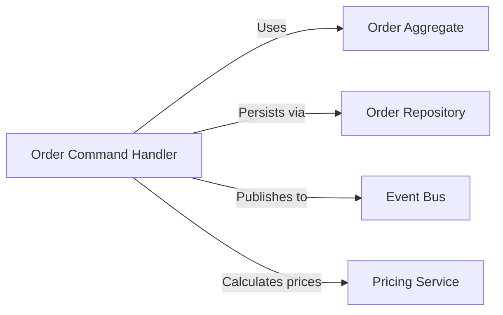

**Data Model:**

```typescript
interface PlaceOrderCommand {
  commandId: string;           // Idempotency key
  customerId: string;
  orderLines: OrderLineDTO[];
  shippingAddress: AddressDTO;
  billingAddress: AddressDTO;
  paymentMethod: PaymentMethodDTO;
}

interface OrderLineDTO {
  productId: string;
  quantity: number;
  unitPrice: Money;
}

interface AddressDTO {
  street: string;
  city: string;
  state: string;
  postalCode: string;
  country: string;
}
```

**Configuration:**

```yaml
order-service:
  command-timeout: 30s
  max-retries: 3
  idempotency-cache-ttl: 24h
  event-publishing:
    enabled: true
    async: true
    retry-policy:
      max-attempts: 5
      backoff: exponential
```

**Error Handling:**

| Error Type | HTTP Status | Retry Strategy | Client Action |
|-----------|-------------|---------------|---------------|
| ValidationError | 400 Bad Request | No retry | Fix input and resubmit |
| OrderNotFound | 404 Not Found | No retry | Check order ID |
| ConcurrentModification | 409 Conflict | Retry with exponential backoff | Reload and retry |
| InsufficientInventory | 422 Unprocessable Entity | No retry | Remove items or reduce quantity |
| InternalError | 500 Internal Server Error | Retry with backoff | Contact support if persists |

**Security Controls:**
- Authentication: JWT bearer token required
- Authorization: Customer can only manage own orders; Admins can manage all
- Input Validation: JSON schema validation on all inputs
- Rate Limiting: 100 requests per minute per customer
- Audit Logging: All order mutations logged with user context

**Performance Characteristics:**
- **Target Latency:** p50: 50ms, p95: 200ms, p99: 500ms
- **Throughput:** 1,000 orders/second sustained
- **Concurrency:** 100 concurrent requests per instance
- **Resource Usage:** 512MB RAM, 0.5 CPU cores per instance

**Monitoring & Observability:**

```yaml
metrics:
  - name: order_commands_total
    type: counter
    labels: [command_type, status]
  - name: order_command_duration_seconds
    type: histogram
    labels: [command_type]
  - name: order_command_errors_total
    type: counter
    labels: [command_type, error_type]

traces:
  - operation: PlaceOrder
    sample_rate: 0.1  # 10% sampling
  - operation: ConfirmOrder
    sample_rate: 1.0  # 100% sampling

logs:
  - level: INFO
    message: "Order command executed"
    fields: [orderId, customerId, commandType, duration_ms]
```

---

## Integration Patterns

### Synchronous Integration (REST)

**Use Case:** Real-time queries and commands requiring immediate response

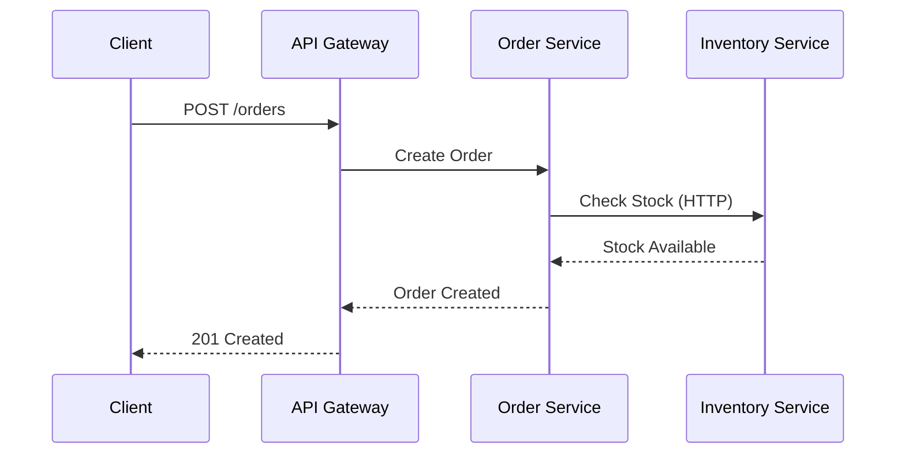

**Best Practices:**
- Use circuit breakers for fault tolerance (Hystrix, Resilience4j)
- Implement request/response timeouts (default: 5s)
- Add correlation IDs for distributed tracing
- Use HTTP/2 for multiplexing

### Asynchronous Integration (Events)

**Use Case:** Decoupled, eventual consistency workflows

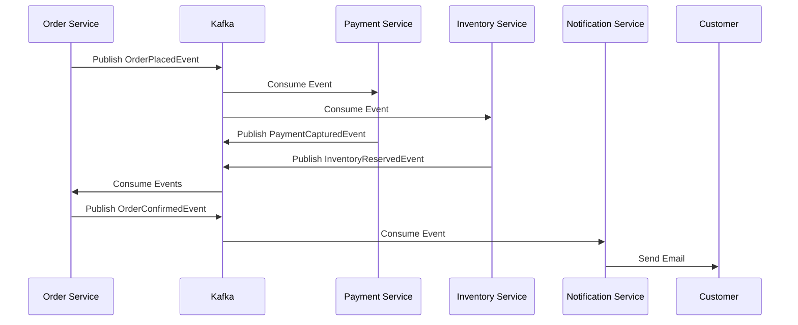

**Best Practices:**
- Use event schemas with versioning (Avro, Protobuf)
- Implement idempotent event handlers
- Add dead letter queues for failed events
- Monitor event processing lag

### API Composition Pattern

**Use Case:** Aggregating data from multiple services

```typescript
// API Gateway aggregates data from multiple services
async function getOrderDetails(orderId: string): Promise<OrderDetails> {
  const [order, customer, payments, shipment] = await Promise.all([
    orderService.getOrder(orderId),
    customerService.getCustomer(customerId),
    paymentService.getPayments(orderId),
    shippingService.getShipment(orderId)
  ]);

  return {
    order,
    customer: {
      name: customer.name,
      email: customer.email
    },
    payments,
    shipment
  };
}
```

### Saga Pattern (Distributed Transactions)

**Use Case:** Maintaining data consistency across services

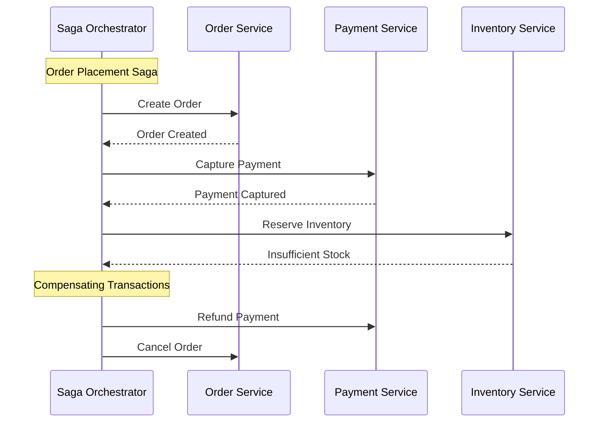

---

## Dependency Management

### Component Dependency Graph

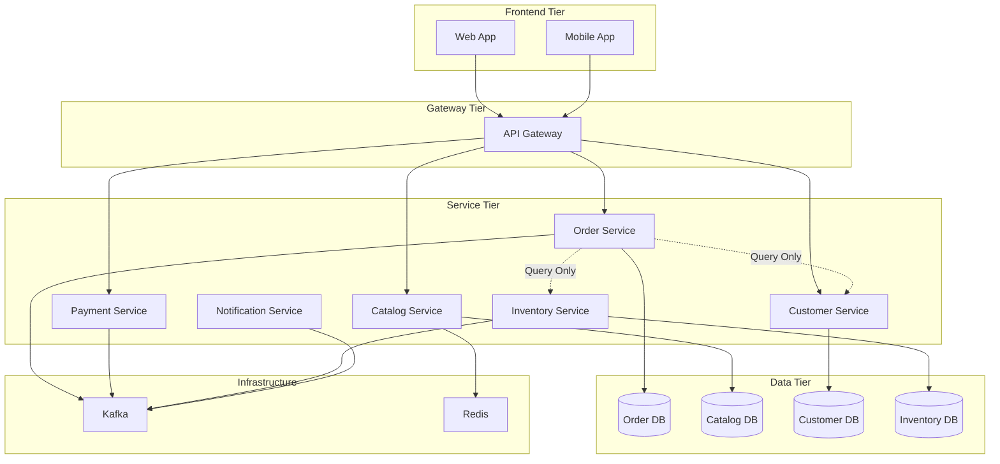

### Dependency Rules

**Allowed Dependencies:**
1. UI Layer → API Gateway → Services (one-way)
2. Services → Infrastructure (database, cache, message queue)
3. Services ←→ Events (via message bus only)

**Prohibited Dependencies:**
1. ❌ Services → Other Services (direct synchronous calls) - Use events or API gateway
2. ❌ Database → Database (cross-database joins) - Use application-level joins
3. ❌ Infrastructure → Services (inversion) - Services own infrastructure

**Dependency Management Strategy:**

```yaml
dependency_policy:
  synchronous_calls:
    allowed: false  # Prefer async events
    exceptions:
      - Gateway to Services (REST)
      - Query-only read operations (with circuit breaker)

  shared_libraries:
    allowed: true
    guidelines:
      - Common DTOs and interfaces
      - Utility functions
      - No business logic in shared libs

  database_sharing:
    allowed: false  # Each service owns its database
    exceptions: []

  event_dependencies:
    allowed: true  # Preferred integration method
    guidelines:
      - Use schema registry
      - Version all events
      - Maintain backward compatibility
```

---

## Non-Functional Requirements

### Performance Requirements

| Metric | Target | Measurement Method |
|--------|--------|-------------------|
| API Response Time (p95) | < 200ms | Prometheus + Grafana |
| API Response Time (p99) | < 500ms | Prometheus + Grafana |
| Throughput | 1,000 req/sec | Load testing (k6, JMeter) |
| Database Query Time (p95) | < 50ms | APM (New Relic, Datadog) |
| Event Processing Lag | < 5 seconds | Kafka consumer lag monitoring |

### Scalability Requirements

```yaml
scalability:
  horizontal_scaling:
    order_service:
      min_instances: 3
      max_instances: 20
      scale_metric: CPU > 70% or Request Rate > 500/sec
      scale_up_cooldown: 60s
      scale_down_cooldown: 300s

    catalog_service:
      min_instances: 2
      max_instances: 10
      scale_metric: CPU > 60%

  vertical_scaling:
    payment_service:  # Compliance requirements may limit horizontal scaling
      instance_size: 4 CPU, 8GB RAM

  database_scaling:
    order_db:
      read_replicas: 2
      connection_pool: 50 per service instance
    catalog_db:
      sharding_strategy: "by category"
```

### Availability Requirements

| Service | SLA | RPO | RTO | DR Strategy |
|---------|-----|-----|-----|-------------|
| Order Service | 99.9% (43 min/month) | 5 minutes | 30 minutes | Active-passive multi-region |
| Payment Service | 99.95% (22 min/month) | 0 (no data loss) | 15 minutes | Active-active with sync replication |
| Catalog Service | 99.5% (3.6 hours/month) | 1 hour | 2 hours | Backup restore |

### Security Requirements

```yaml
security:
  authentication:
    method: OAuth 2.0 + JWT
    token_expiry: 15 minutes (access token)
    refresh_token_expiry: 7 days

  authorization:
    model: RBAC (Role-Based Access Control)
    roles:
      - customer: Can manage own orders
      - admin: Can manage all orders, view reports
      - support: Can view orders, process returns

  encryption:
    in_transit: TLS 1.3
    at_rest:
      - Order DB: AES-256
      - Payment Data: PCI DSS compliant vault

  network_security:
    - Service mesh with mTLS (Istio/Linkerd)
    - Network policies (Kubernetes NetworkPolicy)
    - WAF (Web Application Firewall) at edge

  compliance:
    standards: [PCI DSS, GDPR, SOC 2]
    data_retention: 7 years for financial records
```

---

## Deployment View

### Kubernetes Deployment Architecture

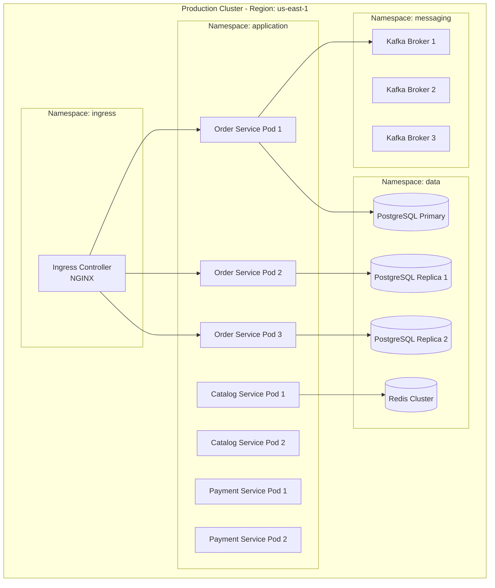

### Deployment Configuration

```yaml
# order-service deployment
apiVersion: apps/v1
kind: Deployment
metadata:
  name: order-service
  namespace: application
spec:
  replicas: 3
  selector:
    matchLabels:
      app: order-service
  template:
    metadata:
      labels:
        app: order-service
        version: v1.2.3
    spec:
      containers:
      - name: order-service
        image: myregistry/order-service:1.2.3
        ports:
        - containerPort: 8001
        resources:
          requests:
            memory: "512Mi"
            cpu: "500m"
          limits:
            memory: "1Gi"
            cpu: "1000m"
        env:
        - name: DATABASE_URL
          valueFrom:
            secretKeyRef:
              name: order-db-secret
              key: connection-string
        - name: KAFKA_BROKERS
          value: "kafka-1:9092,kafka-2:9092,kafka-3:9092"
        livenessProbe:
          httpGet:
            path: /health/live
            port: 8001
          initialDelaySeconds: 30
          periodSeconds: 10
        readinessProbe:
          httpGet:
            path: /health/ready
            port: 8001
          initialDelaySeconds: 10
          periodSeconds: 5
```

---

## Technology Stack

### Programming Languages & Frameworks

| Component | Language | Framework | Version | Rationale |
|-----------|----------|-----------|---------|-----------|
| Order Service | Node.js | Express | 20.x / 4.x | Fast development, strong ecosystem |
| Catalog Service | Python | FastAPI | 3.11 / 0.100+ | ML integration, async support |
| Customer Service | Java | Spring Boot | 17 LTS / 3.x | Enterprise maturity, strong typing |
| Payment Service | Node.js | Express | 20.x / 4.x | PCI compliance libraries available |
| Inventory Service | Go | Gin | 1.21 / 1.9+ | High performance, low resource usage |

### Data Storage

| Purpose | Technology | Deployment Model | Rationale |
|---------|-----------|------------------|-----------|
| Transactional Data | PostgreSQL 15 | Self-hosted on K8s | ACID compliance, strong consistency |
| Product Catalog | MongoDB 6.0 | Atlas (managed) | Flexible schema for product attributes |
| Session Storage | Redis 7.0 | ElastiCache (managed) | In-memory speed, pub/sub support |
| Search Index | Elasticsearch 8.x | Elastic Cloud | Full-text search, faceted navigation |
| Object Storage | AWS S3 | Managed service | Scalable, durable, CDN integration |

### Infrastructure & DevOps

| Category | Technology | Purpose |
|----------|-----------|---------|
| Container Orchestration | Kubernetes 1.28 | Service deployment, scaling |
| Service Mesh | Istio 1.20 | mTLS, traffic management, observability |
| CI/CD | GitHub Actions + ArgoCD | Build pipelines, GitOps deployment |
| Monitoring | Prometheus + Grafana | Metrics collection and visualization |
| Logging | ELK Stack (Elasticsearch, Logstash, Kibana) | Centralized log aggregation |
| Tracing | Jaeger | Distributed tracing |
| API Gateway | Kong Gateway | Rate limiting, authentication, routing |
| Message Queue | Apache Kafka 3.5 | Event streaming, async communication |
| Secret Management | HashiCorp Vault | Credential storage and rotation |
| Infrastructure as Code | Terraform | Cloud resource provisioning |

---

## Implementation Roadmap

### Phase 1: Foundation (Months 1-2)

**Objectives:** Establish core infrastructure and authentication

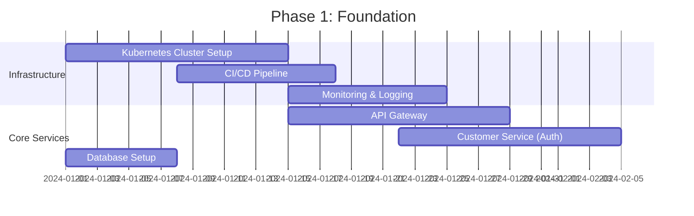

**Deliverables:**
- Kubernetes cluster with Istio service mesh
- CI/CD pipelines for all services
- Prometheus + Grafana monitoring
- Customer service with OAuth 2.0 authentication
- API Gateway with rate limiting

### Phase 2: Core Services (Months 3-4)

**Objectives:** Implement Order and Catalog services

**Deliverables:**
- Order Service with full CRUD operations
- Catalog Service with product search
- Kafka event bus infrastructure
- Redis caching layer
- Initial load testing (100 orders/sec)

### Phase 3: Advanced Features (Months 5-6)

**Objectives:** Add Payment, Inventory, and Notification services

**Deliverables:**
- Payment Service with PCI compliance
- Inventory Service with multi-warehouse support
- Notification Service with email/SMS
- Saga orchestration for order flow
- End-to-end integration tests

### Phase 4: Optimization (Month 7-8)

**Objectives:** Performance tuning and resilience

**Deliverables:**
- Circuit breakers on all external calls
- Database read replicas
- CDN integration for static assets
- Chaos engineering tests (Chaos Monkey)
- Target: 1,000 orders/sec sustained

---

## Example 1: E-Commerce Microservices

### System Overview

**Business Domain:** Online retail platform

**Architecture Pattern:** Event-Driven Microservices

**Key Services:**
1. Order Management Service
2. Product Catalog Service
3. Customer Service
4. Payment Service
5. Inventory Service
6. Shipping Service
7. Notification Service

### Component Interaction Flow

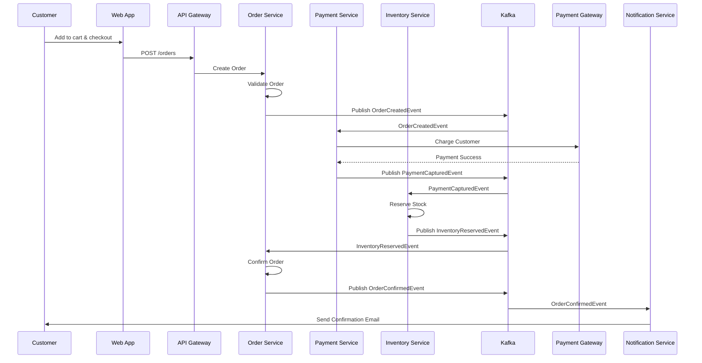

---

## Example 2: Banking System Components

### System Overview

**Business Domain:** Core banking platform

**Architecture Pattern:** Layered Architecture with CQRS

**Key Components:**

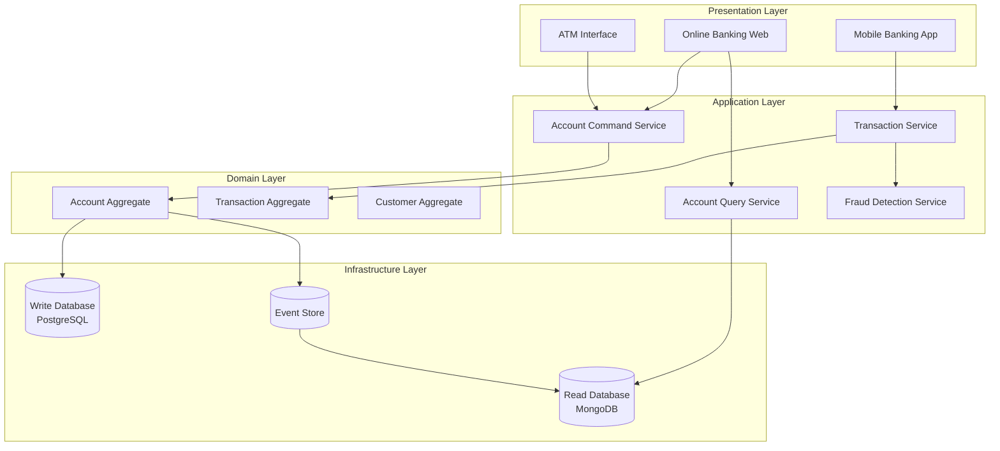

### Component: Account Aggregate

**Responsibilities:**
- Maintain account balance consistency
- Enforce business rules (overdraft limits, daily withdrawal limits)
- Record all transactions
- Emit domain events for state changes

**Key Business Rules:**
- Cannot withdraw more than available balance (unless overdraft enabled)
- Daily withdrawal limit: $1,000
- Minimum balance: $100
- Account must be active for transactions

---

## Appendix: PlantUML Diagrams

### Full Component Diagram (PlantUML)

```plantuml
@startuml
!include https://raw.githubusercontent.com/plantuml-stdlib/C4-PlantUML/master/C4_Component.puml

LAYOUT_WITH_LEGEND()

Container_Boundary(api, "Order Service") {
    Component(controller, "REST API Controller", "Express", "Handles HTTP requests")
    Component(commandHandler, "Command Handler", "TypeScript", "Processes commands")
    Component(queryHandler, "Query Handler", "TypeScript", "Handles queries")
    Component(orderAggregate, "Order Aggregate", "DDD", "Business logic")
    Component(repository, "Order Repository", "TypeORM", "Data access")
    Component(eventPublisher, "Event Publisher", "Kafka", "Publishes events")
}

Container_Ext(gateway, "API Gateway", "Kong")
ContainerDb(database, "Order Database", "PostgreSQL")
Container_Ext(kafka, "Event Bus", "Kafka")

Rel(gateway, controller, "Routes requests", "HTTPS")
Rel(controller, commandHandler, "Delegates", "")
Rel(controller, queryHandler, "Delegates", "")
Rel(commandHandler, orderAggregate, "Uses", "")
Rel(orderAggregate, repository, "Persists", "")
Rel(repository, database, "Reads/Writes", "SQL")
Rel(orderAggregate, eventPublisher, "Publishes events", "")
Rel(eventPublisher, kafka, "Sends", "")

@enduml
```

---

## Related Artifacts

| Artifact | Relationship | Location |
|----------|--------------|----------|
| Architecture Vision | Strategic context | `architecture/architecture-vision.md` |
| Domain Model | Business logic definition | `architecture/domain-model.md` |
| API Specifications | Interface contracts | `documentation/openapi-specification.yaml` |
| Deployment Diagram | Infrastructure view | `architecture/deployment-diagram.md` |
| Database Schema | Data model | `data/database-schema-ddl.yaml` |

---

## References

- **C4 Model** by Simon Brown - Context, Container, Component, Code
- **Building Microservices** by Sam Newman (2nd Edition, 2021)
- **Microservices Patterns** by Chris Richardson (2018)
- **Software Architecture: The Hard Parts** by Neal Ford et al. (2021)
- **Fundamentals of Software Architecture** by Mark Richards & Neal Ford (2020)
- **Cloud Native Patterns** by Cornelia Davis (2019)
- **The Twelve-Factor App** - Methodology for cloud-native apps
- **Martin Fowler's Microservices Resource Guide** - https://martinfowler.com/microservices/

---

**Document Approval:**

| Role | Name | Signature | Date |
|------|------|-----------|------|
| Solution Architect | [Name] | | |
| Tech Lead | [Name] | | |
| DevOps Lead | [Name] | | |

---

**Change History:**

| Version | Date | Author | Changes |
|---------|------|--------|---------|
| 1.0.0 | 2024-01-15 | [Name] | Initial component model |
