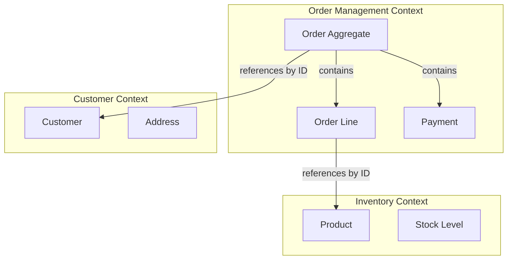
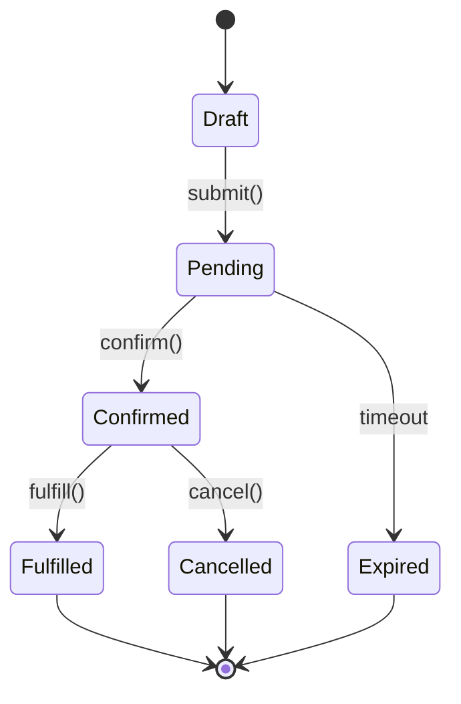
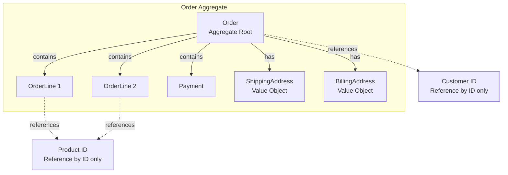
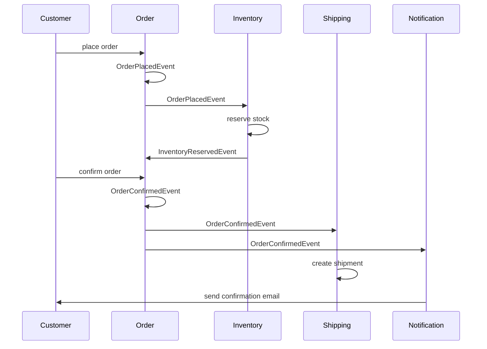
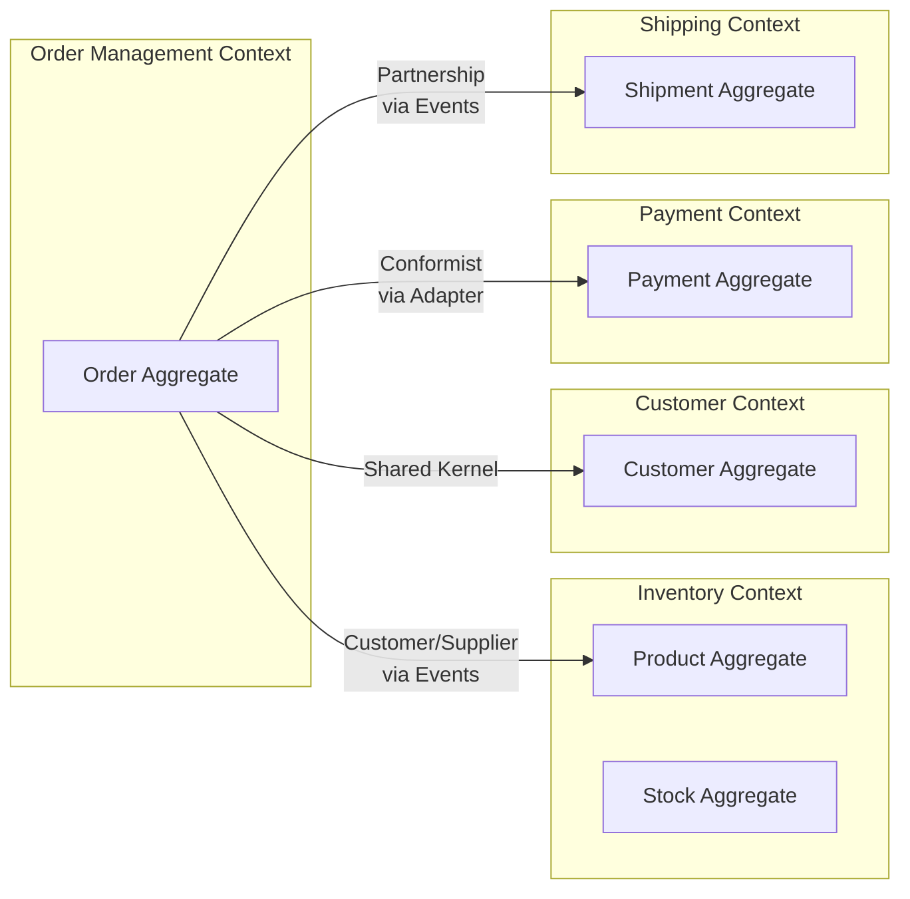
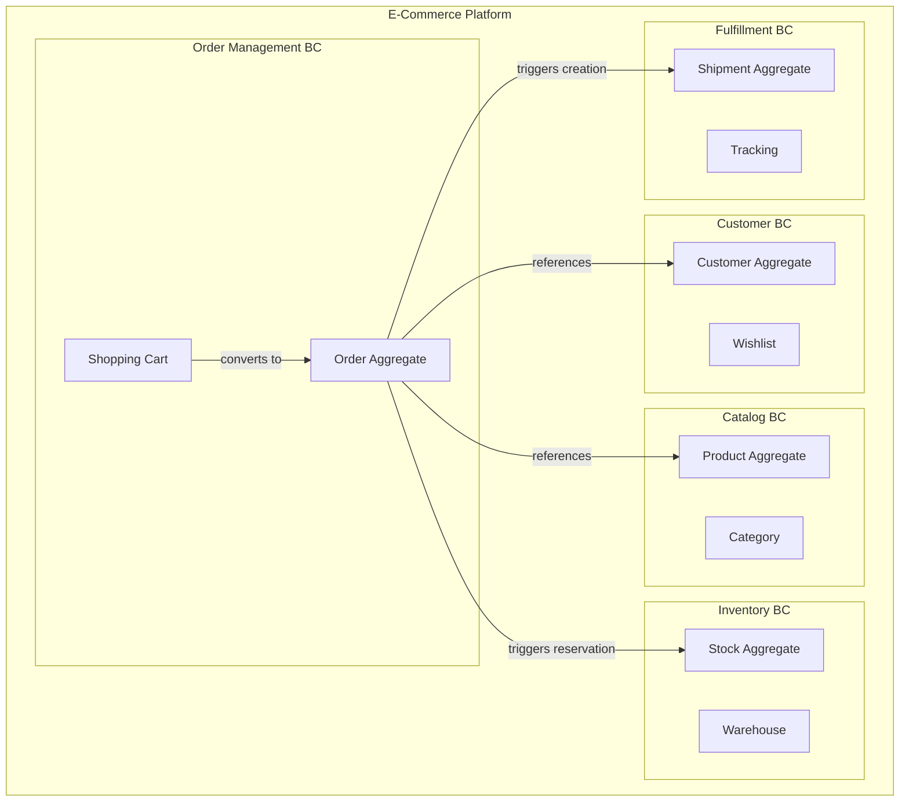
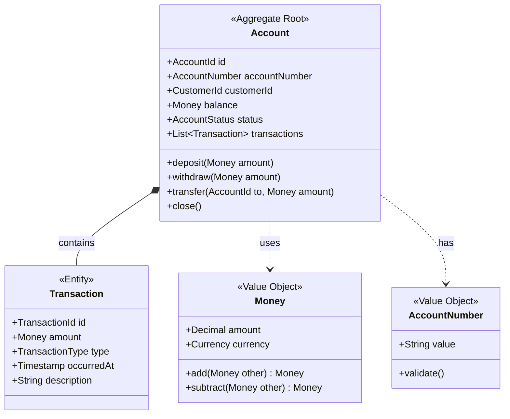
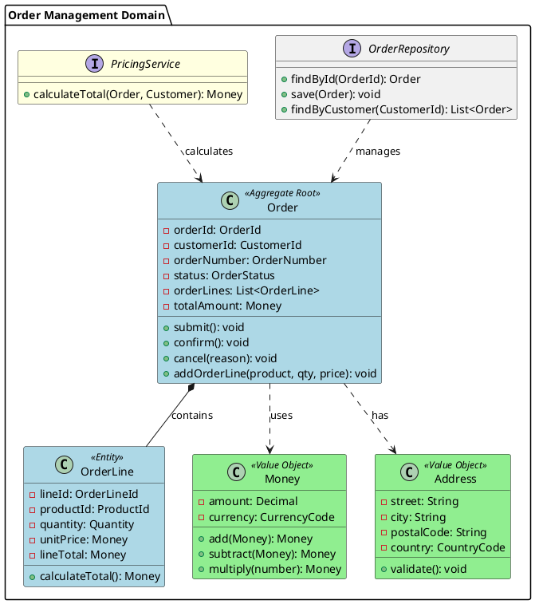

# Domain Model

**Document Version:** 1.0.0
**Last Updated:** 2024-01-15
**Status:** Draft
**Owner:** [Enterprise Architecture Team]
**Classification:** Internal

---

## Executive Summary

This domain model defines the core business domain using Domain-Driven Design (DDD) principles, capturing entities, aggregates, value objects, domain events, and their relationships. It establishes the ubiquitous language and bounded contexts that guide implementation of business logic within hexagonal/clean architecture patterns.

**Business Context:** [Brief description of the business domain being modeled]

**Modeling Approach:** Domain-Driven Design (DDD) tactical patterns with event-driven architecture support

**Target Implementation:** Hexagonal Architecture / Clean Architecture / Microservices

---

## Table of Contents

1. [Bounded Context Overview](#bounded-context-overview)
2. [Ubiquitous Language Glossary](#ubiquitous-language-glossary)
3. [Domain Entities](#domain-entities)
4. [Value Objects](#value-objects)
5. [Aggregates](#aggregates)
6. [Domain Events](#domain-events)
7. [Domain Services](#domain-services)
8. [Repositories](#repositories)
9. [Factories](#factories)
10. [Context Mapping](#context-mapping)
11. [Implementation Guidance](#implementation-guidance)

---

## Bounded Context Overview

### Context Definition

**Bounded Context Name:** [e.g., Order Management, Customer Identity, Inventory]

**Business Capability:** [What business capability does this context support?]

**Strategic Classification:**
- [ ] Core Domain (competitive advantage)
- [ ] Supporting Subdomain (necessary but not differentiating)
- [ ] Generic Subdomain (commodity functionality)

**Context Boundaries:**



### Context Integration Points

| External Context | Relationship Pattern | Integration Method | Ownership |
|-----------------|---------------------|-------------------|-----------|
| Inventory Context | Customer/Supplier | Anti-Corruption Layer | Inventory owns Product |
| Customer Context | Shared Kernel | Direct model sharing | Shared |
| Payment Gateway | Conformist | Adapter pattern | External vendor |
| Shipping Context | Partnership | Published Language (events) | Logistics team |

---

## Ubiquitous Language Glossary

> The ubiquitous language is the shared vocabulary between domain experts and developers. Use these exact terms in code, conversations, and documentation.

| Term | Definition | Synonyms to Avoid | Business Rules |
|------|-----------|-------------------|----------------|
| **Order** | A customer's request to purchase products with payment commitment | Purchase Request, Shopping Cart (after checkout) | Must have at least one order line; cannot modify after confirmation |
| **Order Line** | A single product entry within an order including quantity and price | Line Item, Order Item | Quantity must be positive; price is immutable after order placement |
| **Fulfillment** | The process of picking, packing, and shipping an order | Delivery Process | Cannot begin until payment is captured |
| **Backorder** | An order line for out-of-stock inventory awaiting replenishment | Pending Order | Automatically fulfilled when stock arrives |
| **Order Confirmation** | Irreversible transition from pending to confirmed state | Order Acceptance | Triggers inventory reservation and payment capture |
| **Cancellation Window** | Time period during which customer can cancel without penalty | Grace Period | 30 minutes for digital goods, 24 hours for physical |

---

## Domain Entities

> Entities have unique identity and lifecycle. Two entities with the same attributes but different IDs are considered different.

### Entity: Order

**Identity:** Globally unique OrderId (UUID)

**Lifecycle States:**


**Attributes:**

```yaml
Order:
  identity:
    orderId: UUID              # Globally unique identifier

  properties:
    customerId: CustomerId     # Reference to Customer aggregate
    orderNumber: OrderNumber   # Human-readable identifier (e.g., ORD-2024-001234)
    placedAt: Timestamp        # When order was submitted
    confirmedAt: Timestamp?    # When order was confirmed (nullable)
    status: OrderStatus        # Current lifecycle state
    totalAmount: Money         # Calculated total (with tax)
    currency: CurrencyCode     # ISO 4217 currency

  collections:
    orderLines: List<OrderLine>  # Minimum 1 line required
    payments: List<Payment>       # Payment attempts and confirmations

  computed:
    isModifiable: Boolean      # Can only modify in Draft or Pending state
    daysUntilExpiry: Integer   # Time remaining before automatic cancellation
```

**Business Invariants:**
- Order must contain at least one order line
- Total amount must equal sum of order line totals plus tax
- Cannot add/remove lines after confirmation
- Cannot modify price after order placement
- Cancelled orders cannot transition to other states
- Order can only be fulfilled after payment is captured

**Domain Methods:**

```typescript
class Order extends Entity<OrderId> {

  // Command methods (state changes)
  submit(): void {
    if (this.status !== OrderStatus.Draft) {
      throw new OrderAlreadySubmittedException(this.id);
    }
    if (this.orderLines.isEmpty()) {
      throw new EmptyOrderException("Order must contain at least one line");
    }
    this.status = OrderStatus.Pending;
    this.placedAt = Clock.now();
    this.addDomainEvent(new OrderSubmittedEvent(this.id, this.customerId));
  }

  confirm(): void {
    if (this.status !== OrderStatus.Pending) {
      throw new InvalidOrderStateException("Can only confirm pending orders");
    }
    if (!this.hasValidPayment()) {
      throw new PaymentRequiredException("Order requires valid payment");
    }
    this.status = OrderStatus.Confirmed;
    this.confirmedAt = Clock.now();
    this.addDomainEvent(new OrderConfirmedEvent(this.id, this.orderLines));
  }

  addOrderLine(productId: ProductId, quantity: Quantity, price: Money): void {
    if (!this.isModifiable()) {
      throw new OrderNotModifiableException("Cannot modify confirmed order");
    }
    const line = new OrderLine(productId, quantity, price);
    this.orderLines.add(line);
    this.recalculateTotal();
  }

  cancel(reason: CancellationReason): void {
    if (this.status === OrderStatus.Fulfilled) {
      throw new CannotCancelFulfilledOrderException(this.id);
    }
    if (!this.isWithinCancellationWindow()) {
      throw new CancellationWindowExpiredException();
    }
    this.status = OrderStatus.Cancelled;
    this.addDomainEvent(new OrderCancelledEvent(this.id, reason));
  }

  // Query methods (no state changes)
  isModifiable(): Boolean {
    return this.status === OrderStatus.Draft || this.status === OrderStatus.Pending;
  }

  hasValidPayment(): Boolean {
    return this.payments.any(p => p.status === PaymentStatus.Captured);
  }

  private recalculateTotal(): void {
    this.totalAmount = this.orderLines
      .map(line => line.lineTotal)
      .reduce((sum, total) => sum.add(total));
  }
}
```

---

## Value Objects

> Value objects are immutable and defined by their attributes. Two value objects with identical attributes are considered equal.

### Value Object: Money

**Purpose:** Represent monetary amounts with currency to prevent currency mismatch errors

**Immutability:** All properties are readonly; operations return new instances

**Attributes:**

```yaml
Money:
  amount: Decimal        # Precise decimal (not float) to avoid rounding errors
  currency: CurrencyCode # ISO 4217 code (USD, EUR, GBP)
```

**Implementation:**

```typescript
class Money extends ValueObject {
  readonly amount: Decimal;
  readonly currency: CurrencyCode;

  constructor(amount: Decimal, currency: CurrencyCode) {
    super();
    if (amount.isNegative()) {
      throw new InvalidMoneyException("Amount cannot be negative");
    }
    this.amount = amount;
    this.currency = currency;
  }

  // All operations return new Money instances (immutable)
  add(other: Money): Money {
    this.assertSameCurrency(other);
    return new Money(this.amount.add(other.amount), this.currency);
  }

  subtract(other: Money): Money {
    this.assertSameCurrency(other);
    if (this.amount.isLessThan(other.amount)) {
      throw new InsufficientAmountException();
    }
    return new Money(this.amount.subtract(other.amount), this.currency);
  }

  multiply(multiplier: number): Money {
    return new Money(this.amount.multiply(multiplier), this.currency);
  }

  equals(other: Money): Boolean {
    return this.amount.equals(other.amount) &&
           this.currency === other.currency;
  }

  private assertSameCurrency(other: Money): void {
    if (this.currency !== other.currency) {
      throw new CurrencyMismatchException(
        `Cannot operate on ${this.currency} and ${other.currency}`
      );
    }
  }
}
```

### Value Object: Address

```typescript
class Address extends ValueObject {
  readonly street: string;
  readonly city: string;
  readonly state: string;
  readonly postalCode: PostalCode;
  readonly country: CountryCode; // ISO 3166-1 alpha-2

  // Validation in constructor
  constructor(street: string, city: string, state: string,
              postalCode: PostalCode, country: CountryCode) {
    super();
    this.assertNotEmpty(street, "Street");
    this.assertNotEmpty(city, "City");
    this.street = street;
    this.city = city;
    this.state = state;
    this.postalCode = postalCode;
    this.country = country;
  }

  // Value objects implement equality by value, not identity
  equals(other: Address): Boolean {
    return this.street === other.street &&
           this.city === other.city &&
           this.state === other.state &&
           this.postalCode.equals(other.postalCode) &&
           this.country === other.country;
  }
}
```

### Common Value Objects

| Value Object | Purpose | Validation Rules | Examples |
|--------------|---------|------------------|----------|
| **Email** | Customer email address | RFC 5322 format | customer@example.com |
| **PhoneNumber** | Contact number | E.164 international format | +1-555-123-4567 |
| **SKU** | Product identifier | Alphanumeric, 6-12 chars | PROD-ABC-123 |
| **Quantity** | Item count | Positive integer | 5 units |
| **Percentage** | Discount rate | 0-100 range | 15% |
| **DateRange** | Time period | Start before end | 2024-01-01 to 2024-12-31 |

---

## Aggregates

> Aggregates are consistency boundaries that group related entities and value objects. All access goes through the aggregate root.

### Aggregate: Order (Aggregate Root)

**Aggregate Root:** Order entity

**Aggregate Members:**
- Order (root entity)
- OrderLine (child entity)
- Payment (child entity)
- ShippingAddress (value object)
- BillingAddress (value object)

**Consistency Boundary:**



**Aggregate Design Principles:**

1. **Small Aggregates:** Only include entities that MUST change together in a transaction
2. **Reference by ID:** External aggregates referenced by ID only, never direct object references
3. **Eventual Consistency:** Changes across aggregates use domain events and eventual consistency
4. **Single Transaction:** All changes within aggregate boundary committed in single transaction
5. **Invariant Protection:** Aggregate root enforces all business rules and invariants

**Transactional Boundaries:**

```yaml
# CORRECT: Changes within single aggregate = single transaction
Order.addOrderLine(productId, quantity, price)  # Atomic
Order.confirm()                                  # Atomic

# INCORRECT: Don't modify multiple aggregates in one transaction
Order.confirm() + Inventory.reserveStock()      # ❌ Wrong - use events instead

# CORRECT: Use domain events for cross-aggregate consistency
Order.confirm()
  -> raises OrderConfirmedEvent
  -> Inventory reads event and reserves stock (eventual consistency)
```

**Example: E-Commerce Order Aggregate**

```typescript
class Order extends AggregateRoot<OrderId> {
  private orderId: OrderId;
  private customerId: CustomerId;        // Reference by ID, not object
  private orderLines: List<OrderLine>;   // Owned entity within aggregate
  private payments: List<Payment>;        // Owned entity within aggregate
  private status: OrderStatus;
  private shippingAddress: Address;      // Value object

  // Aggregate root exposes all operations
  addOrderLine(productId: ProductId, quantity: Quantity, price: Money): void {
    // Invariant: Cannot modify after confirmation
    this.assertModifiable();

    // Business rule: Check for duplicate products
    if (this.hasProductLine(productId)) {
      throw new DuplicateProductException(productId);
    }

    const orderLine = new OrderLine(productId, quantity, price);
    this.orderLines.add(orderLine);
    this.recalculateTotal();
  }

  confirm(): void {
    // Invariants checked by aggregate root
    this.assertHasOrderLines();
    this.assertHasValidPayment();
    this.assertWithinInventoryLimits();

    this.status = OrderStatus.Confirmed;

    // Domain event for cross-aggregate coordination
    this.addDomainEvent(new OrderConfirmedEvent(
      this.orderId,
      this.customerId,
      this.orderLines.map(l => new OrderLineSnapshot(l))
    ));
  }

  // NO direct access to child entities from outside
  // All modifications go through aggregate root methods
}
```

---

## Domain Events

> Domain events capture significant business occurrences. They enable decoupling between aggregates and bounded contexts.

### Event Design Principles

1. **Past Tense:** Events are facts that already happened (OrderPlaced, PaymentCaptured)
2. **Immutable:** Events cannot be modified once created
3. **Self-Contained:** Include all data needed by consumers (no callbacks to source)
4. **Versioned:** Support schema evolution with version field
5. **Timestamped:** Include when event occurred

### Event Catalog



### Event Definitions

#### Event: OrderConfirmedEvent

```yaml
OrderConfirmedEvent:
  metadata:
    eventId: UUID                    # Unique event identifier
    eventType: "OrderConfirmedEvent" # Event type discriminator
    version: "1.0"                   # Schema version
    occurredAt: ISO8601Timestamp     # When event occurred
    correlationId: UUID              # Trace related events
    causationId: UUID                # Event that caused this event

  payload:
    orderId: UUID
    orderNumber: String              # Human-readable: ORD-2024-001234
    customerId: UUID

    orderLines:
      - productId: UUID
        productName: String           # Denormalized for convenience
        quantity: Integer
        unitPrice:
          amount: Decimal
          currency: String
        lineTotal:
          amount: Decimal
          currency: String

    totalAmount:
      amount: Decimal
      currency: String

    shippingAddress:
      street: String
      city: String
      state: String
      postalCode: String
      country: String

    confirmedAt: ISO8601Timestamp
```

**Implementation:**

```typescript
class OrderConfirmedEvent extends DomainEvent {
  readonly eventId: UUID;
  readonly eventType = "OrderConfirmedEvent";
  readonly version = "1.0";
  readonly occurredAt: Timestamp;

  readonly orderId: OrderId;
  readonly orderNumber: OrderNumber;
  readonly customerId: CustomerId;
  readonly orderLines: ReadonlyArray<OrderLineSnapshot>;
  readonly totalAmount: Money;
  readonly shippingAddress: Address;
  readonly confirmedAt: Timestamp;

  constructor(order: Order) {
    this.eventId = UUID.generate();
    this.occurredAt = Clock.now();
    this.orderId = order.id;
    this.orderNumber = order.orderNumber;
    this.customerId = order.customerId;
    this.orderLines = order.orderLines.map(l => l.snapshot());
    this.totalAmount = order.totalAmount;
    this.shippingAddress = order.shippingAddress;
    this.confirmedAt = Clock.now();
  }
}
```

### Event Catalog Table

| Event Name | Trigger | Consumers | Eventual Consistency Impact |
|------------|---------|-----------|---------------------------|
| **OrderPlacedEvent** | Customer submits order | Inventory (reserve stock)<br/>Analytics (track conversion) | Stock availability updated within 2 seconds |
| **OrderConfirmedEvent** | Payment captured | Shipping (create shipment)<br/>Notification (email customer)<br/>Loyalty (award points) | Shipment created within 5 minutes |
| **OrderCancelledEvent** | Customer/system cancels | Inventory (release stock)<br/>Payment (process refund)<br/>Notification (email customer) | Stock released within 30 seconds |
| **PaymentCapturedEvent** | Payment gateway confirms | Order (confirm order)<br/>Fraud Detection (monitor) | Order confirmed immediately |
| **InventoryReservedEvent** | Stock allocated | Order (mark as ready)<br/>Reporting (update metrics) | Order marked ready for fulfillment |

---

## Domain Services

> Domain services contain business logic that doesn't naturally belong to any entity or value object.

### Service: PricingService

**Purpose:** Calculate order pricing with complex rules involving multiple aggregates

**Why a Service?** Pricing logic involves tax rates, promotions, customer segments - doesn't belong to Order alone

```typescript
interface PricingService {

  /**
   * Calculate total price for order including taxes and discounts
   *
   * @param order - Order aggregate to price
   * @param customer - Customer for segment-based pricing
   * @param promotions - Active promotions applicable to order
   * @returns Detailed price breakdown
   */
  calculateOrderTotal(
    order: Order,
    customer: Customer,
    promotions: List<Promotion>
  ): PriceBreakdown;

}

class PriceBreakdown extends ValueObject {
  readonly subtotal: Money;           // Sum of line items
  readonly discountAmount: Money;     // Total discounts applied
  readonly taxAmount: Money;          // Calculated tax
  readonly shippingCost: Money;       // Shipping charges
  readonly grandTotal: Money;         // Final amount
  readonly appliedPromotions: List<PromotionCode>;
}
```

### Service: InventoryAllocationService

**Purpose:** Coordinate inventory reservation across warehouses

```typescript
interface InventoryAllocationService {

  /**
   * Reserve inventory for order across multiple warehouses
   *
   * @param orderLines - Products and quantities to reserve
   * @param shippingAddress - Destination for optimal warehouse selection
   * @returns Allocation result with reservations by warehouse
   * @throws InsufficientInventoryException if cannot fulfill
   */
  allocateInventory(
    orderLines: List<OrderLine>,
    shippingAddress: Address
  ): AllocationResult;

}
```

### Domain Service Guidelines

- **Stateless:** Services should not maintain state between calls
- **Interface in Domain:** Define interface in domain layer, implement in infrastructure
- **Dependency Injection:** Services are injected into aggregate roots when needed
- **Avoid Anemic Models:** Don't move entity logic to services; keep behavior in aggregates
- **Cross-Aggregate Coordination:** Use services when operations span multiple aggregates

---

## Repositories

> Repositories provide collection-like access to aggregates, abstracting persistence details.

### Repository: OrderRepository

**Purpose:** Persist and retrieve Order aggregates

**Repository Pattern Benefits:**
- Decouples domain from persistence infrastructure
- Provides collection-like interface
- Encapsulates query logic
- Enables testing with in-memory implementations

```typescript
interface OrderRepository {

  /**
   * Retrieve order by unique identifier
   * @throws OrderNotFoundException if not found
   */
  findById(orderId: OrderId): Order;

  /**
   * Retrieve order by human-readable order number
   * @returns null if not found
   */
  findByOrderNumber(orderNumber: OrderNumber): Order | null;

  /**
   * Find all orders for a customer
   * @param customerId - Customer identifier
   * @param pagination - Page parameters
   * @returns Paginated list of orders
   */
  findByCustomerId(customerId: CustomerId, pagination: Pagination): Page<Order>;

  /**
   * Find orders in specific status
   * @param status - Order status to filter
   * @returns List of matching orders
   */
  findByStatus(status: OrderStatus): List<Order>;

  /**
   * Persist new order
   * @param order - Order aggregate to save
   * @returns Saved order with generated ID
   */
  save(order: Order): Order;

  /**
   * Update existing order
   * @param order - Order aggregate with changes
   * @throws OptimisticLockException on concurrent modification
   */
  update(order: Order): void;

  /**
   * Remove order (rare - usually soft delete via status)
   * @param orderId - Order to delete
   */
  delete(orderId: OrderId): void;

  /**
   * Get next available order number
   * @returns Next sequential order number
   */
  nextOrderNumber(): OrderNumber;
}
```

### Repository Implementation Guidelines

1. **Repository per Aggregate:** One repository per aggregate root, not per entity
2. **Return Aggregates:** Always return fully reconstituted aggregates, never partial
3. **Collection Interface:** Design like in-memory collection (`add`, `remove`, `findBy`)
4. **No Business Logic:** Repositories only handle persistence, no domain rules
5. **Unit of Work:** Coordinate with Unit of Work pattern for transaction management
6. **Specification Pattern:** Use specifications for complex queries

```typescript
// Example: Using Specification Pattern
interface Specification<T> {
  isSatisfiedBy(candidate: T): boolean;
}

class OrdersByStatusAndCustomer implements Specification<Order> {
  constructor(
    private status: OrderStatus,
    private customerId: CustomerId
  ) {}

  isSatisfiedBy(order: Order): boolean {
    return order.status === this.status &&
           order.customerId.equals(this.customerId);
  }
}

// Usage
const spec = new OrdersByStatusAndCustomer(OrderStatus.Pending, customerId);
const orders = orderRepository.findBySpecification(spec);
```

---

## Factories

> Factories encapsulate complex aggregate creation logic.

### Factory: OrderFactory

**When to Use Factories:**
- Complex initialization requiring multiple steps
- Multiple creation pathways (different constructors)
- Enforcing complex invariants during creation
- Reconstituting aggregates from persistence

```typescript
class OrderFactory {

  constructor(
    private pricingService: PricingService,
    private orderRepository: OrderRepository
  ) {}

  /**
   * Create new order from shopping cart
   */
  createFromCart(
    customerId: CustomerId,
    cart: ShoppingCart,
    shippingAddress: Address,
    billingAddress: Address
  ): Order {
    // Generate unique order number
    const orderNumber = this.orderRepository.nextOrderNumber();
    const orderId = OrderId.generate();

    // Convert cart items to order lines
    const orderLines = cart.items.map(item =>
      new OrderLine(
        item.productId,
        item.quantity,
        item.currentPrice  // Capture price at order time
      )
    );

    // Calculate pricing
    const pricing = this.pricingService.calculateOrderTotal(
      orderLines,
      customerId,
      cart.appliedPromotions
    );

    // Create order with all invariants satisfied
    const order = new Order(
      orderId,
      orderNumber,
      customerId,
      orderLines,
      pricing.grandTotal,
      shippingAddress,
      billingAddress,
      OrderStatus.Draft
    );

    return order;
  }

  /**
   * Reconstitute order from persistence (for repository)
   */
  reconstitute(snapshot: OrderSnapshot): Order {
    const order = new Order(
      snapshot.orderId,
      snapshot.orderNumber,
      snapshot.customerId,
      snapshot.orderLines.map(l => this.reconstituteLine(l)),
      snapshot.totalAmount,
      snapshot.shippingAddress,
      snapshot.billingAddress,
      snapshot.status
    );

    // Restore timestamps
    order.placedAt = snapshot.placedAt;
    order.confirmedAt = snapshot.confirmedAt;

    return order;
  }
}
```

---

## Context Mapping

### Bounded Context Relationships



### Context Mapping Patterns

| Pattern | Description | When to Use | Example |
|---------|-------------|-------------|---------|
| **Shared Kernel** | Two contexts share subset of domain model | Close collaboration, same team | Order & Customer share Address |
| **Customer/Supplier** | Downstream depends on upstream; upstream provides API | Clear upstream/downstream relationship | Order (customer) depends on Inventory (supplier) |
| **Conformist** | Downstream conforms to upstream model | Upstream is external, no influence | Conforming to payment gateway API |
| **Anti-Corruption Layer** | Translation layer protects domain from external model | External system has poor/different model | Adapter for legacy ERP system |
| **Partnership** | Two contexts cooperate on shared goals | Mutual dependency, team cooperation | Order & Shipping coordinate fulfillment |
| **Published Language** | Shared language (often events) for integration | Multiple consumers, loose coupling | Domain events as integration contract |

---

## Implementation Guidance

### Hexagonal Architecture Layers

```
┌─────────────────────────────────────────────┐
│         Presentation Layer (UI/API)         │
│            (Controllers, DTOs)              │
└─────────────────┬───────────────────────────┘
                  │ Port (Interface)
┌─────────────────▼───────────────────────────┐
│         Application Layer (Use Cases)       │
│    (OrderService, OrderCommandHandler)      │
└─────────────────┬───────────────────────────┘
                  │ Uses
┌─────────────────▼───────────────────────────┐
│           Domain Layer (Core Logic)         │
│  (Order, OrderLine, OrderRepository IF,     │
│   Domain Events, Domain Services)           │
└─────────────────┬───────────────────────────┘
                  │ Port (Interface)
┌─────────────────▼───────────────────────────┐
│       Infrastructure Layer (Tech Details)   │
│  (OrderRepositoryImpl, EventBus, Database)  │
└─────────────────────────────────────────────┘
```

### Code Organization

```
src/
├── domain/                          # Pure domain logic (no dependencies)
│   ├── order/
│   │   ├── Order.ts                # Aggregate root entity
│   │   ├── OrderLine.ts            # Child entity
│   │   ├── OrderId.ts              # Value object
│   │   ├── OrderNumber.ts          # Value object
│   │   ├── OrderStatus.ts          # Enum
│   │   ├── OrderRepository.ts      # Repository interface
│   │   ├── OrderFactory.ts         # Factory
│   │   ├── PricingService.ts       # Domain service interface
│   │   └── events/
│   │       ├── OrderPlacedEvent.ts
│   │       ├── OrderConfirmedEvent.ts
│   │       └── OrderCancelledEvent.ts
│   ├── shared/
│   │   ├── Money.ts                # Shared value object
│   │   ├── Address.ts              # Shared value object
│   │   └── Entity.ts               # Base entity class
├── application/                     # Use cases, application services
│   ├── commands/
│   │   ├── PlaceOrderCommand.ts
│   │   └── PlaceOrderHandler.ts
│   └── queries/
│       ├── GetOrderQuery.ts
│       └── GetOrderHandler.ts
└── infrastructure/                  # Technical implementations
    ├── persistence/
    │   └── OrderRepositoryImpl.ts  # Concrete repository
    └── messaging/
        └── DomainEventPublisher.ts # Event bus implementation
```

### Testing Strategy

```typescript
// Domain Entity Unit Test
describe('Order', () => {
  it('should confirm order when payment is captured', () => {
    // Given: Order in Pending state with valid payment
    const order = OrderTestBuilder
      .anOrder()
      .withStatus(OrderStatus.Pending)
      .withCapturedPayment()
      .build();

    // When: Order is confirmed
    order.confirm();

    // Then: Order status is Confirmed and event is raised
    expect(order.status).toBe(OrderStatus.Confirmed);
    expect(order.domainEvents).toContainEvent(OrderConfirmedEvent);
  });

  it('should throw exception when confirming order without payment', () => {
    // Given: Order without payment
    const order = OrderTestBuilder
      .anOrder()
      .withStatus(OrderStatus.Pending)
      .withoutPayment()
      .build();

    // When/Then: Confirmation throws exception
    expect(() => order.confirm())
      .toThrow(PaymentRequiredException);
  });
});

// Repository Integration Test
describe('OrderRepository', () => {
  it('should persist and retrieve order with all child entities', () => {
    // Given: Order with multiple order lines
    const order = OrderTestBuilder
      .anOrder()
      .withOrderLine(productId1, 2, Money.dollars(10))
      .withOrderLine(productId2, 1, Money.dollars(25))
      .build();

    // When: Order is saved and retrieved
    orderRepository.save(order);
    const retrieved = orderRepository.findById(order.id);

    // Then: Retrieved order matches original
    expect(retrieved.orderLines.length).toBe(2);
    expect(retrieved.totalAmount).toEqual(Money.dollars(45));
  });
});
```

---

## Example 1: E-Commerce Domain Model

### Context Diagram



### Key Aggregates

1. **Order Aggregate** (Root: Order)
   - Entities: Order, OrderLine, Payment
   - Value Objects: Money, Address, OrderNumber
   - Events: OrderPlaced, OrderConfirmed, OrderCancelled

2. **Product Aggregate** (Root: Product)
   - Entities: Product, ProductVariant
   - Value Objects: SKU, Price, ProductDescription
   - Events: ProductCreated, PriceChanged, ProductDiscontinued

3. **Customer Aggregate** (Root: Customer)
   - Entities: Customer, CustomerPreferences
   - Value Objects: Email, PhoneNumber, CustomerTier
   - Events: CustomerRegistered, CustomerUpgraded

---

## Example 2: Banking Domain Model

### Context: Account Management



### Domain Rules

```typescript
class Account extends AggregateRoot<AccountId> {

  withdraw(amount: Money): void {
    // Business Rule: Cannot withdraw more than balance
    if (this.balance.isLessThan(amount)) {
      throw new InsufficientFundsException(this.id, this.balance, amount);
    }

    // Business Rule: Cannot withdraw from closed account
    if (this.status === AccountStatus.Closed) {
      throw new AccountClosedException(this.id);
    }

    // Business Rule: Daily withdrawal limit
    const todayWithdrawals = this.getTodayWithdrawals();
    if (todayWithdrawals.add(amount).isGreaterThan(this.dailyLimit)) {
      throw new DailyLimitExceededException();
    }

    this.balance = this.balance.subtract(amount);
    this.transactions.add(new Transaction(
      TransactionId.generate(),
      amount,
      TransactionType.Withdrawal,
      Clock.now(),
      "ATM Withdrawal"
    ));

    this.addDomainEvent(new MoneyWithdrawnEvent(this.id, amount));
  }
}
```

---

## Appendix: PlantUML Diagrams

### Full Domain Model Class Diagram



---

## Related Artifacts

| Artifact | Relationship | Location |
|----------|--------------|----------|
| Architecture Vision | Provides context | `architecture/architecture-vision.md` |
| Component Model | Technical realization | `architecture/component-model.md` |
| API Specifications | External contracts | `documentation/openapi-specification.yaml` |
| Database Schema | Persistence model | `data/database-schema-ddl.yaml` |
| Event Schemas | Integration contracts | `data/event-schemas.yaml` |

---

## References

- **Domain-Driven Design** by Eric Evans (2003) - Original DDD book
- **Implementing Domain-Driven Design** by Vaughn Vernon (2013) - Practical DDD
- **Domain-Driven Design Distilled** by Vaughn Vernon (2016) - Concise overview
- **Patterns, Principles, and Practices of Domain-Driven Design** by Scott Millett (2015)
- **DDD Reference** by Eric Evans - Quick reference guide
- Martin Fowler's articles on DDD, Aggregates, and Event Sourcing
- Microsoft .NET Microservices Architecture Guide - DDD patterns
- CQRS Journey by Microsoft Patterns & Practices

---

**Document Approval:**

| Role | Name | Signature | Date |
|------|------|-----------|------|
| Domain Expert | [Name] | | |
| Lead Architect | [Name] | | |
| Tech Lead | [Name] | | |

---

**Change History:**

| Version | Date | Author | Changes |
|---------|------|--------|---------|
| 1.0.0 | 2024-01-15 | [Name] | Initial domain model |
