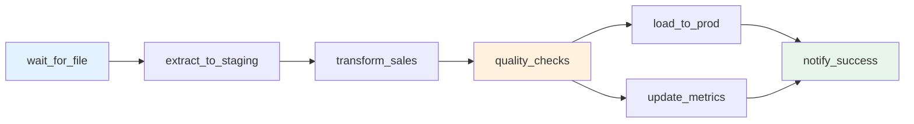

# DAG Definitions

> **Purpose**: Directed Acyclic Graph (DAG) definitions for workflow orchestration platforms (Apache Airflow, Prefect, Dagster) documenting data pipelines, task dependencies, and scheduling.
>
> **See also**: `artifact_descriptions/dag-definitions.md` | YAML version: `dag-definitions.yaml`

## DAG Overview

```yaml
version: 1.0.0
orchestrationPlatform: Apache Airflow | Prefect | Dagster | Temporal
owner: Data Engineering Team
classification: Internal
lastUpdated: 2025-01-15
```

---

## Example 1: Daily Sales ETL (Apache Airflow)

```python
from airflow import DAG
from airflow.operators.python import PythonOperator
from airflow.providers.snowflake.operators.snowflake import SnowflakeOperator
from airflow.providers.amazon.aws.sensors.s3 import S3KeySensor
from datetime import datetime, timedelta

default_args = {
    'owner': 'data-engineering',
    'depends_on_past': False,
    'email': ['data-alerts@company.com'],
    'email_on_failure': True,
    'email_on_retry': False,
    'retries': 3,
    'retry_delay': timedelta(minutes=5),
    'retry_exponential_backoff': True,
    'max_retry_delay': timedelta(minutes=30),
    'sla': timedelta(hours=2),  # Must complete within 2 hours
}

dag = DAG(
    dag_id='daily_sales_etl_v2',
    default_args=default_args,
    description='Extract daily sales data, transform, load to Snowflake',
    schedule_interval='0 2 * * *',  # 2am UTC daily
    start_date=datetime(2024, 1, 1),
    catchup=False,
    max_active_runs=1,
    tags=['sales', 'daily', 'production'],
)

# Sensor: Wait for upstream data file
wait_for_sales_file = S3KeySensor(
    task_id='wait_for_sales_file',
    bucket_name='company-data-lake',
    bucket_key='raw/sales/{{ ds }}/sales_export.csv',
    aws_conn_id='aws_default',
    timeout=3600,  # 1 hour timeout
    poke_interval=300,  # Check every 5 minutes
    mode='reschedule',  # Don't block worker slot
    dag=dag,
)

# Extract: Load raw data from S3 to Snowflake staging
extract_to_staging = SnowflakeOperator(
    task_id='extract_to_staging',
    snowflake_conn_id='snowflake_prod',
    sql='''
        COPY INTO staging.raw_sales
        FROM s3://company-data-lake/raw/sales/{{ ds }}/
        FILE_FORMAT = (TYPE = 'CSV' FIELD_OPTIONALLY_ENCLOSED_BY = '"')
        ON_ERROR = SKIP_FILE
        PURGE = FALSE;
    ''',
    dag=dag,
)

# Transform: Clean and deduplicate
transform_sales = SnowflakeOperator(
    task_id='transform_sales',
    snowflake_conn_id='snowflake_prod',
    sql='dbt/transform_sales.sql',
    params={'execution_date': '{{ ds }}'},
    dag=dag,
)

# Data quality checks
def validate_data_quality(**context):
    from great_expectations_provider.operators.great_expectations import GreatExpectationsOperator

    # Row count check
    # Nullability check
    # Data freshness check
    pass

quality_checks = PythonOperator(
    task_id='quality_checks',
    python_callable=validate_data_quality,
    provide_context=True,
    dag=dag,
)

# Load: Merge into production table
load_to_prod = SnowflakeOperator(
    task_id='load_to_prod',
    snowflake_conn_id='snowflake_prod',
    sql='''
        MERGE INTO prod.daily_sales target
        USING staging.clean_sales source
        ON target.sale_id = source.sale_id
        WHEN MATCHED THEN UPDATE SET *
        WHEN NOT MATCHED THEN INSERT *;
    ''',
    dag=dag,
)

# Send success notification
def send_success_notification(**context):
    import requests
    requests.post(
        'https://hooks.slack.com/services/XXX',
        json={'text': f'✅ DAG {context["dag"].dag_id} completed for {context["ds"]}'}
    )

notify_success = PythonOperator(
    task_id='notify_success',
    python_callable=send_success_notification,
    provide_context=True,
    trigger_rule='all_success',
    dag=dag,
)

# Define task dependencies
wait_for_sales_file >> extract_to_staging >> transform_sales >> quality_checks >> load_to_prod >> notify_success
```

---

## Example 2: Real-Time Streaming Pipeline (Prefect)

```python
from prefect import flow, task
from prefect.task_runners import DaskTaskRunner
from datetime import timedelta

@task(retries=3, retry_delay_seconds=60)
def consume_kafka_events(topic: str, batch_size: int = 1000):
    """Consume events from Kafka topic."""
    from kafka import KafkaConsumer
    consumer = KafkaConsumer(
        topic,
        bootstrap_servers=['kafka-broker:9092'],
        auto_offset_reset='latest',
        max_poll_records=batch_size,
    )

    events = []
    for message in consumer:
        events.append(message.value)
        if len(events) >= batch_size:
            break

    return events

@task(retries=2)
def transform_events(events: list):
    """Apply transformations to events."""
    import pandas as pd

    df = pd.DataFrame(events)

    # Deduplication
    df = df.drop_duplicates(subset=['event_id'])

    # Type casting
    df['event_timestamp'] = pd.to_datetime(df['event_timestamp'])
    df['user_id'] = df['user_id'].astype(str)

    # Enrichment
    df['hour_of_day'] = df['event_timestamp'].dt.hour

    return df.to_dict('records')

@task(retries=3)
def load_to_warehouse(events: list, table: str):
    """Load events to Snowflake warehouse."""
    from snowflake.connector import connect
    import pandas as pd

    conn = connect(
        user='etl_user',
        password='{{ secret }}',
        account='company.us-east-1',
        warehouse='COMPUTE_WH',
        database='analytics',
        schema='prod',
    )

    df = pd.DataFrame(events)
    df.to_sql(table, conn, if_exists='append', index=False)

@flow(
    name="realtime_event_ingestion",
    task_runner=DaskTaskRunner(),
    retries=3,
)
def realtime_event_pipeline(topic: str = "user.events.v1"):
    """Ingest and process streaming events."""

    # Consume events
    events = consume_kafka_events(topic=topic, batch_size=10000)

    # Transform in parallel
    transformed = transform_events(events)

    # Load to warehouse
    load_to_warehouse(transformed, table="usage_events")

# Schedule: Run every 5 minutes
if __name__ == "__main__":
    realtime_event_pipeline.serve(
        name="event-pipeline-deployment",
        cron="*/5 * * * *",
        parameters={"topic": "user.events.v1"},
    )
```

---

## Example 3: ML Training Pipeline (Dagster)

```python
from dagster import asset, AssetExecutionContext, Definitions, ScheduleDefinition
import pandas as pd

@asset(
    group_name="ml_training",
    compute_kind="pandas",
)
def customer_features(context: AssetExecutionContext) -> pd.DataFrame:
    """Extract features for churn prediction model."""
    query = '''
        SELECT
          customer_id,
          days_since_last_login,
          support_tickets_30d,
          feature_adoption_score,
          payment_failures_90d,
          nps_score,
          churned_flag
        FROM analytics.prod.customer_features
        WHERE snapshot_date = CURRENT_DATE - 1
    '''

    from snowflake.connector import connect
    conn = connect(...)
    df = pd.read_sql(query, conn)

    context.log.info(f"Loaded {len(df)} customer records")
    return df

@asset(
    deps=[customer_features],
    group_name="ml_training",
)
def trained_model(context: AssetExecutionContext, customer_features: pd.DataFrame):
    """Train XGBoost churn prediction model."""
    from xgboost import XGBClassifier
    from sklearn.model_selection import train_test_split

    # Split data
    X = customer_features.drop(columns=['customer_id', 'churned_flag'])
    y = customer_features['churned_flag']
    X_train, X_test, y_train, y_test = train_test_split(X, y, test_size=0.2, random_state=42)

    # Train model
    model = XGBClassifier(
        n_estimators=500,
        max_depth=6,
        learning_rate=0.05,
    )
    model.fit(X_train, y_train)

    # Log metrics
    from sklearn.metrics import roc_auc_score
    auc = roc_auc_score(y_test, model.predict_proba(X_test)[:, 1])
    context.log.info(f"Model AUC: {auc:.4f}")

    # Save model
    import joblib
    joblib.dump(model, '/models/churn_model_v3.pkl')

    return {"auc": auc, "model_path": "/models/churn_model_v3.pkl"}

@asset(
    deps=[trained_model],
    group_name="ml_deployment",
)
def deployed_model(context: AssetExecutionContext, trained_model: dict):
    """Deploy model to SageMaker endpoint."""
    import boto3

    sagemaker = boto3.client('sagemaker')

    # Create model
    response = sagemaker.create_model(
        ModelName='churn-prediction-v3',
        PrimaryContainer={
            'Image': '123456789.dkr.ecr.us-east-1.amazonaws.com/xgboost:latest',
            'ModelDataUrl': 's3://models/churn_model_v3.tar.gz',
        },
        ExecutionRoleArn='arn:aws:iam::123456789:role/SageMakerRole',
    )

    context.log.info(f"Model deployed: {response['ModelArn']}")
    return response['ModelArn']

# Define schedule
daily_training_schedule = ScheduleDefinition(
    job=Definitions(assets=[customer_features, trained_model, deployed_model]),
    cron_schedule="0 2 * * *",  # 2am daily
)
```

---

## DAG Design Patterns

### Idempotency

```python
# BAD: Not idempotent (running twice creates duplicates)
INSERT INTO prod.daily_sales
SELECT * FROM staging.sales WHERE date = '{{ ds }}';

# GOOD: Idempotent (safe to re-run)
MERGE INTO prod.daily_sales target
USING (SELECT * FROM staging.sales WHERE date = '{{ ds }}') source
ON target.sale_id = source.sale_id
WHEN MATCHED THEN UPDATE SET *
WHEN NOT MATCHED THEN INSERT *;
```

### Backfilling

```python
# Support backfilling with catchup=True
dag = DAG(
    dag_id='sales_etl',
    schedule_interval='@daily',
    start_date=datetime(2024, 1, 1),
    catchup=True,  # Backfill from start_date to now
    max_active_runs=3,  # Limit parallel runs
)

# Use execution_date for parameterization
extract_data = BashOperator(
    task_id='extract',
    bash_command='python extract.py --date {{ ds }}',  # ds = YYYY-MM-DD
)
```

### Dynamic Task Generation

```python
# Generate tasks dynamically based on configuration
TABLES = ['customers', 'orders', 'products', 'inventory']

for table in TABLES:
    sync_task = SnowflakeOperator(
        task_id=f'sync_{table}',
        sql=f'dbt run --models {table}',
    )

    quality_task = GreatExpectationsOperator(
        task_id=f'validate_{table}',
        checkpoint_name=f'{table}_quality_checks',
    )

    sync_task >> quality_task
```

---

## Monitoring & Alerting

### Task-Level SLAs

```python
task_with_sla = PythonOperator(
    task_id='critical_task',
    python_callable=my_function,
    sla=timedelta(minutes=30),  # Alert if task runs > 30 min
    on_sla_miss_callback=lambda context: send_alert(context),
)
```

### DAG-Level Monitoring

```python
# Airflow webserver UI metrics
- Task duration trends
- Success/failure rates
- SLA misses
- DAG run duration

# Custom metrics to Datadog/CloudWatch
from airflow.plugins_manager import AirflowPlugin
from airflow.listeners import hookimpl

@hookimpl
def on_task_instance_success(task_instance, session):
    send_metric('airflow.task.success', tags=[f'dag:{task_instance.dag_id}'])

@hookimpl
def on_task_instance_failed(task_instance, session):
    send_metric('airflow.task.failure', tags=[f'dag:{task_instance.dag_id}'])
```

---

## Visualization

### Task Dependency Graph



---

**Document Owner**: Data Engineering Team
**Last Updated**: 2025-01-15
