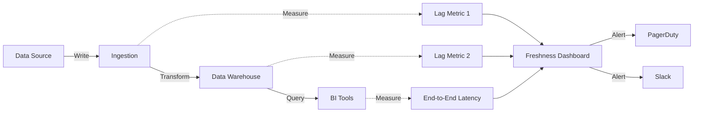

# Data Freshness SLAs

> **Purpose**: Define maximum acceptable latency between data generation and availability for consumption, establishing formal service level agreements for data pipelines, ETL/ELT processes, and data products.
>
> **See also**: `artifact_descriptions/data-freshness-slas.md` | YAML version: `data-freshness-slas.yaml`

## Document Metadata

```yaml
version: 1.0.0
created: 2025-01-15
owner: Data Platform Team
reviewCycle: Quarterly
classification: Internal
lastReviewed: 2025-01-15
nextReview: 2025-04-15
```

## Overview

This document establishes data freshness service level agreements (SLAs) for all production data assets. These SLAs ensure data consumers receive timely, actionable data to support business operations, analytics, and machine learning use cases.

### Freshness Tier Definitions

| Tier | Latency Target | Use Cases | Infrastructure |
|------|----------------|-----------|----------------|
| **Real-time** | < 1 minute | Fraud detection, operational dashboards, real-time personalization | Kafka, Kinesis, streaming |
| **Near real-time** | < 15 minutes | Customer 360, inventory tracking, BI dashboards | CDC (Fivetran, Debezium), micro-batch |
| **Hourly** | < 1 hour | Marketing attribution, campaign performance | Incremental dbt, scheduled ELT |
| **Daily** | < 24 hours | Financial reporting, model training, compliance | Batch ETL, full refreshes |

### SLA Measurement Methodology

- **Measurement Window**: 9am-5pm PT (business hours) for critical datasets
- **Percentile Targets**: p95 latency (not max) to handle occasional spikes
- **Calculation**: `MAX(CURRENT_TIMESTAMP - source_timestamp)` for the dataset
- **Monitoring Frequency**: Every 5 minutes for real-time/near real-time; hourly for batch

---

## Example 1: E-Commerce Platform

### Product Inventory Feed (Real-time)

```yaml
dataset:
  name: analytics.prod.product_inventory
  source: ecommerce_api.inventory_events
  description: Real-time product stock levels and availability status

freshness_sla:
  tier: real-time
  target_latency: 30 seconds
  measurement: MAX(CURRENT_TIMESTAMP - inventory_update_timestamp)

  thresholds:
    warning: 30 seconds
    critical: 60 seconds

  business_rationale: |
    Real-time inventory updates prevent overselling and ensure accurate
    product availability on website. Stale data > 1 minute causes customer
    frustration and lost sales.

monitoring:
  frequency: Every 10 seconds
  implementation: dbt source freshness check + Monte Carlo freshness monitor
  dashboard: https://monitor.example.com/freshness/inventory

  alerts:
    - severity: warning
      condition: freshness > 30 seconds
      channel: slack #data-platform
      action: Investigate streaming pipeline lag

    - severity: critical
      condition: freshness > 60 seconds
      channel: pagerduty data-platform-oncall
      action: Page on-call engineer; escalate to engineering lead after 5 min

pipeline_details:
  source_system: Shopify API webhook
  ingestion: Kafka topic "inventory.updates" -> Kafka Connect -> Snowflake
  transformation: Snowpipe continuous ingestion -> dbt incremental model
  refresh_cadence: Event-driven (streaming)

exceptions:
  - scenario: Historical backfill
    sla_waiver: true
    rationale: Reprocessing old data doesn't require real-time latency

  - scenario: Planned maintenance window
    notification_required: 48 hours advance notice
    max_duration: 2 hours
```

### Customer Order Data (Near Real-time)

```yaml
dataset:
  name: analytics.prod.orders
  source: postgres.ecommerce_db.orders
  description: Customer orders with line items and payment status

freshness_sla:
  tier: near-real-time
  target_latency: 10 minutes
  measurement: MAX(CURRENT_TIMESTAMP - order_placed_at)

  thresholds:
    warning: 10 minutes
    critical: 20 minutes

  business_rationale: |
    Order data feeds customer service dashboards and fraud detection models.
    15-minute latency is acceptable for business operations.

monitoring:
  frequency: Every 5 minutes
  implementation: Fivetran HVR CDC + dbt source freshness

pipeline_details:
  source_system: PostgreSQL 14 (orders, line_items tables)
  ingestion: Fivetran CDC replication (5-minute sync)
  transformation: dbt incremental model (runs every 5 minutes)
  estimated_pipeline_time:
    fivetran_sync: 3 minutes
    dbt_transformation: 2 minutes
    total_budget: 10 minutes

latency_breakdown:
  - stage: Source DB write -> Fivetran detect
    sla: 2 minutes
  - stage: Fivetran replication
    sla: 3 minutes
  - stage: dbt transformation
    sla: 2 minutes
  - stage: BI cache refresh
    sla: 3 minutes
  - total: 10 minutes
```

### Daily Sales Aggregates (Daily Batch)

```yaml
dataset:
  name: analytics.prod.daily_sales_summary
  source: analytics.prod.orders (aggregated)
  description: Daily rollup of sales metrics by product, region, channel

freshness_sla:
  tier: daily
  target_latency: 8 hours (data available by 8am PT for previous day)
  measurement: MAX(CURRENT_TIMESTAMP - business_date + INTERVAL '8 hours')

  thresholds:
    warning: Data not available by 8am PT
    critical: Data not available by 10am PT

  business_rationale: |
    Executive dashboards and financial reporting require previous day's
    sales data by 8am PT. Late data delays morning standup meetings.

monitoring:
  frequency: Once at 8am PT
  implementation: dbt source freshness check + Airflow SLA monitoring

pipeline_details:
  source_system: analytics.prod.orders
  orchestration: Apache Airflow DAG "daily_sales_rollup"
  schedule: "0 6 * * *" (6am PT daily)
  transformation: dbt model with full day's data aggregation
  expected_duration: 45 minutes

  airflow_sla:
    task: rollup_daily_sales
    sla_time: 08:00 PT
    on_sla_miss: Email VP Analytics + Data Platform Lead
```

---

## Example 2: SaaS Analytics Platform

### User Activity Events (Real-time)

```yaml
dataset:
  name: analytics.usage_events
  source: app_events.user_actions
  description: Clickstream and feature usage events

freshness_sla:
  tier: real-time
  target_latency: 60 seconds
  measurement_query: |
    SELECT
      MAX(TIMESTAMPDIFF(SECOND, event_timestamp, CURRENT_TIMESTAMP)) as lag_seconds
    FROM analytics.usage_events
    WHERE event_timestamp > DATEADD(MINUTE, -15, CURRENT_TIMESTAMP);

  thresholds:
    warning: 60 seconds
    critical: 180 seconds

monitoring:
  implementation: Monte Carlo freshness check + Datadog custom metric
  dashboard: https://datadoghq.com/dashboard/usage-pipeline

pipeline_details:
  architecture: Lambda architecture (streaming + batch correction)
  streaming_path:
    - Kinesis Data Streams (buffer: 1 second)
    - Lambda function (transformation: ~2 seconds)
    - Kinesis Firehose -> S3 (buffer: 60 seconds)
    - Snowpipe auto-ingest (latency: ~10 seconds)

  batch_correction:
    schedule: Hourly
    purpose: Correct late-arriving events and deduplication
```

### Customer Health Scores (Hourly)

```yaml
dataset:
  name: analytics.customer_health_scores
  source: Multiple (usage_events, support_tickets, nps_scores)
  description: ML-based customer health indicators

freshness_sla:
  tier: hourly
  target_latency: 1 hour
  measurement: MAX(CURRENT_TIMESTAMP - score_calculated_at)

  business_rationale: |
    Customer success team uses health scores for proactive outreach.
    Hourly updates sufficient for early warning system.

monitoring:
  implementation: Airflow SLA + Great Expectations freshness expectation

pipeline_details:
  orchestration: Prefect flow "calculate_health_scores"
  schedule: "0 * * * *" (top of every hour)
  dependencies:
    - analytics.usage_events (must be fresh within 15 min)
    - analytics.support_tickets (daily refresh acceptable)
    - analytics.nps_scores (weekly refresh acceptable)

  data_quality_gates:
    - check: No null customer_ids
      blocker: true
    - check: Scores between 0-100
      blocker: true
    - check: >= 95% of active customers have scores
      blocker: false
      action: Alert but don't fail pipeline
```

---

## Example 3: Financial Services

### Transaction Monitoring (Real-time)

```yaml
dataset:
  name: risk.transaction_events
  source: core_banking.transactions
  description: Real-time transaction feed for fraud detection

freshness_sla:
  tier: real-time
  target_latency: 5 seconds (p95)
  target_latency_max: 30 seconds (p99)

  regulatory_requirement: true
  regulation: PCI-DSS real-time fraud monitoring

  thresholds:
    warning: 10 seconds (p95)
    critical: 30 seconds (p95)
    emergency: 60 seconds (p95)

monitoring:
  frequency: Continuous (every second)
  compliance_reporting: Daily SLA compliance report to Risk Committee

pipeline_details:
  source: Oracle 19c (core banking)
  cdc_tool: Debezium + Kafka Connect
  kafka_topic: banking.transactions.cdc
  consumer_lag_alert: > 1000 messages

  disaster_recovery:
    failover_datacenter: us-east-2
    rto: 60 seconds
    rpo: 0 (no data loss acceptable)

incident_response:
  sla_breach_procedure: |
    1. Automated page to data platform on-call (< 1 min)
    2. On-call triages and engages database team if CDC lag
    3. VP Engineering notification after 5 minutes breach
    4. Executive escalation after 15 minutes breach
    5. Incident postmortem required for all critical breaches
```

### Regulatory Reporting (Daily with Strict Deadline)

```yaml
dataset:
  name: compliance.daily_position_report
  source: trading.positions + accounting.ledger
  description: Consolidated position report for regulatory filing

freshness_sla:
  tier: daily
  target_latency: Data finalized by 7am ET for T-1 business day
  hard_deadline: 9am ET (regulatory filing deadline)

  regulatory_requirement: true
  regulation: SEC Rule 17a-5 (daily position reporting)

  thresholds:
    warning: 7:00am ET
    critical: 8:00am ET (1 hour before filing deadline)
    regulatory_breach: 9:00am ET (missed filing deadline)

monitoring:
  implementation: Custom Airflow sensor + compliance dashboard
  attestation_required: true
  sign_off: CFO or designated controller

pipeline_details:
  orchestration: Airflow DAG "sec_daily_filing"
  schedule: "0 4 * * *" (4am ET, 3-hour processing window)
  data_cutoff: Previous business day 4pm ET

  critical_dependencies:
    - trading.eod_positions (by 6pm ET T-1)
    - accounting.ledger_close (by 8pm ET T-1)
    - reference_data.security_master (by midnight)

  quality_gates:
    - Balance sheet must reconcile to penny
    - All required schedules present (10 total)
    - No data gaps or missing accounts
    - Electronic signature from Controller

  failure_protocol:
    - 7am ET: Auto-escalate to Data Engineering Lead
    - 8am ET: Page CFO and Head of Compliance
    - 8:30am ET: Activate manual filing contingency
```

---

## SLA Governance

### Change Management

Changes to SLAs require:
1. **Business justification** documented in JIRA ticket
2. **Impact analysis** on downstream consumers
3. **Cost implications** (e.g., streaming vs. batch infrastructure)
4. **Data Platform Lead approval** for tier changes
5. **VP Analytics approval** for critical dataset SLA relaxations

### SLA Review Cadence

| Review Type | Frequency | Participants | Purpose |
|-------------|-----------|--------------|---------|
| Operational review | Weekly | Data Engineering, SRE | Review breaches, tune alerts |
| Business review | Quarterly | Data Platform, Business stakeholders | Validate SLA alignment with needs |
| Compliance review | Annually | Legal, Compliance, Data Platform | Ensure regulatory requirements met |

### Breach Reporting

```sql
-- SLA Breach Summary (Last 7 Days)
SELECT
  dataset_name,
  freshness_tier,
  target_latency_minutes,
  COUNT(*) as breach_count,
  AVG(actual_latency_minutes) as avg_latency,
  MAX(actual_latency_minutes) as max_latency,
  SUM(CASE WHEN severity = 'critical' THEN 1 ELSE 0 END) as critical_breaches
FROM data_platform.freshness_sla_monitoring
WHERE measured_at > CURRENT_DATE - 7
  AND actual_latency_minutes > target_latency_minutes
GROUP BY 1, 2, 3
ORDER BY breach_count DESC;
```

---

## Implementation Patterns

### dbt Source Freshness Check

```yaml
# dbt_project.yml sources configuration
sources:
  - name: production
    database: analytics
    schema: prod
    tables:
      - name: orders
        description: Customer orders from PostgreSQL
        freshness:
          warn_after: {count: 10, period: minute}
          error_after: {count: 20, period: minute}
        loaded_at_field: updated_at

      - name: inventory
        freshness:
          warn_after: {count: 30, period: second}
          error_after: {count: 60, period: second}
        loaded_at_field: inventory_updated_at
```

```bash
# Run freshness checks in CI/CD
dbt source freshness --select source:production
```

### Monte Carlo Freshness Monitor

```python
# monte_carlo_config.yml
monitors:
  - type: freshness
    table: analytics.prod.orders
    time_field: order_placed_at
    threshold_minutes: 10
    severity: high
    notifications:
      - slack_channel: data-quality
      - pagerduty: data-platform-oncall

  - type: freshness
    table: analytics.prod.inventory
    time_field: inventory_updated_at
    threshold_seconds: 30
    severity: critical
```

### Custom Great Expectations Suite

```python
# great_expectations/expectations/freshness_suite.json
{
  "expectation_type": "expect_column_max_to_be_between",
  "kwargs": {
    "column": "data_lag_seconds",
    "min_value": 0,
    "max_value": 600,  # 10 minutes
    "meta": {
      "freshness_sla": "10 minutes",
      "dataset": "analytics.prod.orders"
    }
  }
}
```

---

## Monitoring Dashboard

### Key Metrics



### Sample Freshness Query

```sql
-- Real-time freshness monitoring query
WITH freshness_check AS (
  SELECT
    'analytics.prod.orders' as dataset,
    MAX(order_placed_at) as last_order_time,
    CURRENT_TIMESTAMP as check_time,
    TIMESTAMPDIFF(SECOND, MAX(order_placed_at), CURRENT_TIMESTAMP) as lag_seconds,
    600 as sla_seconds,  -- 10 minute SLA
    CASE
      WHEN TIMESTAMPDIFF(SECOND, MAX(order_placed_at), CURRENT_TIMESTAMP) > 1200 THEN 'CRITICAL'
      WHEN TIMESTAMPDIFF(SECOND, MAX(order_placed_at), CURRENT_TIMESTAMP) > 600 THEN 'WARNING'
      ELSE 'OK'
    END as status
  FROM analytics.prod.orders
)
SELECT
  *,
  CONCAT(
    'Dataset ', dataset, ' is ', status, '. ',
    'Last data: ', CAST(lag_seconds AS VARCHAR), ' seconds ago. ',
    'SLA: ', CAST(sla_seconds AS VARCHAR), ' seconds.'
  ) as alert_message
FROM freshness_check
WHERE status != 'OK';
```

---

## Cost vs. Freshness Tradeoffs

| Freshness Tier | Monthly Cost (per TB) | Infrastructure | When to Use |
|----------------|----------------------|----------------|-------------|
| Real-time (< 1 min) | $500-1000 | Kafka + streaming | Business-critical ops, fraud detection |
| Near real-time (< 15 min) | $200-400 | CDC + micro-batch | BI dashboards, customer service |
| Hourly | $100-200 | Scheduled ELT | Marketing analytics, ML training |
| Daily | $50-100 | Batch ETL | Reporting, compliance |

### Decision Framework

Use **real-time** when:
- Decisions made in seconds/minutes (fraud, inventory)
- Regulatory requirement (transaction monitoring)
- Direct customer impact (pricing, availability)

Use **near real-time** when:
- Supporting human decision-making (CS dashboards)
- Acceptable 5-15 minute delays
- Balance of cost and business value

Use **hourly/daily** when:
- Analytical workloads (reporting, trending)
- Historical analysis sufficient
- Cost-sensitive use cases

---

## Appendix: Common Failure Modes

| Failure Mode | Symptoms | Resolution | Prevention |
|--------------|----------|------------|------------|
| **CDC lag** | Increasing freshness gap | Restart CDC connector, check source DB load | Monitor replication lag, right-size source DB |
| **Kafka consumer lag** | Messages backing up | Add consumer instances, tune batch size | Set up consumer lag alerts |
| **dbt model timeout** | Transformation doesn't complete | Optimize SQL, increase warehouse size | Use incremental models, partition large tables |
| **Network partition** | No data flowing | Check VPC peering, security groups | Multi-AZ deployment, health checks |
| **Source system downtime** | No new source data | Work with source system team | SLA with source system owners |
| **Warehouse overload** | Queries queuing | Prioritize critical queries, add compute | Implement query priority tiers |

---

**Document Owner**: Data Platform Team
**Last Updated**: 2025-01-15
**Next Review**: 2025-04-15
**Approval**: VP Analytics, Head of Data Engineering
