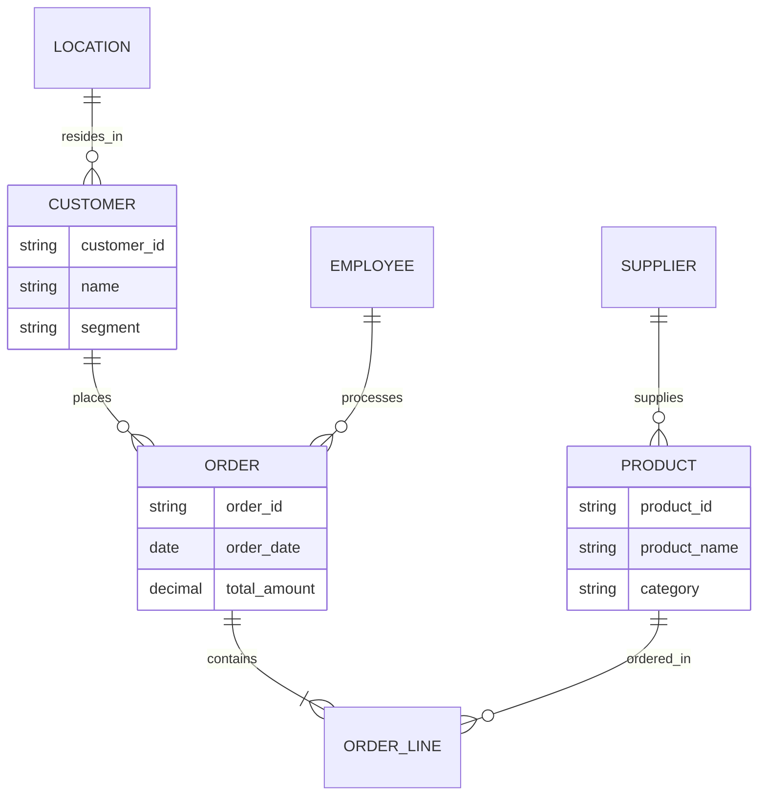
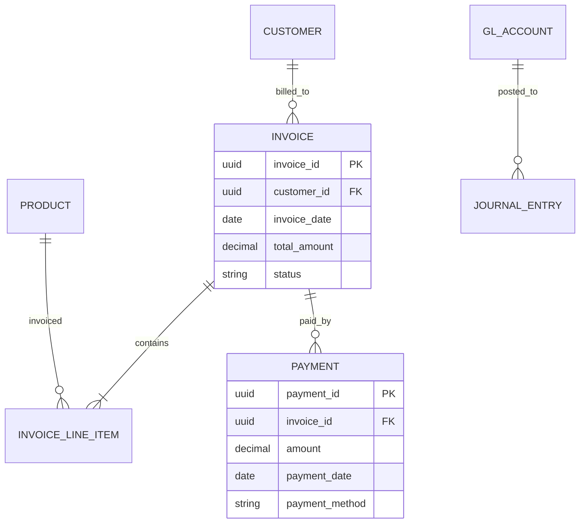
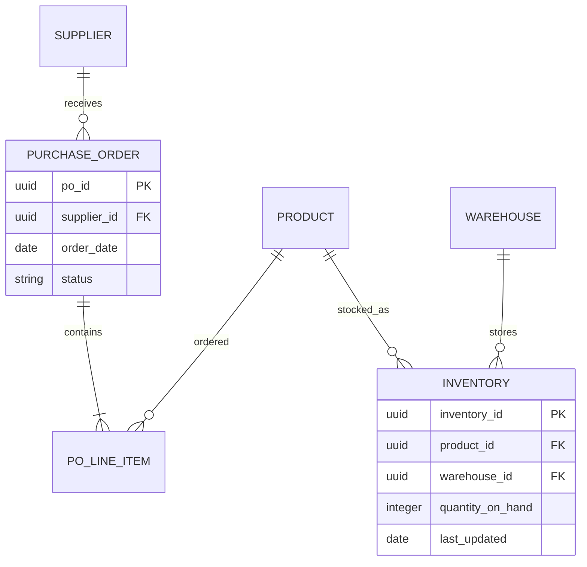
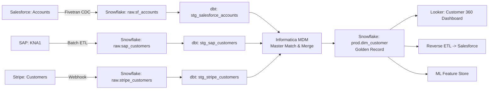

# Enterprise Data Model

> **Purpose**: Authoritative enterprise-wide data model spanning conceptual, logical, and physical layers, defining canonical entities, master data structures, reference data, and cross-system integration patterns.
>
> **See also**: `artifact_descriptions/enterprise-data-model.md` | YAML version: `enterprise-data-model.yaml`

## Model Overview

```yaml
version: 3.0.0
modelingApproach: Hybrid (3NF normalized + dimensional)
masterDataDomains: [Customer, Product, Location, Employee, Supplier]
owner: Enterprise Data Architecture Team
lastUpdated: 2025-01-15
tooling: ERwin Data Modeler | Collibra | Informatica MDM
```

---

## Model Layers

### Conceptual Model (Business View)

High-level business entities and relationships for stakeholder communication.



### Logical Model (Normalized 3NF)

Technology-independent, normalized representation of entities.

### Physical Model (Database Implementation)

Database-specific implementation (see `physical-data-model.md`).

---

## Master Data Domains

### 1. Customer Master Data

#### Golden Customer Record

```yaml
entity: Customer
description: Authoritative customer record from multiple source systems
data_steward: Customer Success VP

attributes:
  - name: customer_id
    type: UUID
    description: Global unique identifier
    source: MDM generated
    primary_key: true

  - name: customer_external_id
    type: VARCHAR(50)
    description: CRM system ID (Salesforce)
    source: salesforce.accounts.id

  - name: customer_erp_id
    type: VARCHAR(20)
    description: ERP system ID (SAP)
    source: sap_s4hana.kna1.kunnr

  - name: email
    type: VARCHAR(255)
    description: Primary email address
    source: Multiple (survivorship rules apply)
    pii: true
    classification: PII - Email

  - name: name_full
    type: VARCHAR(255)
    description: Full customer name
    source: Derived from first_name, last_name

  - name: customer_type
    type: ENUM
    values: [Individual, Business]
    description: Customer type classification

  - name: lifecycle_stage
    type: ENUM
    values: [Prospect, Lead, Customer, Churned]
    source: salesforce.accounts.stage

  - name: lifetime_value
    type: DECIMAL(12,2)
    description: Calculated lifetime value
    source: Calculated from billing_system.invoices

source_systems:
  - system: Salesforce CRM
    table: accounts
    sync_frequency: Real-time (CDC)
    fields_mapped: [external_id, email, name, phone, billing_address]

  - system: SAP S/4HANA
    table: KNA1 (Customer Master)
    sync_frequency: Hourly batch
    fields_mapped: [erp_id, credit_limit, payment_terms]

  - system: Stripe Billing
    table: customers
    sync_frequency: Real-time (webhook)
    fields_mapped: [stripe_id, subscription_status, mrr]

survivorship_rules:
  email:
    priority: [salesforce, stripe, sap]
    rule: Use most recently updated non-null value from highest priority source

  phone:
    priority: [salesforce, manual_override, sap]

  billing_address:
    priority: [stripe, salesforce, sap]
```

#### Entity Resolution & Matching

```sql
-- Fuzzy matching rules for customer deduplication
CREATE OR REPLACE FUNCTION match_customers(
  email1 VARCHAR,
  email2 VARCHAR,
  name1 VARCHAR,
  name2 VARCHAR
) RETURNS BOOLEAN AS $$
BEGIN
  -- Exact email match
  IF LOWER(email1) = LOWER(email2) THEN
    RETURN TRUE;
  END IF;

  -- Fuzzy name match (Levenshtein distance)
  IF levenshtein(LOWER(name1), LOWER(name2)) <= 3 THEN
    RETURN TRUE;
  END IF;

  RETURN FALSE;
END;
$$ LANGUAGE plpgsql;
```

---

### 2. Product Master Data

```yaml
entity: Product
description: Canonical product catalog across all sales channels
data_steward: Product Management VP

attributes:
  - name: product_id
    type: UUID
    primary_key: true

  - name: sku
    type: VARCHAR(50)
    unique: true
    description: Stock Keeping Unit (globally unique)

  - name: product_name
    type: VARCHAR(255)
    description: Marketing product name

  - name: category_hierarchy
    type: VARCHAR(500)
    description: "Level 1 > Level 2 > Level 3"
    example: "Electronics > Computers > Laptops"

  - name: list_price
    type: DECIMAL(12,2)
    description: Manufacturer suggested retail price

  - name: cost
    type: DECIMAL(12,2)
    description: Cost of goods sold
    classification: Confidential

  - name: product_status
    type: ENUM
    values: [Active, Discontinued, End-of-Life]

  - name: effective_date
    type: DATE
    description: Product availability start date

  - name: end_date
    type: DATE
    description: Product discontinuation date (if applicable)

hierarchies:
  category_hierarchy:
    levels: [Department, Category, Subcategory]
    example:
      - Electronics > Computers > Laptops
      - Apparel > Men's > Shirts

  brand_hierarchy:
    levels: [Brand, Sub-brand, Product Line]
```

---

### 3. Location Master Data (Geographic Hierarchy)

```yaml
entity: Location
description: Global geographic hierarchy (Country > State > City > Postal Code)

hierarchy:
  - level: Country
    attributes: [country_code_iso2, country_name]
    example: {code: 'US', name: 'United States'}

  - level: State/Province
    attributes: [state_code, state_name]
    example: {code: 'CA', name: 'California'}

  - level: City
    attributes: [city_name, population]

  - level: Postal Code
    attributes: [postal_code, latitude, longitude]

attributes:
  - name: location_id
    type: UUID
    primary_key: true

  - name: country_code
    type: CHAR(2)
    description: ISO 3166-1 alpha-2

  - name: postal_code
    type: VARCHAR(20)
    description: ZIP/Postal code

  - name: latitude
    type: DECIMAL(10,8)

  - name: longitude
    type: DECIMAL(11,8)

  - name: timezone
    type: VARCHAR(50)
    example: "America/Los_Angeles"

reference_data_source: GeoNames.org (licensed dataset)
```

---

## Subject Area Models

### Finance Subject Area



### Supply Chain Subject Area



---

## Canonical Data Model (CDM) for Integration

### Purpose
Single source of truth for cross-system data exchange.

### Example: Order Event (Canonical Format)

```json
{
  "canonical_order": {
    "order_id": "uuid",
    "customer": {
      "customer_id": "uuid",
      "customer_external_id": "salesforce_account_id",
      "email": "customer@example.com",
      "name_full": "Jane Doe"
    },
    "order_date": "2025-01-15T10:30:00Z",
    "currency_code": "USD",
    "order_total": 1250.00,
    "line_items": [
      {
        "line_number": 1,
        "product_id": "uuid",
        "sku": "LAPTOP-001",
        "quantity": 2,
        "unit_price": 599.00,
        "line_total": 1198.00
      }
    ],
    "billing_address": {
      "street": "123 Main St",
      "city": "San Francisco",
      "state_code": "CA",
      "postal_code": "94105",
      "country_code": "US"
    }
  }
}
```

### System-Specific Mappings

| Source System | Mapping to CDM |
|---------------|----------------|
| **Salesforce** | `Opportunity.Id` -> `order_external_id`<br>`Account.Id` -> `customer_external_id` |
| **SAP S/4HANA** | `VBAK-VBELN` (Sales Order) -> `order_erp_id`<br>`KNA1-KUNNR` (Customer) -> `customer_erp_id` |
| **Shopify** | `Order.id` -> `order_ecommerce_id`<br>`Customer.id` -> `customer_ecommerce_id` |

---

## Reference Data Management

### Reference Tables (Code Lists)

```sql
-- Country codes (ISO 3166-1)
CREATE TABLE ref_countries (
  country_code CHAR(2) PRIMARY KEY,
  country_name VARCHAR(100) NOT NULL,
  iso_alpha3 CHAR(3),
  numeric_code CHAR(3),
  is_active BOOLEAN DEFAULT TRUE
);

-- Currency codes (ISO 4217)
CREATE TABLE ref_currencies (
  currency_code CHAR(3) PRIMARY KEY,
  currency_name VARCHAR(100),
  decimal_places SMALLINT DEFAULT 2
);

-- Product categories (hierarchical)
CREATE TABLE ref_product_categories (
  category_id UUID PRIMARY KEY,
  parent_category_id UUID REFERENCES ref_product_categories(category_id),
  category_name VARCHAR(100),
  category_level SMALLINT,  -- 1, 2, 3
  sort_order INTEGER
);
```

---

## Data Lineage

### Source-to-Target Mapping



---

## Data Quality Rules

### Enterprise Data Quality Standards

```yaml
data_quality_dimensions:
  - dimension: Completeness
    description: Required fields must not be null
    rules:
      - Customer.email must not be null (100% completeness)
      - Customer.name_full must not be null

  - dimension: Uniqueness
    description: Business keys must be unique
    rules:
      - Customer.email must be unique across all customers
      - Product.sku must be unique

  - dimension: Validity
    description: Data must conform to format/domain rules
    rules:
      - Customer.email must match regex pattern
      - Product.list_price must be >= 0
      - Order.order_date must be <= CURRENT_DATE

  - dimension: Consistency
    description: Cross-field validation rules
    rules:
      - Order.shipped_date must be >= Order.ordered_date
      - Invoice.total_amount = SUM(Invoice_Line_Item.line_total)

  - dimension: Timeliness
    description: Data freshness requirements
    rules:
      - Customer master data freshness < 15 minutes
      - Product catalog updates within 1 hour
```

---

## Slowly Changing Dimensions (SCD)

### SCD Type 2: Full History Tracking

```sql
-- Track full history of customer changes
CREATE TABLE dim_customer_history (
  customer_key INTEGER PRIMARY KEY,  -- Surrogate key
  customer_id UUID NOT NULL,  -- Business key (constant)
  email VARCHAR(255),
  name_full VARCHAR(255),
  lifecycle_stage VARCHAR(50),

  -- SCD Type 2 metadata
  effective_start_date TIMESTAMP NOT NULL,
  effective_end_date TIMESTAMP,  -- NULL for current record
  is_current BOOLEAN DEFAULT TRUE,

  -- Audit
  created_at TIMESTAMP DEFAULT CURRENT_TIMESTAMP
);

-- Example: Customer upgrades from Lead to Customer
-- OLD RECORD (made inactive):
-- customer_key=1001, customer_id=UUID-123, lifecycle_stage='Lead',
-- effective_start_date='2024-01-01', effective_end_date='2025-01-15', is_current=FALSE

-- NEW RECORD (current):
-- customer_key=1002, customer_id=UUID-123, lifecycle_stage='Customer',
-- effective_start_date='2025-01-15', effective_end_date=NULL, is_current=TRUE
```

---

## Governance & Stewardship

### Data Ownership Matrix

| Domain | Data Owner (Accountable) | Data Steward (Responsible) | Consumers |
|--------|--------------------------|---------------------------|-----------|
| Customer | CMO | Customer Success VP | Sales, Marketing, Support |
| Product | CPO | Product Management VP | Sales, Supply Chain, Marketing |
| Finance | CFO | Controller | Finance, Accounting, Executive |
| Employee | CHRO | HR Operations Director | HR, Payroll, IT |

---

**Document Owner**: Enterprise Data Architecture Team
**Last Updated**: 2025-01-15
**Approvals**: Chief Data Officer, Enterprise Architecture Board
