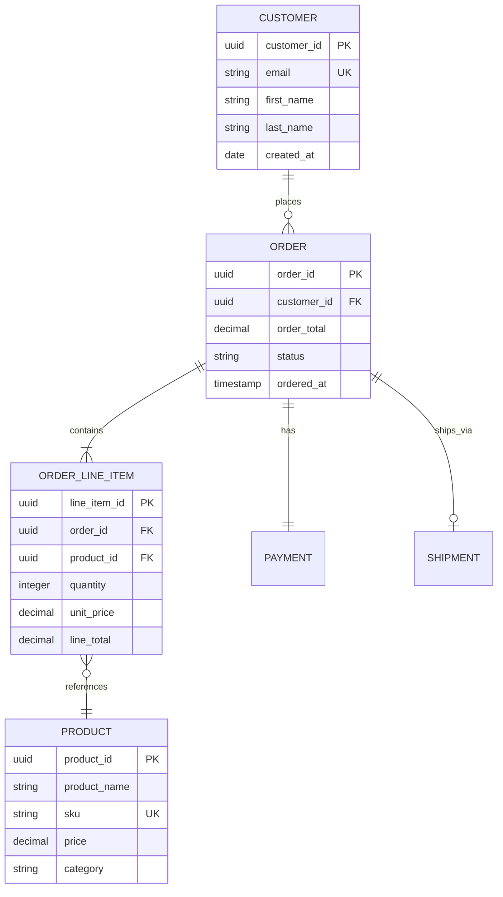
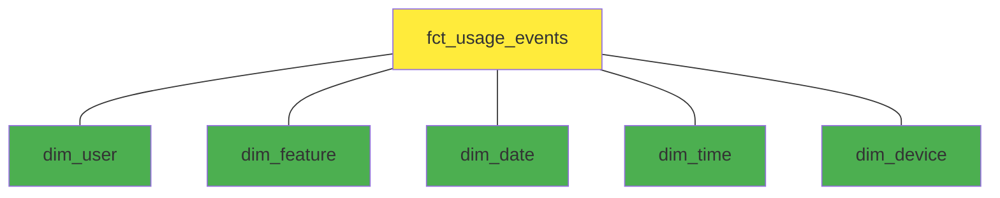
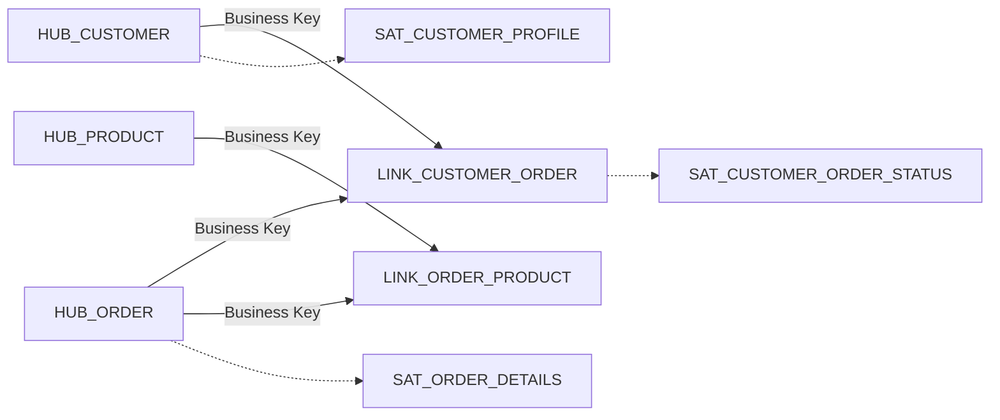

# Logical Data Model

> **Purpose**: Technology-independent, business-oriented representation of data structures capturing entities, attributes, relationships, and business rules using normalization or dimensional modeling.
>
> **See also**: `artifact_descriptions/logical-data-model.md`

## Model Overview

```yaml
version: 2.1.0
modelingApproach: 3NF (Normalized) | Star Schema (Dimensional) | Data Vault 2.0
notation: Crow's Foot | IE Notation | UML
tool: ERwin | ER/Studio | Lucidchart
owner: Data Architecture Team
created: 2024-10-01
lastModified: 2025-01-15
```

---

## Example 1: E-Commerce (Normalized 3NF)

### Subject Area: Orders & Fulfillment

#### Entity Relationship Diagram



#### Entity Specifications

**CUSTOMER Entity**

| Attribute | Data Type | Business Definition | Constraints |
|-----------|-----------|---------------------|-------------|
| customer_id | UUID | Unique customer identifier | PK, NOT NULL |
| email | VARCHAR(255) | Customer email address | UK, NOT NULL |
| first_name | VARCHAR(100) | Customer first name | NOT NULL |
| last_name | VARCHAR(100) | Customer last name | NOT NULL |
| created_at | TIMESTAMP | Account creation date | NOT NULL |
| loyalty_tier | ENUM | Bronze/Silver/Gold/Platinum | Default: 'Bronze' |

**Business Rules**:
- Email must be unique across all customers
- Customer cannot be deleted if they have orders
- Loyalty tier upgraded based on lifetime_value

**ORDER Entity**

| Attribute | Data Type | Business Definition | Constraints |
|-----------|-----------|---------------------|-------------|
| order_id | UUID | Unique order identifier | PK, NOT NULL |
| customer_id | UUID | Reference to customer | FK, NOT NULL |
| order_total | DECIMAL(12,2) | Total order amount | NOT NULL, >= 0 |
| status | ENUM | Order status (pending, confirmed, shipped, delivered, cancelled) | NOT NULL |
| ordered_at | TIMESTAMP | Order placement timestamp | NOT NULL |

**Business Rules**:
- order_total = SUM(ORDER_LINE_ITEM.line_total) for this order
- Status transitions: pending -> confirmed -> shipped -> delivered
- Cancelled orders cannot transition to other statuses

---

## Example 2: SaaS Analytics (Dimensional - Star Schema)

### Fact Table: Usage Events

```yaml
fact_table:
  name: fct_usage_events
  grain: One row per user action event
  type: Transaction Fact Table

dimensions:
  - dim_user (SCD Type 2)
  - dim_feature (SCD Type 1)
  - dim_date (Date Dimension)
  - dim_time (Time of Day Dimension)
  - dim_device (SCD Type 1)

measures:
  - event_count (additive)
  - session_duration_seconds (semi-additive)
  - unique_users (non-additive, count distinct)
```

#### Dimensional Model Diagram



#### Dimension: dim_user (SCD Type 2)

| Attribute | Type | Description | SCD Type |
|-----------|------|-------------|----------|
| user_key | INTEGER | Surrogate key | - |
| user_id | UUID | Business key | - |
| email | VARCHAR | User email | Type 2 |
| user_tier | VARCHAR | Free/Pro/Enterprise | Type 2 |
| company_name | VARCHAR | Company name | Type 2 |
| effective_date | DATE | SCD effective from | Type 2 |
| expiration_date | DATE | SCD effective to | Type 2 |
| is_current | BOOLEAN | Current record flag | Type 2 |

**SCD Type 2 Example**:
```
user_key | user_id | email | user_tier | effective_date | expiration_date | is_current
---------|---------|-------|-----------|----------------|-----------------|----------
1001     | U-123   | a@... | Free      | 2024-01-01     | 2024-06-30      | FALSE
1002     | U-123   | a@... | Pro       | 2024-07-01     | 9999-12-31      | TRUE
```

#### Fact Table: fct_usage_events

| Attribute | Type | Description | Grain |
|-----------|------|-------------|-------|
| event_key | BIGINT | Surrogate key | PK |
| user_key | INTEGER | FK to dim_user | FK |
| feature_key | INTEGER | FK to dim_feature | FK |
| date_key | INTEGER | FK to dim_date | FK |
| time_key | INTEGER | FK to dim_time | FK |
| device_key | INTEGER | FK to dim_device | FK |
| session_id | UUID | Session identifier | Degenerate dimension |
| event_timestamp | TIMESTAMP | Exact event time | - |
| session_duration_seconds | INTEGER | Session duration | Measure |

---

## Example 3: Data Vault 2.0 (Enterprise Data Warehouse)

### Hub-Link-Satellite Pattern



#### HUB_CUSTOMER

| Attribute | Type | Description |
|-----------|------|-------------|
| customer_hashkey | BINARY(16) | MD5 hash of business key |
| customer_id | UUID | Business key |
| load_date | TIMESTAMP | Record load timestamp |
| record_source | VARCHAR | Source system name |

#### SAT_CUSTOMER_PROFILE

| Attribute | Type | Description |
|-----------|------|-------------|
| customer_hashkey | BINARY(16) | FK to HUB_CUSTOMER |
| load_date | TIMESTAMP | Effective from timestamp |
| email | VARCHAR | Customer email |
| first_name | VARCHAR | First name |
| last_name | VARCHAR | Last name |
| loyalty_tier | VARCHAR | Loyalty tier |
| record_source | VARCHAR | Source system |

---

## Normalization Examples

### 1NF (First Normal Form) - Atomic Values

**Before (Not 1NF)**:
```
customer_id | phone_numbers
------------|------------------
C001        | "555-1234, 555-5678"
```

**After (1NF)**:
```
customer_id | phone_number
------------|-------------
C001        | 555-1234
C001        | 555-5678
```

### 2NF (Second Normal Form) - No Partial Dependencies

**Before (1NF but not 2NF)**:
```
order_id | product_id | product_name | quantity
---------|------------|--------------|----------
O001     | P001       | Widget       | 5
```
(product_name depends only on product_id, not full PK)

**After (2NF)**:
```
ORDER_LINE (order_id, product_id, quantity)
PRODUCT (product_id, product_name)
```

### 3NF (Third Normal Form) - No Transitive Dependencies

**Before (2NF but not 3NF)**:
```
customer_id | zip_code | city
------------|----------|------
C001        | 10001    | New York
```
(city depends on zip_code, not customer_id)

**After (3NF)**:
```
CUSTOMER (customer_id, zip_code)
ZIP_CODE (zip_code, city, state)
```

---

## Best Practices

### Naming Conventions
- **Entities**: Singular nouns (CUSTOMER, not CUSTOMERS)
- **Attributes**: Descriptive, avoid abbreviations
- **Primary Keys**: entity_name + "_id" (customer_id)
- **Foreign Keys**: referenced_entity + "_id" (customer_id in ORDER table)

### Relationship Cardinality Notation

```
Customer ||--o{ Order     # One-to-Many (One customer, many orders)
Order ||--|| Payment      # One-to-One (One order, one payment)
Order }o--|{ Product      # Many-to-Many (via ORDER_LINE_ITEM)
```

**Participation**:
- `||`: Mandatory (exactly one)
- `o|`: Optional (zero or one)
- `}o`: Optional many (zero or more)
- `}|`: Mandatory many (one or more)

---

**Document Owner**: Data Architecture Team
**Last Updated**: 2025-01-15
