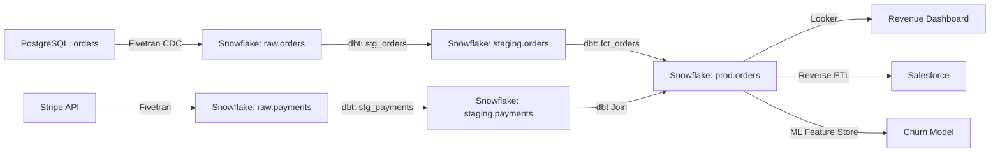

# Metadata Catalogs

> **Purpose**: Centralized inventory documenting data assets, systems, and analytics resources with technical metadata, business context, lineage, quality metrics, and usage statistics.
>
> **See also**: `artifact_descriptions/metadata-catalogs.md`

## Catalog Overview

```yaml
version: 1.0.0
catalogPlatform: Alation | Collibra | DataHub | Amundsen
owner: Data Governance Team
classification: Internal
lastUpdated: 2025-01-15
```

---

## Example 1: E-Commerce Analytics Catalog

### Data Sources

| Source System | Type | Connection | Steward | Sensitivity |
|---------------|------|------------|---------|-------------|
| `postgres_prod` | OLTP Database | PostgreSQL 14 | Engineering | PII (High) |
| `snowflake_analytics` | Data Warehouse | Snowflake | Analytics | Internal |
| `s3_raw_events` | Data Lake | S3 + Glue | Data Engineering | Internal |
| `salesforce` | SaaS | API Integration | Sales Ops | Customer Data |

### Table Catalog Entry: `analytics.prod.customers`

```yaml
table:
  name: analytics.prod.customers
  database: snowflake_analytics
  schema: prod
  type: Table (Materialized)

business:
  description: Golden customer record combining CRM, billing, and product usage
  owner: jane.doe@company.com (Data Platform Team)
  steward: sarah.johnson@company.com (Customer Success)
  certification: Production Certified
  tags: [customer-360, pii, gdpr]

technical:
  row_count: 1,247,893
  size_gb: 4.2
  partitioned_by: created_date
  clustered_by: customer_id
  last_updated: 2025-01-15 08:30:00 UTC
  update_frequency: Incremental (every 15 minutes)

columns:
  - name: customer_id
    type: VARCHAR(36)
    description: Unique customer identifier (UUID)
    nullable: false
    pk: true
    sample_values: ["a1b2c3d4-...", "e5f6g7h8-..."]

  - name: email
    type: VARCHAR(255)
    description: Customer email address
    nullable: false
    pii: true
    classification: PII - Email
    unique: true

  - name: created_at
    type: TIMESTAMP_NTZ
    description: Customer account creation timestamp
    nullable: false

  - name: lifetime_value
    type: NUMBER(12,2)
    description: Total revenue from customer
    nullable: true
    business_metric: true

lineage:
  upstream_sources:
    - postgres_prod.users (via Fivetran CDC)
    - salesforce.accounts (via Fivetran)
    - stripe.customers (via Fivetran)

  transformation: dbt model `customers.sql` (incremental)

  downstream_consumers:
    - looker.customer_dashboard
    - ml_models.churn_prediction
    - segment.reverse_etl_sync

quality:
  freshness_sla: 15 minutes
  completeness: 99.8%
  uniqueness_check: customer_id (100% unique)
  last_profiled: 2025-01-14

usage:
  queries_last_30d: 45,287
  top_users: [data-analysts, customer-success, finance]
  avg_query_time_ms: 340
```

---

## Example 2: SaaS Product Analytics Catalog

### Dashboard Inventory

| Dashboard | Platform | Owner | Users (30d) | Refresh |
|-----------|----------|-------|-------------|---------|
| `Executive KPI Dashboard` | Looker | VP Product | 45 | Real-time |
| `Customer Health Scores` | Tableau | CS Team | 120 | Hourly |
| `Growth Metrics` | Mode | Analytics | 28 | Daily |

### Report Catalog Entry

```yaml
report:
  name: Weekly Active Users Trend
  id: RPT-WAU-001
  platform: Looker
  url: https://looker.company.com/looks/weekly_active_users

business_context:
  purpose: Track weekly active user growth for board reporting
  owner: growth-team@company.com
  audience: Executive team, Product managers
  refresh_schedule: Daily at 6am PT

data_sources:
  primary_source: analytics.prod.usage_events
  additional_sources:
    - analytics.prod.users
    - analytics.prod.feature_usage

  data_freshness: < 1 hour lag

metrics_defined:
  - name: Weekly Active Users (WAU)
    definition: COUNT(DISTINCT user_id) WHERE last_active >= CURRENT_DATE - 7

  - name: WAU Growth Rate
    definition: (WAU_current_week - WAU_previous_week) / WAU_previous_week * 100

access_control:
  visibility: Company-wide
  edit_permissions: Analytics team only
```

---

## Example 3: Data Quality Catalog

### Quality Rules Registry

```yaml
quality_rules:
  - rule_id: DQ-CUST-001
    table: analytics.prod.customers
    rule: email format validation
    check: email RLIKE '^[A-Za-z0-9._%+-]+@[A-Za-z0-9.-]+\\.[A-Z|a-z]{2,}$'
    severity: critical
    owner: data-quality-team@company.com

  - rule_id: DQ-ORD-002
    table: analytics.prod.orders
    rule: order_total >= 0
    check: order_total >= 0
    severity: critical

  - rule_id: DQ-PROD-003
    table: analytics.prod.products
    rule: product name not null
    check: product_name IS NOT NULL
    severity: warning
```

### Data Lineage Visualization



---

## Catalog Schema (DataHub Format)

```json
{
  "datasetUrn": "urn:li:dataset:(urn:li:dataPlatform:snowflake,analytics.prod.customers,PROD)",
  "properties": {
    "name": "customers",
    "qualifiedName": "analytics.prod.customers",
    "description": "Golden customer record",
    "customProperties": {
      "steward": "sarah.johnson@company.com",
      "tier": "Tier 1 - Critical"
    }
  },
  "ownership": {
    "owners": [
      {
        "owner": "urn:li:corpuser:jane.doe",
        "type": "DATAOWNER"
      }
    ]
  },
  "tags": {
    "tags": [
      {"tag": "urn:li:tag:PII"},
      {"tag": "urn:li:tag:GDPR"},
      {"tag": "urn:li:tag:customer-360"}
    ]
  },
  "glossaryTerms": {
    "terms": [
      {"urn": "urn:li:glossaryTerm:Customer"}
    ]
  }
}
```

---

**Document Owner**: Data Governance Team
**Last Updated**: 2025-01-15
