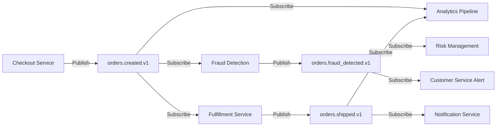

# Topic And Queue Catalog

> **Purpose**: Centralized registry of Kafka topics, message queues (RabbitMQ, SQS), event schemas, producers, consumers, and data contracts for event-driven architectures.
>
> **See also**: `artifact_descriptions/topic-and-queue-catalog.md` | YAML version: `topic-and-queue-catalog.yaml`

## Catalog Overview

```yaml
version: 1.0.0
messagingPlatform: Kafka | RabbitMQ | AWS SQS | Google Pub/Sub
owner: Data Platform Team
classification: Internal
lastUpdated: 2025-01-15
```

---

## Example 1: Kafka Topics (E-Commerce)

### Topic: `orders.created.v1`

```yaml
topic:
  name: orders.created.v1
  cluster: prod-kafka-us-east-1
  partitions: 12
  replication_factor: 3
  retention_ms: 604800000  # 7 days

description: |
  Order creation events from checkout service. Published when
  customer completes checkout and payment is authorized.

schema:
  format: Avro
  registry: Confluent Schema Registry
  compatibility: BACKWARD
  version: 3

  schema_definition: |
    {
      "type": "record",
      "name": "OrderCreated",
      "namespace": "com.company.orders.events",
      "fields": [
        {"name": "order_id", "type": "string"},
        {"name": "customer_id", "type": "string"},
        {"name": "order_total", "type": "double"},
        {"name": "currency", "type": "string"},
        {"name": "items", "type": {
          "type": "array",
          "items": {
            "type": "record",
            "name": "OrderItem",
            "fields": [
              {"name": "product_id", "type": "string"},
              {"name": "quantity", "type": "int"},
              {"name": "unit_price", "type": "double"}
            ]
          }
        }},
        {"name": "created_at", "type": "long", "logicalType": "timestamp-millis"}
      ]
    }

producers:
  - service: checkout-service
    team: payments-team
    sla: 99.9% availability
    throughput: ~500 msg/sec peak

consumers:
  - service: analytics-pipeline
    consumer_group: analytics-orders-processor
    purpose: Ingest to data warehouse
    lag_alert_threshold: 10000 messages

  - service: fraud-detection
    consumer_group: fraud-orders-monitor
    purpose: Real-time fraud scoring
    lag_alert_threshold: 100 messages
    critical: true

  - service: fulfillment-service
    consumer_group: fulfillment-orders
    purpose: Warehouse picking workflow

data_contract:
  fields_required: [order_id, customer_id, order_total, created_at]
  order_total_validation: "> 0"
  breaking_changes_require: Major version bump + 30-day deprecation

monitoring:
  lag_dashboard: https://monitoring.company.com/kafka/orders.created
  error_rate_alert: > 1% over 5 minutes
  throughput_alert: < 100 msg/sec during business hours
```

---

## Example 2: AWS SQS Queues (Async Processing)

### Queue: `image-processing-queue`

```yaml
queue:
  name: image-processing-queue
  platform: AWS SQS
  type: Standard  # or FIFO
  region: us-east-1
  arn: arn:aws:sqs:us-east-1:123456789:image-processing-queue

configuration:
  visibility_timeout: 300 seconds  # 5 minutes
  message_retention: 1209600 seconds  # 14 days
  max_message_size: 256 KB
  delay_seconds: 0
  receive_wait_time: 20 seconds  # Long polling

dead_letter_queue:
  name: image-processing-dlq
  max_receive_count: 3
  retention: 14 days

message_format:
  type: JSON
  schema: |
    {
      "image_id": "uuid",
      "s3_bucket": "string",
      "s3_key": "string",
      "transformations": ["thumbnail", "watermark", "compress"],
      "callback_url": "string (optional)",
      "priority": "low | normal | high",
      "uploaded_at": "ISO 8601 timestamp"
    }

producers:
  - service: upload-service
    throughput: ~50 msg/sec
    team: media-team

consumers:
  - service: image-processor-lambda
    concurrency: 10 Lambda functions
    processing_time_p95: 8 seconds
    team: media-team

monitoring:
  cloudwatch_alarms:
    - metric: ApproximateAgeOfOldestMessage
      threshold: > 600 seconds
      action: Scale up Lambda concurrency

    - metric: ApproximateNumberOfMessagesVisible
      threshold: > 1000 messages
      action: Alert on-call engineer

    - metric: NumberOfMessagesSent to DLQ
      threshold: > 10 in 5 minutes
      action: Page engineering team
```

---

## Example 3: Google Pub/Sub (Event Bus)

### Topic: `user.activity.events`

```yaml
topic:
  name: user.activity.events
  project: company-prod
  platform: Google Cloud Pub/Sub

message_retention: 7 days
message_ordering: false

schema:
  type: Protocol Buffers (proto3)
  definition: |
    syntax = "proto3";

    message UserActivityEvent {
      string event_id = 1;
      string user_id = 2;
      string session_id = 3;
      EventType event_type = 4;
      map<string, string> properties = 5;
      int64 timestamp_ms = 6;

      enum EventType {
        PAGE_VIEW = 0;
        BUTTON_CLICK = 1;
        FORM_SUBMIT = 2;
        FEATURE_USAGE = 3;
      }
    }

subscriptions:
  - name: analytics-dataflow-sub
    ack_deadline: 60 seconds
    message_retention: 7 days
    purpose: Stream to BigQuery via Dataflow
    filter: attributes.event_type="FEATURE_USAGE"

  - name: real-time-dashboard-sub
    ack_deadline: 10 seconds
    purpose: WebSocket updates for live dashboard

  - name: ml-features-sub
    ack_deadline: 120 seconds
    purpose: Feature store population

publishers:
  - service: web-app-frontend
    throughput: ~2000 msg/sec
  - service: mobile-app-backend
    throughput: ~800 msg/sec

monitoring:
  subscription_lag:
    analytics-dataflow-sub: < 1 minute
    real-time-dashboard-sub: < 5 seconds
    ml-features-sub: < 10 minutes
```

---

## Topic Naming Conventions

### Pattern: `<domain>.<entity>.<event_type>.<version>`

Examples:
- `orders.created.v1`
- `users.profile_updated.v2`
- `payments.authorized.v1`
- `inventory.stock_level_changed.v1`

### Versioning Strategy

- **v1**: Initial version
- **v2**: Backward-incompatible schema change (requires migration)
- **Deprecation period**: 90 days minimum for major version changes

---

## Event Schema Evolution

### Backward Compatible Changes (MINOR version bump)

- Adding optional fields
- Adding enum values
- Relaxing validation rules

### Breaking Changes (MAJOR version bump)

- Removing fields
- Renaming fields
- Changing field types
- Adding required fields
- Tightening validation

### Example Migration

```yaml
# orders.created.v1 -> orders.created.v2

changes:
  - type: BREAKING
    description: Split 'address' field into 'billing_address' and 'shipping_address'
    migration_guide: |
      Consumers must:
      1. Subscribe to both v1 and v2 topics during transition
      2. Handle both schema versions
      3. Migrate to v2-only after 90 days

  - type: BACKWARD_COMPATIBLE
    description: Add optional 'promo_code' field
    migration: Automatic (consumers ignore unknown fields)

deprecation_timeline:
  announcement: 2025-01-01
  dual_publish_start: 2025-02-01  # Publish to both v1 and v2
  v1_consumers_migrate: 2025-02-01 to 2025-05-01  # 90 days
  v1_deprecated: 2025-05-01
  v1_deleted: 2025-06-01
```

---

## Message Flow Diagram



---

**Document Owner**: Data Platform Team
**Last Updated**: 2025-01-15
