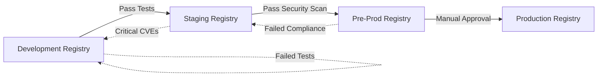

# Artifact Registry Policies

**Document Version:** 2.1.0
**Last Updated:** 2024-10-26
**Owner:** DevOps & Security Team
**Classification:** Internal
**Status:** Active

## Document Control

| Field | Value |
|-------|-------|
| Document ID | ARTIFACT-POL-2024-001 |
| Scope | All artifact registries (container, package, binary) |
| Affected Systems | Docker Hub, ECR, ACR, GCR, JFrog Artifactory, npm, PyPI |
| Last Review Date | 2024-10-15 |
| Next Review Date | 2024-11-26 |
| Compliance Frameworks | NIST SSDF, SLSA, Supply Chain Security |

## Executive Summary

This document establishes mandatory governance policies for all artifact registries used in the software delivery lifecycle. It defines retention rules, access controls, vulnerability scanning requirements, artifact promotion workflows, and naming conventions that ensure secure, traceable, and cost-effective artifact management.

**Key Policies:**
- **Immutable Tags**: Production artifacts use SHA256 digests; tags cannot be overwritten
- **Vulnerability Scanning**: All artifacts scanned on push; Critical/High CVEs block deployment
- **Retention**: Last 10 versions OR 90 days retained; automated pruning of older artifacts
- **Signing**: All production artifacts cryptographically signed with Cosign/Sigstore
- **SBOM**: Software Bill of Materials required for all production deployments

---

## Purpose & Scope

### Primary Purpose

Establish secure, consistent, and auditable artifact management practices across all registries to prevent supply chain attacks, reduce storage costs, and ensure compliance with software security standards.

### Scope

**In Scope:**
- Container image registries (Docker Hub, Quay.io, ECR, GCR, ACR, Harbor, distribution)
- Binary artifact repositories (JFrog Artifactory, Sonatype Nexus, Azure Artifacts)
- Package management registries (npm registry, PyPI, Maven Central, NuGet Gallery, RubyGems)
- Build artifact storage (CI/CD pipeline outputs, compiled binaries, static assets)
- ML model registries (MLflow, Kubeflow, SageMaker Model Registry)

**Out of Scope:**
- Source code repositories (covered in separate SCM policy)
- Database backups (covered in disaster recovery policy)
- End-user file storage (covered in data retention policy)

---

## Registry Types & Purposes

### Container Image Registries

| Registry Type | Purpose | Environment | Immutability | Retention |
|--------------|---------|-------------|--------------|-----------|
| **Production** | Production-ready signed images | prod | Immutable | 180 days or last 20 versions |
| **Staging** | Pre-production testing images | staging | Immutable | 90 days or last 10 versions |
| **Development** | Development and testing images | dev | Mutable | 30 days or last 5 versions |
| **Ephemeral** | CI/CD temporary builds | ci/cd | Mutable | 7 days |

### Package Registries

| Registry Type | Supported Formats | Usage |
|--------------|------------------|-------|
| **JFrog Artifactory** | npm, PyPI, Maven, NuGet, Docker, Helm | Enterprise artifact repository |
| **npm Private Registry** | npm packages | JavaScript/TypeScript applications |
| **PyPI Private** | Python packages | Python applications and ML models |
| **Maven/Gradle** | Java/Kotlin artifacts | JVM-based applications |

---

## Artifact Naming Conventions

### Container Images

**Format:** `<registry>/<organization>/<repository>:<tag or digest>`

**Examples:**
```
# Development (mutable tag)
company.jfrog.io/dev/api-gateway:v1.2.3-alpha

# Staging (semantic version)
company.jfrog.io/staging/api-gateway:1.2.3

# Production (immutable digest)
company.jfrog.io/prod/api-gateway@sha256:abcd1234...

# Feature branch (temporary)
company.jfrog.io/dev/api-gateway:feature-auth-refactor-1234
```

**Naming Rules:**
- Repository names: lowercase, alphanumeric, hyphens only (no underscores)
- Tags: SemVer 2.0 format (MAJOR.MINOR.PATCH) for releases
- Feature tags: `feature-<description>-<build-number>`
- Production: Use SHA256 digest instead of tags for immutability

### Semantic Versioning

**Required for all production artifacts:**

```
Format: MAJOR.MINOR.PATCH[-PRERELEASE][+METADATA]

Examples:
  1.0.0          - Initial release
  1.2.3          - Standard release
  2.0.0-rc.1     - Release candidate
  1.4.5-beta.2   - Beta version
  1.0.0+20231015 - Build metadata
```

**Version Increment Rules:**
- **MAJOR**: Breaking changes or incompatible API changes
- **MINOR**: New features, backward compatible
- **PATCH**: Bug fixes, backward compatible
- **PRERELEASE**: alpha, beta, rc (release candidate)

---

## Retention Policies

### Container Images

| Environment | Retention Rule | Auto-Deletion | Exceptions |
|-------------|---------------|---------------|------------|
| **Production** | Last 20 versions OR 180 days (whichever retains more) | Yes | Critical business apps: 365 days |
| **Staging** | Last 10 versions OR 90 days | Yes | None |
| **Development** | Last 5 versions OR 30 days | Yes | None |
| **CI/CD Temp** | 7 days | Yes | Never retain ephemeral builds |

**Retention Algorithm:**
```python
def should_retain_artifact(artifact):
    """
    Determine if artifact should be retained
    """
    # Keep if within version count limit
    if artifact.version_rank <= retention_policy.max_versions:
        return True

    # Keep if within time window
    if (now() - artifact.created_date) <= retention_policy.max_age_days:
        return True

    # Keep if explicitly tagged as "retain" or "lts"
    if "retain" in artifact.tags or "lts" in artifact.tags:
        return True

    # Keep if currently deployed in production
    if artifact.digest in production_deployments:
        return True

    # Otherwise, eligible for deletion
    return False
```

### Package Artifacts

| Package Type | Retention Policy | Reasoning |
|-------------|-----------------|-----------|
| **npm Packages** | All versions indefinitely | npm packages are immutable by design |
| **PyPI Packages** | All versions indefinitely | Python dependencies need historical versions |
| **Maven Artifacts** | Release: Indefinite; Snapshot: 90 days | Release versions immutable; snapshots temporary |
| **NuGet Packages** | All versions indefinitely | .NET dependencies need historical versions |

### Binary Artifacts

| Artifact Type | Retention | Auto-Cleanup |
|--------------|-----------|--------------|
| **Release Binaries** | 365 days | Yes |
| **Debug Symbols** | 180 days | Yes |
| **Build Logs** | 90 days | Yes |
| **Test Results** | 90 days | Yes |

---

## Vulnerability Scanning Policies

### Scan Requirements

**All artifacts must be scanned:**
- On push to registry (real-time scanning)
- Daily scheduled scans (detect newly discovered CVEs)
- Before promotion to higher environment
- Before production deployment

**Scanning Tools:**
- Container Images: Trivy, Grype, Snyk Container, Prisma Cloud
- Dependencies: Snyk, Dependabot, OWASP Dependency-Check
- SAST: SonarQube, Checkmarx

### Vulnerability Severity Gates

| Severity | Development | Staging | Production | Action |
|----------|------------|---------|------------|--------|
| **Critical** | Warn | Block | Block | Must remediate before deployment |
| **High** | Warn | Warn | Block | Must remediate before production |
| **Medium** | Warn | Warn | Warn | Document in risk register |
| **Low** | Informational | Informational | Informational | No action required |

**Deployment Gate Policy:**

```yaml
vulnerability_policy:
  production:
    block_on:
      - severity: CRITICAL
        age_days: any
      - severity: HIGH
        age_days: any

    warn_on:
      - severity: MEDIUM
        count: >10

  staging:
    block_on:
      - severity: CRITICAL
        age_days: >7  # Must fix critical CVEs within 7 days

    warn_on:
      - severity: HIGH
        age_days: any

  development:
    warn_on:
      - severity: CRITICAL
      - severity: HIGH
```

### Exceptions & Waivers

**Vulnerability Exception Process:**

1. Submit exception request with:
   - CVE identifier
   - Justification (false positive, no exploit path, etc.)
   - Compensating controls
   - Remediation plan and timeline

2. Approval required:
   - High severity: Security Engineer + Manager
   - Critical severity: CISO

3. Exception validity: 90 days maximum

4. Review: Monthly review of all active exceptions

**Example Exception:**
```yaml
exception:
  cve_id: CVE-2023-12345
  artifact: company/api-gateway:1.2.3
  severity: HIGH
  justification: "Vulnerability in unused transitive dependency; code path not reachable"
  compensating_controls:
    - "Dependency excluded from build"
    - "Network access restricted via firewall"
  approved_by: "Security Manager"
  expiry_date: 2024-12-31
  status: ACTIVE
```

---

## Artifact Signing & Verification

### Signing Requirements

**Production Artifacts:**
- All production images MUST be signed using Cosign or Notary
- Signatures stored in transparency log (Rekor)
- Public keys published in trusted location

**Signing Workflow:**

```bash
# Sign container image with Cosign
cosign sign --key cosign.key company.jfrog.io/prod/api-gateway@sha256:abcd1234

# Verify signature before deployment
cosign verify --key cosign.pub company.jfrog.io/prod/api-gateway@sha256:abcd1234

# Kubernetes admission controller enforces signature verification
kubectl apply -f deployment.yaml
# → Denied if signature missing or invalid
```

**Key Management:**
- Signing keys stored in HashiCorp Vault or AWS KMS
- Key rotation: Every 90 days
- Private keys never leave secure environment
- Public keys published to OCI registry and Git repository

### SBOM (Software Bill of Materials)

**Requirements:**
- SBOM generated for all production artifacts
- Format: SPDX or CycloneDX
- Stored alongside artifact in registry
- Include direct and transitive dependencies

**SBOM Generation:**

```bash
# Generate SBOM with Syft
syft company.jfrog.io/prod/api-gateway:1.2.3 -o spdx-json > sbom.spdx.json

# Attach SBOM to image
cosign attach sbom --sbom sbom.spdx.json company.jfrog.io/prod/api-gateway@sha256:abcd1234

# Retrieve SBOM
cosign download sbom company.jfrog.io/prod/api-gateway@sha256:abcd1234
```

---

## Access Control Policies

### Registry Access Levels

| Role | Development Registry | Staging Registry | Production Registry |
|------|---------------------|------------------|---------------------|
| **Developer** | Read + Write | Read + Write (with approval) | Read Only |
| **DevOps Engineer** | Read + Write | Read + Write | Read + Write (limited) |
| **CI/CD Pipeline** | Read + Write (service account) | Read + Write (service account) | Write Only (signed artifacts) |
| **Production Deployer** | No Access | Read Only | Read + Execute |
| **Security Analyst** | Read Only | Read Only | Read Only |

### Service Account Policies

**CI/CD Service Accounts:**
- One service account per pipeline
- Scoped to specific repositories
- Short-lived tokens (24 hour TTL)
- Token rotation on every pipeline run
- All actions logged and attributed

**Example IAM Policy (AWS ECR):**

```json
{
  "Version": "2012-10-17",
  "Statement": [
    {
      "Effect": "Allow",
      "Action": [
        "ecr:GetDownloadUrlForLayer",
        "ecr:BatchGetImage",
        "ecr:BatchCheckLayerAvailability",
        "ecr:PutImage",
        "ecr:InitiateLayerUpload",
        "ecr:UploadLayerPart",
        "ecr:CompleteLayerUpload"
      ],
      "Resource": "arn:aws:ecr:us-east-1:123456789012:repository/dev/*",
      "Condition": {
        "StringEquals": {
          "aws:PrincipalTag/Environment": "development"
        }
      }
    }
  ]
}
```

---

## Promotion Workflows

### Environment Promotion

Artifacts must pass quality gates before promotion:



**Promotion Checklist:**

- [ ] All automated tests passed
- [ ] Security scan clean (no Critical/High CVEs)
- [ ] SBOM generated and attached
- [ ] Artifact signed with Cosign
- [ ] Manual approval by Release Manager (for production)
- [ ] Change ticket approved (for production)

### Promotion Automation

```yaml
# Example GitLab CI promotion pipeline
promote_to_staging:
  stage: promote
  script:
    # Copy artifact from dev to staging
    - crane copy company.jfrog.io/dev/api-gateway:$CI_COMMIT_SHA company.jfrog.io/staging/api-gateway:$CI_COMMIT_SHA

    # Re-scan in staging registry
    - trivy image --severity HIGH,CRITICAL company.jfrog.io/staging/api-gateway:$CI_COMMIT_SHA

    # Tag with semantic version
    - crane tag company.jfrog.io/staging/api-gateway:$CI_COMMIT_SHA $SEMANTIC_VERSION

  only:
    - main

  when: manual

promote_to_production:
  stage: promote
  script:
    # Scan before promotion
    - trivy image --exit-code 1 --severity CRITICAL,HIGH company.jfrog.io/staging/api-gateway:$VERSION

    # Generate SBOM
    - syft company.jfrog.io/staging/api-gateway:$VERSION -o spdx-json > sbom.json

    # Copy to production registry
    - crane copy company.jfrog.io/staging/api-gateway:$VERSION company.jfrog.io/prod/api-gateway:$VERSION

    # Sign artifact
    - cosign sign --key $COSIGN_KEY company.jfrog.io/prod/api-gateway@$(crane digest company.jfrog.io/prod/api-gateway:$VERSION)

    # Attach SBOM
    - cosign attach sbom --sbom sbom.json company.jfrog.io/prod/api-gateway@$(crane digest company.jfrog.io/prod/api-gateway:$VERSION)

  only:
    - tags

  when: manual

  environment:
    name: production
```

---

## Compliance & Auditing

### Audit Logging

**All registry operations must be logged:**
- Push/pull operations (who, what, when, from where)
- Tag operations (create, update, delete)
- Access control changes
- Vulnerability scan results
- Artifact deletions

**Log Retention:** 2 years (compliance requirement)

**Audit Events Logged:**

| Event Type | Details Captured |
|-----------|-----------------|
| **Artifact Push** | User, timestamp, artifact name, digest, size, source IP |
| **Artifact Pull** | User, timestamp, artifact name, digest, destination IP |
| **Tag Operation** | User, timestamp, tag name, action (create/update/delete), target digest |
| **Scan Result** | Timestamp, artifact, scanner, vulnerabilities found, severity counts |
| **Access Grant** | Admin, timestamp, user/service account, permissions granted |
| **Artifact Delete** | User, timestamp, artifact name, reason, approval ID |

### Compliance Mapping

**NIST Secure Software Development Framework (SSDF):**
- PO.5.1: Maintain provenance of software components (SBOM, signing)
- PW.4.1: Verify third-party software (vulnerability scanning)
- PS.1.1: Store artifacts in secure repository (access controls, encryption)

**SLSA (Supply-chain Levels for Software Artifacts):**
- Level 2: Build provenance with build service
- Level 3: Hardened build platform + signed provenance
- Level 4: Hermetic builds + dependency review

---

## Cost Optimization

### Storage Cost Management

**Automated Cleanup:**
- Unused tags older than retention period
- Untagged images (dangling)
- Duplicate layers across images

**Cost Monitoring:**
- Monthly reports on registry storage usage
- Cost allocation by team/project
- Alerts when usage exceeds budget

**Example Cleanup Policy:**

```yaml
cleanup_policies:
  - name: "Remove old development images"
    repository_pattern: "dev/*"
    rules:
      - tag_pattern: "^feature-.*"
        age_days: 30
        action: DELETE

      - tag_pattern: "^v.*"
        keep_last_n: 5
        action: DELETE

  - name: "Remove untagged images"
    repository_pattern: "*"
    rules:
      - untagged: true
        age_days: 7
        action: DELETE

  - name: "Production long-term retention"
    repository_pattern: "prod/*"
    rules:
      - tag_pattern: "^v.*"
        keep_last_n: 20
        min_age_days: 180
        action: DELETE
```

---

## Disaster Recovery

### Backup Strategy

**Registry Backups:**
- Frequency: Daily
- Retention: 30 days
- Storage: Cross-region replication
- RTO: 4 hours
- RPO: 24 hours

**Backup Contents:**
- All artifact blobs and manifests
- Metadata (tags, labels, scan results)
- Access control policies
- Audit logs

**Recovery Testing:**
- Quarterly restore drills
- Validate integrity of restored artifacts
- Document lessons learned

---

## Change History

| Version | Date | Author | Changes | Approver |
|---------|------|--------|---------|----------|
| 2.1.0 | 2024-10-26 | Alex Rivera, DevOps Lead | Added Cosign signing requirements, SBOM policies, SLSA compliance | Sarah Martinez, CISO |
| 2.0.0 | 2024-06-15 | Alex Rivera, DevOps Lead | Major update: Added vulnerability scanning gates, promotion workflows, retention policies | CISO |
| 1.0.0 | 2024-01-10 | DevOps Team | Initial artifact registry policies | VP Engineering |

---

**Next Review Date:** 2024-11-26
**Review Frequency:** Quarterly
**Document Owner:** DevOps Lead
**Compliance Frameworks:** NIST SSDF, SLSA, SOC 2, ISO 27001
