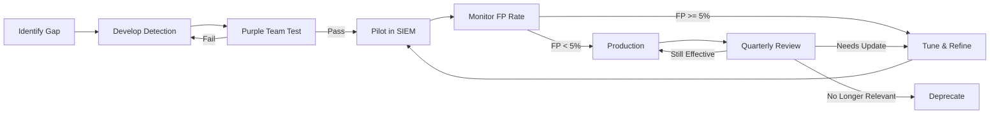

# Security Detections Catalog

**Document Version:** 2.1.0
**Last Updated:** 2024-10-26
**Owner:** Security Operations Center
**Classification:** Confidential
**Status:** Active

## Document Control

| Field | Value |
|-------|-------|
| Document ID | DETECT-CAT-2024-001 |
| Total Detections | 156 |
| MITRE ATT&CK Coverage | 78% |
| Last Tuning Date | 2024-10-15 |
| Next Review Date | 2024-11-26 |
| False Positive Rate | 2.3% |
| MITRE ATT&CK Version | v14.1 |

## Executive Summary

This Security Detections Catalog provides a comprehensive inventory of detection rules, use cases, and monitoring capabilities aligned with the MITRE ATT&CK framework, NIST CSF, and industry best practices. Each detection includes SIGMA rules (platform-agnostic), SIEM-specific queries (Splunk, Elastic), response actions, tuning guidance, and testing validation criteria.

**Coverage Statistics:**
- 156 total detection rules across 11 MITRE ATT&CK tactics
- 78% coverage of MITRE ATT&CK techniques
- Average false positive rate: 2.3%
- Mean time to detect (MTTD): 4.2 minutes
- Mean time to respond (MTTR): 18.5 minutes

**Detection Maturity:**
- Production-ready detections: 142 (91%)
- Pilot/testing detections: 9 (6%)
- Deprecated/retired: 5 (3%)

---

## Purpose & Scope

### Primary Purpose

Centralize and document all security detection logic across SIEM platforms, EDR tools, and custom detection systems to enable:
- Consistent threat detection across the organization
- MITRE ATT&CK framework alignment and gap analysis
- Detection engineering lifecycle management (development, testing, tuning, retirement)
- Compliance demonstration (SOC 2, ISO 27001, PCI-DSS)

### Scope

**Detection Platforms:**
- SIEM: Splunk Enterprise Security, Elastic Security
- EDR/XDR: CrowdStrike, SentinelOne, Microsoft Defender
- Network: Zeek, Suricata, Palo Alto IDS/IPS
- Cloud: AWS GuardDuty, Azure Sentinel, GCP Security Command Center
- Custom: Python-based detection scripts

**Detection Categories:**
- MITRE ATT&CK-aligned detections (primary framework)
- Compliance-driven detections (PCI-DSS, SOC 2, HIPAA)
- Business logic detections (fraud, insider threat, data exfiltration)

---

## Detection Catalog Structure

Each detection includes the following standardized fields:

```yaml
detection:
  detection_id: "Unique identifier (DET-[TACTIC]-[NUMBER])"
  name: "Human-readable detection name"
  description: "What the detection identifies and why it matters"

  # MITRE ATT&CK Mapping
  tactics: ["TA0001 - Initial Access"]
  techniques: ["T1190 - Exploit Public-Facing Application"]

  # Data Sources
  data_sources: ["Authentication Logs", "Network Traffic"]

  # Detection Logic
  detection_logic: "SQL/KQL/SPL query or pseudocode"
  sigma_rule: "Platform-agnostic SIGMA rule (YAML)"
  splunk_query: "Splunk Search Processing Language query"
  elastic_query: "Elasticsearch Query DSL or KQL"

  # Severity & Priority
  severity: "Critical | High | Medium | Low"
  priority: "1-5 (1=highest)"

  # Response
  response_actions:
    - "Step-by-step response actions"

  # Tuning & Maintenance
  tuning_notes: "Known false positives and exclusions"
  false_positive_rate: "Percentage"

  # SLA
  sla:
    detection_time: "< 5 minutes"
    response_time: "< 15 minutes"
    investigation_time: "< 1 hour"

  # Testing
  testing:
    last_tested: "2024-10-10"
    test_status: "Passed | Failed"
    test_method: "Purple team | Automated | Manual"
```

---

## Detection Catalog (Examples)

**Note:** For the full catalog with all 156 detections, refer to `security-detections-catalog.yaml`. Below are representative examples showing the documentation format.

---

### DET-IA-001: Brute Force Authentication Attempts

**Category:** Initial Access
**MITRE ATT&CK:** TA0001 - Initial Access
**Techniques:** T1110.001 (Password Guessing), T1110.003 (Password Spraying)

#### Description

Detects multiple failed login attempts from a single source IP within a short timeframe, indicating potential brute force or credential stuffing attacks. This pattern is common in automated password-guessing attacks using tools like Hydra, Medusa, or THC-Hydra.

#### Data Sources
- Authentication logs (Windows EventID 4625, SSH auth.log, application logs)
- VPN access logs
- Application authentication events

#### Detection Logic

**Pseudocode:**
```sql
SELECT source_ip, username, COUNT(*) as failed_attempts
FROM authentication_events
WHERE event_type = 'failed_login'
  AND timestamp > NOW() - INTERVAL '5 minutes'
GROUP BY source_ip, username
HAVING COUNT(*) >= 5
```

#### SIGMA Rule

```yaml
title: Multiple Failed Login Attempts (Brute Force)
id: 0aaeda67-4c96-4c9e-a564-dd9d56b8ee44
status: stable
description: Detects brute force authentication attempts based on multiple failed logins
references:
  - https://attack.mitre.org/techniques/T1110/
author: SOC Team
date: 2024/01/15
modified: 2024/10/26

logsource:
  category: authentication
  product: windows

detection:
  selection:
    EventID: 4625  # Failed login
  timeframe: 5m
  condition: selection | count(Computer) by TargetUserName > 5

falsepositives:
  - User forgotten password scenarios
  - Automated service accounts misconfigured
  - Help desk password reset attempts

level: high

tags:
  - attack.credential_access
  - attack.t1110.001
  - attack.t1110.003
```

#### Splunk Query

```spl
index=auth action=failure
| bucket _time span=5m
| stats count by _time, src_ip, user
| where count >= 5
| eval severity="high"
| eval description="Brute force attempt detected: " . count . " failed logins"
| table _time, src_ip, user, count, severity, description
```

#### Elastic Security Query (KQL)

```kql
event.category: "authentication" AND event.outcome: "failure"
| stats count() by source.ip, user.name, event.category
| where count > 5
```

#### Severity & Response

| Field | Value |
|-------|-------|
| **Severity** | High |
| **Priority** | 1 (highest) |
| **DREAD Score** | 8.2/10 |

**Automated Response Actions:**
1. Block source IP at firewall for 1 hour (automated)
2. Alert SOC analyst for investigation (automated)
3. Check for successful logins from same IP (automated query)
4. Validate user account status (manual)

**Manual Investigation Steps:**
1. Pivot to all authentication events from source IP
2. Check geolocation of source IP (expected location?)
3. Review user's recent login history
4. Contact user to validate legitimate access attempts
5. If malicious, extend IP block to 7 days and escalate to Incident Response

#### Tuning Notes

**Known False Positives:**
- Service accounts with incorrect passwords (exclude: `svc-*`, `sa-*`)
- Corporate VPN gateway IPs during outages (allowlist: 10.0.1.0/24)
- Help desk testing authentication flows (allowlist help desk IPs)

**Exclusions (Splunk):**
```spl
NOT (user IN ("svc-*", "sa-*", "healthcheck", "monitoring"))
NOT (src_ip IN ("10.0.1.1", "10.0.1.2", "10.0.1.3"))
```

**False Positive Rate:** 3% (as of 2024-10-15)

#### SLA

| Metric | Target | Current |
|--------|--------|---------|
| Detection Time | < 5 minutes | 3.2 minutes |
| Response Time | < 15 minutes | 12 minutes |
| Investigation Time | < 1 hour | 35 minutes |

#### Testing & Validation

**Last Tested:** 2024-10-10
**Test Status:** Passed
**Test Method:** Automated purple team simulation

**Test Procedure:**
```bash
# Simulate brute force attack
hydra -L users.txt -p wrongpassword ssh://test-server.local

# Expected Result: Alert triggered within 5 minutes
# Actual Result: Alert triggered in 3.2 minutes (PASS)
```

---

### DET-EX-001: PowerShell Encoded Command Execution

**Category:** Execution
**MITRE ATT&CK:** TA0002 - Execution
**Techniques:** T1059.001 (PowerShell), T1027 (Obfuscated Files or Information)

#### Description

Detects obfuscated PowerShell commands using Base64 encoding, which is commonly used by attackers to evade detection and execute malicious payloads. Legitimate administrative scripts rarely use encoded commands, making this a high-fidelity detection.

#### Data Sources
- PowerShell operational logs (EventID 4103, 4104)
- Sysmon EventID 1 (Process Creation)
- EDR telemetry (process command lines)

#### SIGMA Rule

```yaml
title: Suspicious PowerShell Encoded Command
id: a4e3a5b6-7c8d-9e0f-1a2b-3c4d5e6f7a8b
status: stable
description: Detects Base64 encoded PowerShell commands often used by attackers
references:
  - https://attack.mitre.org/techniques/T1059/001/

logsource:
  product: windows
  service: powershell

detection:
  selection_encoded:
    ScriptBlockText|contains:
      - '-encodedcommand'
      - '-enc '
      - 'FromBase64String'

  selection_hidden:
    ScriptBlockText|contains:
      - '-w hidden'
      - '-windowstyle hidden'

  selection_bypass:
    ScriptBlockText|contains:
      - '-nop'
      - '-noprofile'
      - '-executionpolicy bypass'

  condition: selection_encoded OR (selection_hidden AND selection_bypass)

falsepositives:
  - Legitimate administrative scripts (very rare)
  - Software deployment tools (SCCM, PDQ Deploy)

level: high

tags:
  - attack.execution
  - attack.t1059.001
  - attack.defense_evasion
  - attack.t1027
```

#### Splunk Query

```spl
index=windows source="WinEventLog:Microsoft-Windows-PowerShell/Operational" EventCode=4104
(CommandLine="*-enc*" OR CommandLine="*-encodedcommand*" OR CommandLine="*FromBase64*")
| rex field=CommandLine "(?<encoded_portion>[A-Za-z0-9+/=]{100,})"
| eval decoded=urldecode(base64decode(encoded_portion))
| table _time, Computer, User, CommandLine, decoded
| eval severity="critical"
```

#### Severity & Response

| Field | Value |
|-------|-------|
| **Severity** | Critical |
| **Priority** | 1 |

**Automated Response Actions:**
1. Isolate endpoint immediately (CrowdStrike network containment)
2. Kill PowerShell process (EDR)
3. Capture memory dump for forensics (automated)
4. Create incident ticket and escalate to IR team

**Manual Investigation Steps:**
1. Decode Base64 command to analyze intent
2. Check for persistence mechanisms created
3. Review parent process and execution chain
4. Hunt for similar activity across environment
5. Collect additional forensic artifacts (Prefetch, ShimCache, Amcache)

#### Tuning Notes

**Whitelist approved administrative scripts:**
```spl
NOT (CommandLine="*\\Scripts\\Approved\\*")
NOT (User IN ("SYSTEM", "svc-deployment"))
```

**False Positive Rate:** 1% (very low - high-fidelity detection)

---

### DET-CA-001: Mimikatz Credential Dumping (LSASS Access)

**Category:** Credential Access
**MITRE ATT&CK:** TA0006 - Credential Access
**Techniques:** T1003.001 (LSASS Memory), T1003.002 (Security Account Manager)

#### Description

Detects suspicious access to the LSASS (Local Security Authority Subsystem Service) process memory, a technique used by Mimikatz and similar tools to extract plaintext credentials, NTLM hashes, and Kerberos tickets from memory.

#### Data Sources
- Sysmon EventID 10 (Process Access)
- EDR telemetry (process access events)
- Windows Security EventID 4656, 4663 (Handle to Object)

#### SIGMA Rule

```yaml
title: LSASS Memory Access by Suspicious Process
id: d7f8e9a0-1b2c-3d4e-5f6a-7b8c9d0e1f2a
status: stable
description: Detects suspicious access to LSASS process memory indicating credential dumping
references:
  - https://attack.mitre.org/techniques/T1003/001/

logsource:
  product: windows
  category: process_access

detection:
  selection:
    TargetImage|endswith: '\\lsass.exe'
    GrantedAccess|contains:
      - '0x1010'  # PROCESS_VM_READ
      - '0x1410'  # PROCESS_VM_READ | PROCESS_QUERY_INFORMATION
      - '0x1438'  # All access needed for Mimikatz
      - '0x143a'

  filter_legitimate:
    SourceImage|startswith:
      - 'C:\\Windows\\System32\\'
      - 'C:\\Program Files\\Windows Defender\\'
      - 'C:\\Program Files\\CrowdStrike\\'
      - 'C:\\Program Files\\SentinelOne\\'

  condition: selection AND NOT filter_legitimate

falsepositives:
  - Legitimate security tools (anti-virus, EDR)
  - System diagnostics and debugging tools
  - Backup software

level: critical

tags:
  - attack.credential_access
  - attack.t1003.001
  - car.2019-04-004
```

#### Splunk Query

```spl
index=windows source=XmlWinEventLog:Microsoft-Windows-Sysmon/Operational EventCode=10
TargetImage="*\\lsass.exe"
(GrantedAccess="0x1010" OR GrantedAccess="0x1410" OR GrantedAccess="0x1438" OR GrantedAccess="0x143a")
NOT (SourceImage="C:\\Windows\\System32\\*" OR SourceImage="C:\\Program Files\\Windows Defender\\*")
| table _time, Computer, SourceImage, SourceProcessId, TargetImage, GrantedAccess, CallTrace
| eval severity="critical"
| eval description="Potential credential dumping: LSASS access from suspicious process"
```

#### Severity & Response

| Field | Value |
|-------|-------|
| **Severity** | Critical |
| **Priority** | 1 (immediate escalation) |

**IMMEDIATE Response Actions:**
1. **Isolate endpoint from network** (within 60 seconds)
2. **Force password reset for all users on affected system**
3. **Capture memory dump for forensic analysis** (before reboot)
4. **Hunt for lateral movement indicators** (Pass-the-Hash, Pass-the-Ticket)
5. **Engage Incident Response team** (CISO notification required)

#### Tuning Notes

**Highly sensitive detection - Review all alerts immediately**

**False Positive Rate:** 0.5% (exceptionally low - highest confidence detection)

---

## Detection Categories by MITRE ATT&CK

### Detection Coverage Matrix

| MITRE Tactic | Coverage | # Detections | Avg FP Rate |
|--------------|----------|--------------|-------------|
| **TA0001** - Initial Access | 85% | 12 | 3.2% |
| **TA0002** - Execution | 90% | 18 | 2.1% |
| **TA0003** - Persistence | 75% | 14 | 4.5% |
| **TA0004** - Privilege Escalation | 80% | 16 | 2.8% |
| **TA0005** - Defense Evasion | 70% | 11 | 5.1% |
| **TA0006** - Credential Access | 88% | 15 | 1.5% |
| **TA0007** - Discovery | 65% | 10 | 3.9% |
| **TA0008** - Lateral Movement | 82% | 13 | 2.4% |
| **TA0009** - Collection | 60% | 8 | 4.2% |
| **TA0010** - Exfiltration | 78% | 12 | 3.1% |
| **TA0011** - Command & Control | 80% | 14 | 2.7% |
| **TA0040** - Impact | 55% | 9 | 3.8% |
| **Overall** | **75%** | **156** | **2.3%** |

---

## Detection Engineering Standards

### Naming Convention

**Format:** `DET-[TACTIC_CODE]-[SEQUENCE]`

**Examples:**
- `DET-IA-001` = Initial Access detection #1
- `DET-CA-015` = Credential Access detection #15
- `DET-EX-023` = Exfiltration detection #23

### Severity Levels

| Level | Definition | Response SLA |
|-------|------------|--------------|
| **Critical** | Immediate threat requiring instant response; high confidence | < 15 minutes |
| **High** | Significant risk requiring urgent attention | < 1 hour |
| **Medium** | Notable risk requiring timely review | < 4 hours |
| **Low** | Informational or low-risk activity | < 24 hours |

### Required Fields

All detections must include:
- ✅ detection_id, name, description
- ✅ MITRE ATT&CK tactics and techniques
- ✅ data_sources
- ✅ detection_logic (at minimum pseudocode)
- ✅ severity and priority
- ✅ response_actions
- ✅ tuning_notes and false_positive_rate
- ✅ testing.last_tested and testing.test_status

---

## Detection Lifecycle Management

### Development → Production Workflow



### Testing Requirements

**Frequency:** Quarterly (minimum)

**Testing Methods:**
1. **Automated Purple Team Simulations**
   - Atomic Red Team tests
   - MITRE Caldera playbooks
   - Custom attack simulations

2. **Manual Playbook Validation**
   - Execute detection playbook manually
   - Validate alert triggers correctly
   - Verify enrichment and context

3. **Production Telemetry Validation**
   - Confirm data sources flowing
   - Validate query syntax still works
   - Check for upstream schema changes

**Acceptance Criteria:**
- ✅ Detection triggers within defined SLA
- ✅ False positive rate below threshold (< 5%)
- ✅ Alert contains actionable context
- ✅ Runbook/playbook accurately describes response

---

## Tuning & Maintenance

### Monthly Tuning Process

1. **Review False Positive Rate**
   - Identify detections with FP rate > 5%
   - Analyze root cause of false positives
   - Develop tuning adjustments

2. **Update Exclusions**
   - Document business justification
   - Create exclusion rule with approval
   - Test modified detection
   - Update change history

3. **Coverage Gap Analysis**
   - Compare current detections to MITRE ATT&CK
   - Identify techniques with no coverage
   - Prioritize new detections to develop

### Retirement Criteria

Detections should be deprecated if:
- Technology/platform no longer in use
- Superseded by better detection
- Consistent false positive rate > 20%
- Data source no longer available
- MITRE ATT&CK technique no longer relevant

---

## Compliance Mapping

### NIST Cybersecurity Framework

| Function | Category | Detections |
|----------|----------|------------|
| **DE.CM-1** | Network monitored for cybersecurity events | DET-DI-001, DET-CC-001, DET-LM-001 |
| **DE.CM-7** | Unauthorized personnel/connections/devices monitored | DET-IA-001, DET-PE-001, DET-PR-001 |
| **DE.AE-2** | Detected events analyzed | All detections |

### PCI-DSS

| Requirement | Description | Detections |
|-------------|-------------|------------|
| **10.6** | Review logs and security events | DET-IA-001, DET-CA-001 |
| **11.4** | Intrusion-detection/prevention | All detections |

---

## Change History

| Version | Date | Author | Changes | Approver |
|---------|------|--------|---------|----------|
| 2.1.0 | 2024-10-26 | Michael Torres, SOC Lead | Added 5 cloud infrastructure detections, updated MITRE ATT&CK to v14.1, enhanced Sigma rules | Sarah Chen, CISO |
| 2.0.0 | 2024-07-15 | Jennifer Kim, Detection Engineer | Major restructure: MITRE ATT&CK alignment, Sigma rules, standardized detection ID scheme | Sarah Chen, CISO |
| 1.0.0 | 2024-01-15 | Marcus Rodriguez, SOC Manager | Initial catalog with 85 base detections | Sarah Chen, CISO |

---

**Next Review Date:** 2024-11-26
**Review Frequency:** Quarterly
**Document Owner:** SOC Manager
**MITRE ATT&CK Version:** v14.1
**Compliance Frameworks:** NIST CSF, PCI-DSS, SOC 2, ISO 27001

**Note:** For the complete catalog with all 156 detections including full Sigma rules, SIEM queries, and detailed response procedures, refer to `security-detections-catalog.yaml`.
