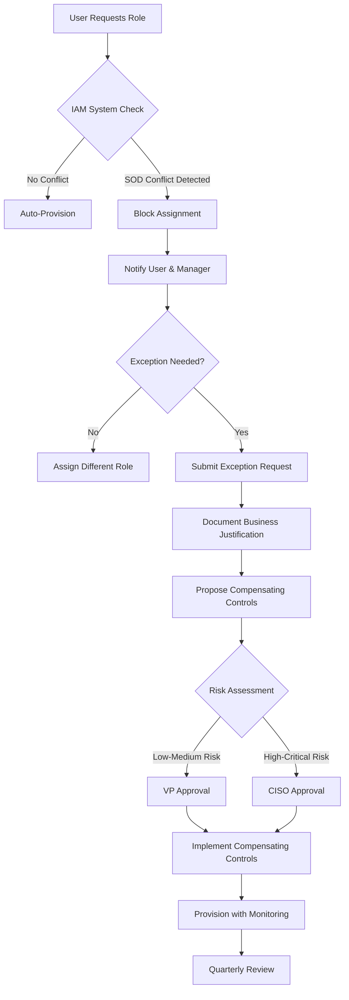

# Segregation of Duties (SOD) Matrix

**Document Version:** 2.1.0
**Last Updated:** 2024-10-26
**Owner:** Identity and Access Management Team
**Classification:** Confidential
**Status:** Active

## Document Control

| Field | Value |
|-------|-------|
| Document ID | SOD-MATRIX-2024-001 |
| Created Date | 2024-01-10 |
| Last Modified | 2024-10-26 |
| Next Review Date | 2024-11-26 |
| Approver | CISO |
| Compliance Frameworks | SOX, ISO 27001, NIST 800-53, PCI-DSS |

## Executive Summary

This Segregation of Duties (SOD) Matrix defines incompatible role combinations and access patterns that create unacceptable fraud or error risk. By preventing single individuals from controlling all aspects of critical transactions, this matrix implements one of the most fundamental internal controls for financial integrity, data security, and regulatory compliance.

The matrix identifies 45 SOD conflicts across financial, technical, and security domains, documents compensating controls where separation is impractical, and establishes approval workflows for temporary exceptions. All role assignments are automatically validated against this matrix through the IAM system, with violations flagged for immediate remediation.

### Strategic Importance

- **Fraud Prevention**: Prevents single individuals from committing and concealing fraudulent activities
- **Error Reduction**: Creates natural checkpoints that catch mistakes before impact
- **Regulatory Compliance**: Satisfies SOX, PCI-DSS, ISO 27001 SOD requirements
- **Audit Readiness**: Provides clear documentation of control separation for auditors
- **Risk Mitigation**: Reduces impact of compromised credentials or insider threats

## Purpose & Scope

### Primary Purpose

This matrix systematically identifies incompatible duties that, when combined in a single individual, create unacceptable risk of fraud, error, or security compromise. It serves as the authoritative reference for access provisioning, role design, and access certification processes.

### Scope

**In Scope:**
- Financial transaction processing roles (accounts payable, receivable, payroll)
- IT administrative roles (system admin, security admin, database admin)
- Security and audit roles (security engineer, compliance auditor, penetration tester)
- Development and deployment roles (developer, release manager, production deployer)
- Data access roles (data engineer, data scientist, DBA)
- Vendor and procurement roles (vendor management, contract approval, payment processing)

**Out of Scope:**
- Detailed job descriptions (see Role Catalog)
- Specific system permissions (see RBAC/ABAC Matrix)
- Organizational hierarchy (see org charts)

### Target Audience

**Primary:** IAM administrators, HR systems, access provisioners, role designers
**Secondary:** Auditors, compliance officers, risk management, security architects

---

## SOD Conflict Categories

### Category 1: Financial SOD Conflicts

Financial segregation prevents individuals from initiating, approving, and recording transactions.

#### Conflict 1.1: Accounts Payable Processing

| Incompatible Role Pair | Risk Description | Mitigation |
|------------------------|------------------|------------|
| **Vendor Master Data Management** + **Accounts Payable Processor** | Individual could create fictitious vendors and process payments to themselves | **Strict Separation**: No exceptions allowed. Require separate individuals. |
| **Invoice Approver** + **Payment Processor** | Individual could approve fraudulent invoices and process payments without review | Require dual approval for payments > $10,000 |
| **Purchase Order Creator** + **Receiving Clerk** | Individual could create POs, falsely confirm receipt, and trigger payment for goods never received | Implement 3-way match validation (PO, receipt, invoice) |

**Example Violation:**
```
User: john.smith@company.com
Role 1: AP_VENDOR_MANAGER (can create/modify vendor records)
Role 2: AP_PAYMENT_PROCESSOR (can process vendor payments)
Risk Score: CRITICAL
Status: VIOLATION - Must remediate within 24 hours
```

**Compensating Controls:**
- All vendor additions require email confirmation to vendor contact
- Payments > $5,000 require secondary approval
- Monthly audit report of users with multiple AP roles

#### Conflict 1.2: Payroll Processing

| Incompatible Role Pair | Risk Description | Mitigation |
|------------------------|------------------|------------|
| **Payroll Processor** + **Employee Master Data** | Could create ghost employees or alter salary information | Strict separation enforced via IAM system |
| **Payroll Approver** + **Bank Account Administrator** | Could redirect payments to personal accounts | Require separate banking and payroll teams |
| **Timekeeping Manager** + **Payroll Processor** | Could falsify hours and process fraudulent payments | Implement manager approval workflow |

#### Conflict 1.3: Financial Reporting

| Incompatible Role Pair | Risk Description | Mitigation |
|------------------------|------------------|------------|
| **Journal Entry Creator** + **GL Reconciliation** | Could create and approve fraudulent journal entries | Require independent reconciliation team |
| **Financial Report Preparer** + **Financial Report Approver** | Could manipulate financial statements without oversight | CFO approval required for all external reports |
| **Budget Approver** + **Actual Expense Processor** | Could circumvent budget controls | Budget and AP must be separate departments |

---

### Category 2: IT Administration SOD Conflicts

Technical segregation prevents administrators from circumventing security controls.

#### Conflict 2.1: System Administration

| Incompatible Role Pair | Risk Description | Mitigation |
|------------------------|------------------|------------|
| **System Administrator** + **Security Administrator** | Could disable security controls and cover tracks in audit logs | **Strict Separation**: Use separate admin accounts. Enable immutable audit logging to external SIEM. |
| **Database Administrator** + **Application Developer** | Developer could modify production data or deploy unauthorized code | DBAs cannot have code commit rights. Developers cannot have production DB access. |
| **Backup Administrator** + **Restore Administrator** | Could selectively restore data to hide malicious changes | Require manager approval for all production restores |

**Example Separation:**
```
Production Environment Access Control:
- System Admin (SysAdmin team): OS-level access, service management
- Security Admin (SecOps team): Firewall rules, IAM configuration
- Network Admin (NetOps team): Network configuration, routing

Rule: No individual may hold more than one admin role type
Exception Process: CISO approval required (temporary, max 7 days)
```

#### Conflict 2.2: Security Operations

| Incompatible Role Pair | Risk Description | Mitigation |
|------------------------|------------------|------------|
| **Security Engineer** + **Security Auditor** | Could implement weak controls and approve own work | Auditors must report to separate chain (CFO/Legal) |
| **Penetration Tester** + **Production System Administrator** | Could use admin access to bypass security without detection | Pentesters have no production access; all testing in isolated environments |
| **Incident Responder** + **Malware Developer** | Insider could plant malware and lead investigation | Background checks, code review for all security tools |

#### Conflict 2.3: Development & Deployment

| Incompatible Role Pair | Risk Description | Mitigation |
|------------------------|------------------|------------|
| **Application Developer** + **Production Deployer** | Developer could deploy untested or malicious code | **Strict Separation**: Deployments require DevOps or Release Manager approval |
| **Code Committer** + **Code Reviewer (same code)** | Developer could approve own code without peer review | Require 2 approvers; author cannot approve own PR |
| **Developer** + **Production Database Write Access** | Could manipulate production data directly | Developers have read-only access; changes via code deployment only |

**Example GitOps Workflow:**
```markdown
Development Process with SOD:
1. Developer (jane.doe) writes code → Creates Pull Request
2. Senior Developer (john.smith) reviews code → Approves PR
   - Automated checks: Tests pass, security scan clean, no SOD violations
3. Release Manager (alice.johnson) triggers deployment → Production release
   - Rule: jane.doe cannot approve or deploy her own code
   - Enforcement: GitHub branch protection + IAM policies
```

---

### Category 3: Data Access SOD Conflicts

Data segregation protects sensitive information from unauthorized access or modification.

#### Conflict 3.1: Data Engineering & Analytics

| Incompatible Role Pair | Risk Description | Mitigation |
|------------------------|------------------|------------|
| **Data Engineer (Pipeline Development)** + **Data Quality Auditor** | Could manipulate data and certify its accuracy | QA team independent of data engineering |
| **Data Scientist** + **PII Data Custodian** | Could extract and misuse personal data | PII access requires DPO approval; data masked by default |
| **Database Administrator** + **Data Access Approver** | Could grant self unauthorized access to sensitive data | Access requests approved by data owners, not DBAs |

#### Conflict 3.2: Encryption & Key Management

| Incompatible Role Pair | Risk Description | Mitigation |
|------------------------|------------------|------------|
| **Encryption Key Administrator** + **Encrypted Data Consumer** | Could decrypt sensitive data without authorization | Key management team separate from application teams |
| **HSM Administrator** + **Certificate Authority** | Could issue fraudulent certificates | PKI and HSM teams must be independent |
| **Secrets Manager** + **Application Deployer** | Could extract secrets and use in unauthorized contexts | Secrets auto-injected at runtime; deployers cannot view secrets |

---

### Category 4: Security & Compliance SOD Conflicts

Prevents conflicts of interest in security and audit functions.

#### Conflict 4.1: Audit Independence

| Incompatible Role Pair | Risk Description | Mitigation |
|------------------------|------------------|------------|
| **Internal Auditor** + **Any Operational Role** | Auditor would audit own work | **Strict Separation**: Auditors cannot have operational roles. Report to Audit Committee, not CTO/CFO. |
| **Compliance Officer** + **System Administrator** | Could implement non-compliant controls and certify compliance | Compliance team independent; no system access |
| **Risk Manager** + **Risk Owner** | Cannot objectively assess risks they own | Risk management must be independent function |

#### Conflict 4.2: Access Management

| Incompatible Role Pair | Risk Description | Mitigation |
|------------------------|------------------|------------|
| **Access Provisioner** + **Access Certifier** | Could grant inappropriate access and self-certify | Access reviews performed by managers, not IAM team |
| **IAM Administrator** + **Privileged User** | Could elevate own privileges without approval | IAM changes require peer review and manager approval |
| **Password Reset Specialist** + **Security Auditor** | Could reset passwords to gain unauthorized access | Help desk cannot reset privileged accounts |

---

## SOD Enforcement Matrix

### Enforcement Levels

| Level | Description | Enforcement Method | Exception Process |
|-------|-------------|-------------------|-------------------|
| **STRICT** | Zero tolerance; no exceptions | IAM system prevents role assignment; hard block | CISO approval required (documented, time-limited) |
| **CONTROLLED** | Generally prohibited; exceptions rare | IAM flags violation; requires approval before provisioning | VP approval with business justification |
| **MONITORED** | Discouraged; requires justification | IAM allows but logs; monthly review | Manager approval required |
| **INFORMATIONAL** | Noted but not blocked | Logged for awareness; annual review | No approval required |

### Conflict Severity Matrix

| Risk Domain | Conflict Type | Severity | Enforcement Level |
|-------------|--------------|----------|-------------------|
| Financial | Vendor creation + Payment processing | CRITICAL | STRICT |
| Financial | Invoice approval + Payment execution | HIGH | CONTROLLED |
| Technical | System admin + Security admin | CRITICAL | STRICT |
| Technical | Developer + Production deployer | HIGH | STRICT |
| Security | Security engineer + Security auditor | CRITICAL | STRICT |
| Data | DBA + Application developer | HIGH | STRICT |
| Compliance | Internal auditor + Operational role | CRITICAL | STRICT |

---

## Example SOD Conflict Scenarios

### Scenario 1: Critical Financial SOD Violation

**Situation:**
```yaml
User: michael.chen@company.com
Assigned Roles:
  - AP_VENDOR_MANAGER
  - AP_PAYMENT_APPROVER

Conflict Detected: CRITICAL
Risk: User can create fictitious vendor and approve payment
Enforcement: STRICT - Role assignment blocked by IAM system
```

**Resolution:**
1. IAM system prevents role assignment
2. Automated alert to:
   - User's manager
   - IAM team
   - Compliance officer
3. Manager must choose: Remove existing role OR request different role
4. If exception needed (e.g., small company), requires:
   - CISO written approval
   - Compensating controls documented
   - Limited duration (max 90 days)
   - Enhanced monitoring enabled

**Compensating Controls (if exception approved):**
- All vendor additions require VP Finance approval
- All payments > $1,000 require secondary approver
- Weekly audit report of all vendors added and payments made by this user
- Transaction monitoring with anomaly detection

### Scenario 2: Development SOD Violation

**Situation:**
```yaml
User: sarah.martinez@company.com
Assigned Roles:
  - SENIOR_DEVELOPER
  - PRODUCTION_DEPLOYER

Recent Activity:
  - Committed code to feature branch (2024-10-20)
  - Approved own pull request (2024-10-20) ← SOD VIOLATION
  - Deployed to production (2024-10-20) ← SOD VIOLATION

Conflict: Developer approved and deployed own code
Risk: Untested or malicious code in production
```

**Resolution:**
1. Rollback deployment immediately
2. Revoke PRODUCTION_DEPLOYER role from sarah.martinez
3. Require two-person review:
   - Code review by senior engineer (not author)
   - Deployment approval by Release Manager
4. Update GitHub branch protection rules to prevent author approval

### Scenario 3: Acceptable SOD with Mitigations

**Situation:**
```yaml
User: james.thompson@company.com
Company: Small startup (20 employees)
Roles Required:
  - DEVOPS_ENGINEER (infrastructure management)
  - DEVELOPER (application development)

Conflict: Developer should not have production access
Business Justification: Only DevOps engineer; separation not feasible
```

**Approved Mitigations:**
```yaml
Exception ID: SOD-EXC-2024-042
Approver: CISO
Valid Until: 2025-01-31 (reviewed quarterly)

Compensating Controls:
  1. All infrastructure changes via Terraform (code-reviewed)
  2. All deployments via CI/CD pipeline (automated approval gates)
  3. Production changes require pull request approval from CTO
  4. Real-time alerts on all production modifications
  5. Weekly access review by CTO
  6. All actions logged to immutable audit log (Splunk)

Monitoring:
  - Alert on any manual production changes (not via Terraform)
  - Alert on any infrastructure change >6pm or weekends
  - Monthly audit report to CISO and audit committee

Review Schedule: Quarterly
Next Review: 2024-12-31
Exit Strategy: Hire second DevOps engineer by Q2 2025
```

---

## SOD Exception Management

### Exception Request Process



### Exception Request Template

```markdown
SOD Exception Request Form

REQUEST DETAILS:
- Request ID: [Auto-generated]
- Requested By: [Name, Email]
- Date: [YYYY-MM-DD]
- Manager: [Name, Email]

ROLE CONFLICT:
- Current Role(s): [List existing roles]
- Requested Role: [Role causing SOD conflict]
- Detected Conflict: [Auto-populated from SOD matrix]
- Risk Level: [Critical/High/Medium/Low]

BUSINESS JUSTIFICATION:
- Why is this exception necessary? [Required]
- What business process requires this access? [Required]
- Why can't duties be separated? [Required]
- How long is exception needed? [Temporary / Permanent]
- If temporary, expected end date: [YYYY-MM-DD]

COMPENSATING CONTROLS:
1. [Describe control 1]
2. [Describe control 2]
3. [Describe control 3]

APPROVALS:
- Manager Approval: [Name, Date]
- Risk Assessment: [Name, Date, Score]
- VP/CISO Approval: [Name, Date]

MONITORING PLAN:
- Enhanced Logging: [Yes/No]
- Alert Rules: [Describe]
- Review Frequency: [Weekly/Monthly/Quarterly]
- Next Review Date: [YYYY-MM-DD]
```

---

## Compliance Mapping

### SOX (Sarbanes-Oxley) Compliance

| SOX Section | Requirement | SOD Controls |
|-------------|-------------|--------------|
| **302** | CEO/CFO certify financial controls | SOD matrix approved by CFO; quarterly certification |
| **404** | Management assessment of internal controls | SOD conflicts documented as key control; annual testing |
| **802** | Penalties for document destruction | Immutable audit logs of all SOD violations and exceptions |

**SOX-Critical SOD Rules:**
- Accounts Payable: Vendor creation, invoice approval, payment processing must be separated
- Journal Entries: Entry creation and approval must be separate
- Financial Reporting: Preparer and approver must be different individuals

### PCI-DSS Compliance

| Requirement | Description | SOD Implementation |
|-------------|-------------|-------------------|
| **7.1.2** | Restrict access based on job classification | Role-based access with SOD enforcement |
| **7.2.3** | Privileges assigned based on job function | SOD matrix ensures minimum necessary access |
| **10.2.2** | Audit trail of privileged user actions | Enhanced logging for users with SOD exceptions |

### ISO 27001 Compliance

| Control | Description | SOD Implementation |
|---------|-------------|-------------------|
| **A.6.1.2** | Segregation of duties | This SOD matrix is the implementation |
| **A.9.2.3** | Management of privileged access rights | SOD rules for admin role combinations |
| **A.12.4.1** | Event logging | All SOD violations and exceptions logged |

---

## Monitoring & Reporting

### Automated Monitoring

```yaml
SOD Violation Monitoring:

  Real-Time Alerts:
    - New role assignment creates SOD conflict → Block + Alert IAM team
    - User attempts action violating SOD → Block + Alert SOC team
    - Exception expires → Alert manager 7 days before expiration

  Daily Reports:
    - All active SOD exceptions (sent to Compliance team)
    - Role assignments pending approval (sent to IAM team)

  Weekly Reports:
    - SOD exception usage analysis (sent to CISO)
    - Trends in violation attempts (sent to Security Manager)

  Monthly Reports:
    - Comprehensive SOD compliance report (sent to Audit Committee)
    - Exception renewals required (sent to approvers)

  Quarterly Reports:
    - SOD effectiveness review (presented to CISO)
    - Audit-ready SOD documentation (provided to Internal Audit)
```

### Key Performance Indicators

| KPI | Target | Current | Status |
|-----|--------|---------|--------|
| SOD Violations Detected | 0 in production | 0 | Green |
| Active SOD Exceptions | < 5% of user base | 3.2% | Green |
| Exception Review Compliance | 100% reviewed on time | 98% | Yellow |
| Average Exception Duration | < 90 days | 67 days | Green |
| SOD-Related Audit Findings | 0 | 0 | Green |

---

## Roles & Responsibilities

### IAM Team
- Maintain SOD matrix and update as roles change
- Configure IAM system to enforce SOD rules
- Process exception requests and track approvals
- Generate compliance reports

### Managers
- Review and approve access requests for direct reports
- Ensure SOD conflicts are identified during hiring/transfers
- Certify access during quarterly access reviews
- Identify need for SOD exceptions and submit requests

### Compliance Team
- Audit SOD exception justifications and compensating controls
- Test effectiveness of SOD controls quarterly
- Report SOD compliance to audit committee
- Update SOD matrix based on regulatory changes

### CISO
- Approve high-risk SOD exceptions
- Review SOD effectiveness quarterly
- Present SOD compliance to Board
- Fund compensating controls (logging, monitoring tools)

---

## Change History

| Version | Date | Author | Changes | Approver |
|---------|------|--------|---------|----------|
| 2.1.0 | 2024-10-26 | Patricia Williams, IAM Director | Added cloud admin SOD rules; updated PCI-DSS mappings | Michael Zhang, CISO |
| 2.0.0 | 2024-07-01 | James Cooper, Security Architect | Major revision: Added 15 new IT conflicts; implemented automated enforcement | Michael Zhang, CISO |
| 1.5.0 | 2024-04-15 | Patricia Williams | Added developer/deployer SOD rules for DevOps | CISO |
| 1.0.0 | 2024-01-10 | Patricia Williams | Initial SOD matrix with 30 financial and technical conflicts | CISO |

---

**Next Review Date:** 2024-11-26
**Review Frequency:** Monthly (or upon significant role changes)
**Document Owner:** IAM Director
**Compliance Frameworks:** SOX, PCI-DSS, ISO 27001, NIST 800-53 (AC-5)
