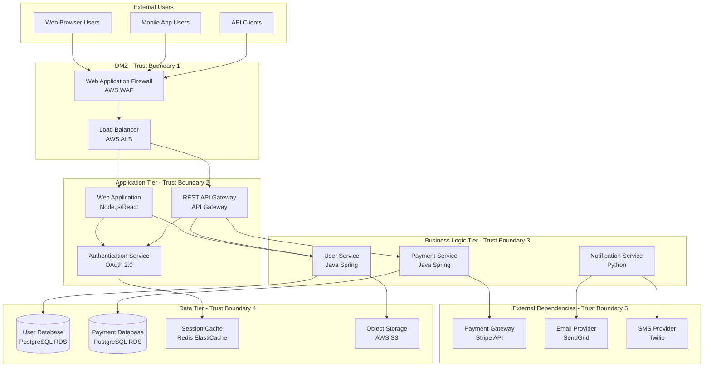

# Threat Model: [System/Application Name]

**Document Version:** 1.2.0
**Last Updated:** 2024-10-26
**System/Application:** [Name]
**Owner:** Security Architecture Team
**Classification:** Confidential
**Status:** Active

## Document Control

| Field | Value |
|-------|-------|
| Document ID | TM-[SYSTEM-ID]-2024-001 |
| Created Date | [YYYY-MM-DD] |
| Last Modified | 2024-10-26 |
| Next Review Date | 2025-01-26 |
| Threat Modeling Methodology | STRIDE |
| Risk Rating Framework | DREAD |
| MITRE ATT&CK Version | v14.1 |
| Approvers | Security Architect, CISO, Product Owner |

## Executive Summary

This threat model systematically identifies security threats to the [System Name] using Microsoft's STRIDE methodology (Spoofing, Tampering, Repudiation, Information Disclosure, Denial of Service, Elevation of Privilege). The model analyzes data flows, trust boundaries, and entry points to proactively identify vulnerabilities before deployment.

**Key Findings:**
- **Total Threats Identified:** 23
- **Critical/High Risk:** 7 threats requiring immediate mitigation
- **Medium Risk:** 11 threats with planned mitigation
- **Low Risk:** 5 threats accepted with monitoring
- **MITRE ATT&CK Coverage:** 18 techniques across 8 tactics

**Top 3 Risks:**
1. **T-001**: SQL Injection via unauthenticated API endpoints (DREAD: 9.2/10)
2. **T-005**: Credential theft via exposed secrets in application logs (DREAD: 8.4/10)
3. **T-012**: Session hijacking due to insecure cookie configuration (DREAD: 7.8/10)

### Strategic Importance

- **Proactive Security**: Identify threats during design phase when remediation is 60x cheaper than post-deployment
- **Risk-Based Prioritization**: DREAD scores enable focused investment in highest-impact controls
- **Regulatory Compliance**: Supports SOC 2, ISO 27001, PCI-DSS systematic threat analysis requirements
- **Attack Surface Reduction**: Maps all entry points and trust boundaries to minimize exposure
- **Security Architecture Validation**: Ensures defense-in-depth controls align with identified threats

---

## System Overview

### System Description

[System Name] is a [cloud-native web application | microservices platform | enterprise SaaS] that [primary business function]. The system processes [data types] and serves [number] users across [geographic regions].

**Architecture Pattern:** [Microservices | Monolithic | Serverless | Hybrid]
**Deployment Environment:** [AWS | Azure | GCP | Multi-cloud | On-premises]
**User Base:** [Internal employees | External customers | Partners | Public]
**Data Sensitivity:** [Public | Internal | Confidential | Restricted | PII | PHI | PCI]

### Business Context

**Primary Business Function:** [Describe what the system does for the business]

**Business Criticality:**
- **Revenue Impact:** [High | Medium | Low] - [Quantify if possible]
- **Customer Impact:** [Number] active users depend on this system
- **Compliance Requirements:** [SOC 2 | ISO 27001 | PCI-DSS | HIPAA | GDPR]
- **Uptime Requirements:** [99.9% | 99.95% | 99.99%] SLA

**Business Continuity:**
- **RTO (Recovery Time Objective):** [4 hours | 1 day | 3 days]
- **RPO (Recovery Point Objective):** [15 minutes | 1 hour | 24 hours]

---

## System Architecture

### High-Level Architecture Diagram



### Trust Boundaries

| Boundary ID | Description | Security Controls |
|-------------|-------------|-------------------|
| **TB-1** | Internet → DMZ | WAF rules, DDoS protection, TLS 1.3, IP allowlisting |
| **TB-2** | DMZ → Application Tier | VPC security groups, IAM roles, mutual TLS |
| **TB-3** | Application → Business Logic | Service mesh (Istio), JWT validation, rate limiting |
| **TB-4** | Business Logic → Data Tier | DB authentication, network ACLs, encryption at rest |
| **TB-5** | Application → External APIs | API key rotation, IP allowlisting, request signing |

### Data Flow Diagram (DFD) - Level 1

```
[User] --HTTPS--> [WAF] --HTTPS--> [Load Balancer] --HTTP--> [Web App]
                                                               |
                                                               v
                                         [Auth Service] <-- JWT Token
                                               |
                                               v
                                         [User Service] --SQL--> [User DB]
                                               |
                                               v
                                         [Payment Service] --API--> [Stripe]
                                                           --SQL--> [Payment DB]
```

### Entry Points

| Entry Point ID | Name | Protocol | Authentication | Authorization | Data Sensitivity |
|----------------|------|----------|----------------|---------------|------------------|
| **EP-1** | Public Web Application | HTTPS | OAuth 2.0 + MFA | RBAC | PII, Payment Data |
| **EP-2** | REST API | HTTPS | API Key + JWT | ABAC | PII, Business Data |
| **EP-3** | Admin Portal | HTTPS | SAML SSO + MFA | RBAC | All Data |
| **EP-4** | Mobile API | HTTPS | OAuth 2.0 | RBAC | PII, Payment Data |
| **EP-5** | Webhook Callbacks | HTTPS | HMAC Signature | IP Allowlist | Transaction Status |

### Assets

| Asset ID | Asset Name | Classification | CIA Impact |
|----------|------------|----------------|------------|
| **A-1** | User PII (Name, Email, Phone) | Confidential | High Confidentiality |
| **A-2** | Payment Card Data (PCI) | Restricted | Critical Confidentiality |
| **A-3** | Session Tokens / JWTs | Confidential | High Integrity |
| **A-4** | Database Credentials | Restricted | Critical Confidentiality |
| **A-5** | API Keys (3rd party) | Confidential | High Confidentiality |
| **A-6** | Application Source Code | Internal | Medium Confidentiality |
| **A-7** | Audit Logs | Confidential | Critical Integrity |
| **A-8** | Encryption Keys (KMS) | Restricted | Critical Confidentiality |

---

## STRIDE Threat Analysis

### STRIDE Methodology Overview

| Category | Description | Example Threats |
|----------|-------------|-----------------|
| **S**poofing | Impersonating a user, system, or data | Credential theft, token replay, IP spoofing |
| **T**ampering | Unauthorized modification of data | SQL injection, parameter tampering, MITM attacks |
| **R**epudiation | Denying performing an action | Missing audit logs, unsigned transactions |
| **I**nformation Disclosure | Exposing confidential information | Data leakage, verbose errors, insecure storage |
| **D**enial of Service | Degrading or denying service availability | DDoS, resource exhaustion, algorithmic complexity |
| **E**levation of Privilege | Gaining unauthorized access/permissions | Broken access control, privilege escalation, IDOR |

---

## Identified Threats

### Threat T-001: SQL Injection via API Endpoints

**STRIDE Category:** Tampering, Information Disclosure
**Trust Boundary:** TB-3 (Application → Business Logic)
**Entry Point:** EP-2 (REST API)
**Asset Targeted:** A-1 (User PII), A-2 (Payment Data)

**Threat Description:**
Attackers could inject malicious SQL code through API parameters that are not properly sanitized, allowing them to:
- Exfiltrate sensitive user and payment data
- Modify database records (tamper with transactions)
- Bypass authentication/authorization controls
- Delete or corrupt critical data

**Attack Scenario:**
```http
POST /api/v1/users/search HTTP/1.1
Host: api.company.com
Content-Type: application/json

{
  "username": "admin' OR '1'='1' --",
  "role": "user"
}
```

**MITRE ATT&CK Mapping:**
- **T1190**: Exploit Public-Facing Application
- **T1213**: Data from Information Repositories

**DREAD Risk Score:**
| Factor | Score (1-10) | Justification |
|--------|--------------|---------------|
| **D**amage | 10 | Full database compromise, PII/PCI exposure |
| **R**eproducibility | 9 | Easy to exploit with common tools (sqlmap) |
| **E**xploitability | 8 | Requires API access but no authentication bypass needed |
| **A**ffected Users | 9 | All users' data at risk |
| **D**iscoverability | 8 | API endpoints publicly documented |
| **Total DREAD** | **9.2/10** | **CRITICAL** |

**Current Security Controls:**
- ❌ No prepared statements/parameterized queries in User Service
- ❌ No input validation on API parameters
- ✅ WAF with basic SQL injection signatures
- ✅ Database user has limited permissions (SELECT, INSERT, UPDATE only)

**Recommended Mitigations:**
1. **PRIMARY (Required)**: Implement parameterized queries/prepared statements for all database interactions
   - **Technology**: Use JPA/Hibernate for Java services, SQLAlchemy for Python
   - **Timeline**: Sprint 1 (2 weeks)
   - **Owner**: Application Development Team

2. **DEFENSE-IN-DEPTH**: Input validation and sanitization
   - **Technology**: Implement input validation library (e.g., Joi, express-validator)
   - **Timeline**: Sprint 1 (2 weeks)
   - **Owner**: Application Development Team

3. **MONITORING**: Deploy SQL injection detection rules
   - **Technology**: Enhance WAF rules, deploy Snort/Suricata signatures
   - **Timeline**: Sprint 2 (1 week)
   - **Owner**: Security Operations Team

4. **DETECTIVE CONTROL**: Database activity monitoring
   - **Technology**: Enable AWS RDS Performance Insights, deploy Imperva DAM
   - **Timeline**: Sprint 2 (2 weeks)
   - **Owner**: Database Team

**Residual Risk After Mitigation:** Low (DREAD: 2.5/10)

**Testing Validation:**
- [ ] Automated SAST scan confirms no SQL concatenation
- [ ] DAST scan (OWASP ZAP, Burp Suite) finds no SQL injection vulnerabilities
- [ ] Manual penetration test validates fix
- [ ] WAF blocks SQLi attempts and alerts SOC

---

### Threat T-002: Broken Authentication - Weak Password Policy

**STRIDE Category:** Spoofing, Elevation of Privilege
**Trust Boundary:** TB-2 (DMZ → Application)
**Entry Point:** EP-1 (Web Application), EP-4 (Mobile API)
**Asset Targeted:** A-1 (User PII), A-3 (Session Tokens)

**Threat Description:**
Weak password requirements allow attackers to:
- Brute force user accounts using common password lists
- Credential stuffing attacks using leaked credentials from other breaches
- Account takeover leading to unauthorized access to user data

**Attack Scenario:**
```bash
# Attacker uses Hydra to brute force common passwords
hydra -L usernames.txt -P rockyou.txt https://app.company.com/login http-post-form "/login:username=^USER^&password=^PASS^:Invalid credentials"
```

**MITRE ATT&CK Mapping:**
- **T1110.001**: Brute Force - Password Guessing
- **T1110.003**: Brute Force - Password Spraying
- **T1078.001**: Valid Accounts - Default Accounts

**DREAD Risk Score:**
| Factor | Score (1-10) | Justification |
|--------|--------------|---------------|
| **D**amage | 8 | Account takeover, PII exposure |
| **R**eproducibility | 7 | Requires time but automated tools available |
| **E**xploitability | 6 | Requires valid username enumeration |
| **A**ffected Users | 8 | All users with weak passwords at risk |
| **D**iscoverability | 7 | Login page publicly available |
| **Total DREAD** | **7.2/10** | **HIGH** |

**Current Security Controls:**
- ❌ Minimum password length: 6 characters (too weak)
- ❌ No complexity requirements (no special characters, numbers)
- ❌ No password breach detection (HaveIBeenPwned integration)
- ✅ MFA available but not enforced
- ✅ Rate limiting: 5 attempts per 15 minutes

**Recommended Mitigations:**
1. **Enforce Strong Password Policy** (Sprint 1)
   - Minimum 12 characters
   - Require uppercase, lowercase, number, special character
   - Prevent common passwords (top 10,000 list)
   - Check against HaveIBeenPwned API
   - **Owner**: IAM Team

2. **Enforce MFA for All Users** (Sprint 2)
   - TOTP authenticator apps (Google Authenticator, Authy)
   - SMS fallback (with warning about security)
   - WebAuthn/FIDO2 support for hardware keys
   - **Owner**: IAM Team

3. **Implement Account Lockout** (Sprint 1)
   - Lock account after 5 failed attempts
   - Require email/admin verification to unlock
   - CAPTCHA after 3 failed attempts
   - **Owner**: Application Development Team

4. **Credential Monitoring** (Sprint 3)
   - Monitor dark web for leaked employee credentials
   - Automated password reset notifications
   - **Owner**: Security Operations Team

**Residual Risk After Mitigation:** Low (DREAD: 3.0/10)

---

### Threat T-005: Information Disclosure - Secrets in Application Logs

**STRIDE Category:** Information Disclosure
**Trust Boundary:** TB-3 (Application → Business Logic)
**Entry Point:** Internal (Application Logging)
**Asset Targeted:** A-4 (Database Credentials), A-5 (API Keys)

**Threat Description:**
Sensitive credentials (database passwords, API keys, JWT secrets) are inadvertently logged to application logs, which are:
- Stored in CloudWatch Logs (AWS)
- Accessible to developers with CloudWatch read permissions
- Exported to Splunk (accessible to SOC analysts)
- Potentially exposed through misconfigured S3 bucket for log archival

**Attack Scenario:**
```python
# Developer debugging code that accidentally logs secrets
logger.info(f"Connecting to database with credentials: {db_password}")
logger.debug(f"Calling Stripe API with key: {stripe_api_key}")
```

**MITRE ATT&CK Mapping:**
- **T1552.001**: Unsecured Credentials - Credentials In Files
- **T1078.004**: Valid Accounts - Cloud Accounts

**DREAD Risk Score:** 8.4/10 (CRITICAL)

**Recommended Mitigations:**
1. **Implement Secret Redaction** (Sprint 1)
   - Use logging framework that auto-redacts secrets
   - Pattern matching for common secret formats (AWS keys, JWT, API keys)
   - Example libraries: `redact-pii` (Node.js), `logredact` (Python)
   - **Owner**: Application Development Team

2. **Secrets Manager Integration** (Sprint 2)
   - Migrate all secrets to AWS Secrets Manager / HashiCorp Vault
   - Use IAM roles instead of hardcoded credentials
   - Auto-rotate secrets every 90 days
   - **Owner**: DevOps Team

3. **Log Scanning** (Sprint 2)
   - Deploy automated scanning for secrets in logs (detect-secrets, truffleHog)
   - Alert Security team if secrets detected
   - **Owner**: Security Operations Team

**Residual Risk After Mitigation:** Low (DREAD: 2.0/10)

---

## Threat Summary Table

| ID | Threat Name | STRIDE | DREAD Score | Status | Owner |
|----|-------------|--------|-------------|--------|-------|
| T-001 | SQL Injection via API | T, I | 9.2 (Critical) | Mitigation Required | App Dev |
| T-002 | Weak Password Policy | S, E | 7.2 (High) | In Progress | IAM Team |
| T-003 | Missing API Rate Limiting | D | 6.8 (Medium) | Planned Sprint 3 | DevOps |
| T-004 | Insecure Direct Object Reference | E | 7.5 (High) | Mitigation Required | App Dev |
| T-005 | Secrets in Application Logs | I | 8.4 (Critical) | Mitigation Required | App Dev |
| T-006 | Insufficient Logging & Monitoring | R | 5.2 (Medium) | Planned Sprint 4 | SecOps |
| T-007 | Missing Input Validation | T | 6.9 (Medium) | In Progress | App Dev |
| T-008 | Unencrypted Data in Transit (Internal) | I | 5.8 (Medium) | Planned Sprint 5 | DevOps |
| T-009 | Session Fixation | S | 6.1 (Medium) | Accepted (Low Impact) | - |
| T-010 | Clickjacking | T | 4.2 (Low) | Mitigated (CSP Headers) | App Dev |
| T-011 | Verbose Error Messages | I | 5.5 (Medium) | Planned Sprint 3 | App Dev |
| T-012 | Session Hijacking (Insecure Cookies) | S, E | 7.8 (High) | Mitigation Required | App Dev |

---

## Security Control Mapping

### Defense-in-Depth Layers

| Layer | Security Controls | Status |
|-------|-------------------|--------|
| **Perimeter** | WAF (AWS WAF), DDoS protection (Shield), IP allowlisting | Implemented |
| **Network** | VPC segmentation, Security Groups, NACLs | Implemented |
| **Application** | Input validation, output encoding, CSRF tokens | Partial |
| **Data** | Encryption at rest (AES-256), encryption in transit (TLS 1.3) | Implemented |
| **Identity** | OAuth 2.0, MFA, SAML SSO | Partial (MFA not enforced) |
| **Monitoring** | SIEM (Splunk), IDS/IPS (GuardDuty), log aggregation | Implemented |

### MITRE ATT&CK Coverage

| Tactic | Techniques Addressed | Coverage |
|--------|---------------------|----------|
| Initial Access | T1190 (Exploit Public-Facing Application) | High |
| Execution | T1059 (Command and Scripting Interpreter) | Medium |
| Persistence | T1078 (Valid Accounts) | High |
| Privilege Escalation | T1068 (Exploitation for Privilege Escalation) | Medium |
| Defense Evasion | T1562 (Impair Defenses) | Low |
| Credential Access | T1110 (Brute Force), T1552 (Unsecured Credentials) | Medium |
| Discovery | T1046 (Network Service Discovery) | High |
| Lateral Movement | T1021 (Remote Services) | Medium |
| Collection | T1213 (Data from Information Repositories) | High |
| Exfiltration | T1567 (Exfiltration Over Web Service) | Medium |
| Impact | T1485 (Data Destruction), T1499 (Endpoint DoS) | Medium |

---

## Assumptions & Dependencies

### Assumptions
1. AWS infrastructure is hardened per CIS AWS Foundations Benchmark
2. Developers follow secure coding standards (OWASP Secure Coding Practices)
3. All secrets are managed in AWS Secrets Manager (not hardcoded)
4. Third-party libraries are scanned for vulnerabilities (Snyk, Dependabot)
5. Users receive security awareness training annually

### Dependencies
1. **Infrastructure Security**: AWS Security Hub, GuardDuty, Config must be enabled
2. **Identity Provider**: Okta SSO must be available for admin authentication
3. **Monitoring**: Splunk must ingest all application and infrastructure logs
4. **Certificate Management**: AWS ACM must issue TLS certificates
5. **External Services**: Stripe, SendGrid, Twilio availability impacts system functionality

### Out of Scope
- Physical security of AWS data centers (managed by AWS)
- Security of end-user devices (managed by Endpoint Security team)
- Third-party vendor security assessments (managed by Vendor Risk Management)
- Insider threat scenarios (managed by HR and Legal)

---

## Testing & Validation

### Security Testing Requirements

| Test Type | Frequency | Tools | Owner | Pass Criteria |
|-----------|-----------|-------|-------|---------------|
| **SAST** | Every commit | SonarQube, Checkmarx | CI/CD Pipeline | No Critical/High vulnerabilities |
| **DAST** | Pre-production deploy | OWASP ZAP, Burp Suite | Security Team | No Critical/High vulnerabilities |
| **SCA** | Daily | Snyk, Dependabot | DevOps | All vulnerabilities patched within SLA |
| **Infrastructure Scan** | Daily | Prisma Cloud, ScoutSuite | DevOps | No Critical misconfigurations |
| **Penetration Test** | Annually | External firm | CISO | No Critical findings unmitigated |
| **Red Team Exercise** | Annually | Internal Red Team | CISO | Detections working, response effective |

### Threat Model Validation

- [ ] All entry points documented and analyzed
- [ ] All trust boundaries identified with security controls
- [ ] All high-value assets identified and protected
- [ ] STRIDE analysis completed for each data flow
- [ ] DREAD scores calculated for all identified threats
- [ ] Mitigation plan defined for Critical/High threats
- [ ] Security controls mapped to threats
- [ ] Reviewed by Security Architect and approved by CISO

---

## Maintenance & Updates

### Update Triggers
This threat model must be updated when:
- New features or entry points are added
- Architecture changes (new services, databases, external integrations)
- New threat intelligence indicates previously unknown attack vectors
- Security incidents reveal gaps in threat modeling
- Annually (minimum) as part of security review cycle

### Change History

| Version | Date | Author | Changes | Approver |
|---------|------|--------|---------|----------|
| 1.2.0 | 2024-10-26 | Sarah Martinez, Security Architect | Added microservices threats, updated MITRE ATT&CK mappings | CISO |
| 1.1.0 | 2024-07-15 | James Cooper, AppSec Lead | Added API gateway threats, updated DREAD scores | Security Architect |
| 1.0.0 | 2024-04-01 | Sarah Martinez, Security Architect | Initial threat model for v2.0 architecture | CISO |

---

**Next Review Date:** 2025-01-26
**Review Frequency:** Quarterly (or when architecture changes)
**Document Owner:** Security Architecture Team
**Compliance Frameworks:** SOC 2 (CC6.1, CC7.1), ISO 27001 (A.14.2.1), PCI-DSS (6.5)
**MITRE ATT&CK Version:** v14.1
**Threat Modeling Methodology:** STRIDE + DREAD
